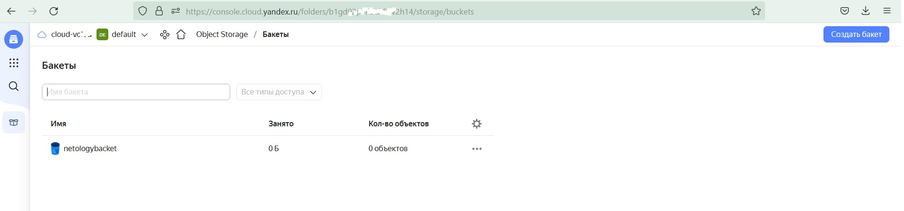

# Домашнее задание к занятию "7.3. Основы и принцип работы Терраформ"

## Задача 1. Создадим бэкэнд в S3 (необязательно, но крайне желательно).

Если в рамках предыдущего задания у вас уже есть аккаунт AWS, то давайте продолжим знакомство со взаимодействием
терраформа и aws. 

1. Создайте s3 бакет, iam роль и пользователя от которого будет работать терраформ. Можно создать отдельного пользователя,
а можно использовать созданного в рамках предыдущего задания, просто добавьте ему необходимы права, как описано 
[здесь](https://www.terraform.io/docs/backends/types/s3.html).
2. Зарегистрируйте бэкэнд в терраформ проекте как описано по ссылке выше. 
```
Создал файл main.tf по шаблону:

provider "yandex" {
  token     = "<IAM-_или_OAuth-токен>"
  cloud_id  = "<идентификатор_облака>"
  folder_id = "<идентификатор_каталога>"
  zone      = "ru-central1-a"
}

resource "yandex_iam_service_account" "sa" {
  name = "<имя_сервисного_аккаунта>"
}

// Назначение роли сервисному аккаунту
resource "yandex_resourcemanager_folder_iam_member" "sa-editor" {
  folder_id = "<идентификатор_каталога>"
  role      = "storage.editor"
  member    = "serviceAccount:${yandex_iam_service_account.sa.id}"
}

// Создание статического ключа доступа
resource "yandex_iam_service_account_static_access_key" "sa-static-key" {
  service_account_id = yandex_iam_service_account.sa.id
  description        = "static access key for object storage"
}

// Создание бакета с использованием ключа
resource "yandex_storage_bucket" "test" {
  access_key = yandex_iam_service_account_static_access_key.sa-static-key.access_key
  secret_key = yandex_iam_service_account_static_access_key.sa-static-key.secret_key
  bucket     = "<имя_бакета>"
}
-------------------------------------------
root@vagrant:~/0703# terraform plan
var.OAUTH
  Enter a value: y0_AgAAAAAFc1G88888888888888888888888888888888888888888881ejzte5OnZFU6qQ

yandex_iam_service_account.sa: Refreshing state... [id=aje3kv64cvh1i58i8e3g]
yandex_resourcemanager_folder_iam_member.sa-editor: Refreshing state... [id=b1gd02p4ii36h57v2h14/storage.editor/serviceAccount:aje3kv64cvh1i58i8e3g]
yandex_iam_service_account_static_access_key.sa-static-key: Refreshing state... [id=ajeq6kdq81o0fsinq8kv]

Note: Objects have changed outside of Terraform

Terraform detected the following changes made outside of Terraform since the last "terraform apply" which may have affected this plan:

  # yandex_iam_service_account.sa has been deleted
  - resource "yandex_iam_service_account" "sa" {
      - id         = "aje3kv64cvh1i58i8e3g" -> null
        name       = "serviceac2"
        # (2 unchanged attributes hidden)
    }

  # yandex_iam_service_account_static_access_key.sa-static-key has been deleted
  - resource "yandex_iam_service_account_static_access_key" "sa-static-key" {
      - access_key         = "YCAJEbPc*********4X01r" -> null
        id                 = "ajeq6k*******inq8kv"
      - secret_key         = (sensitive value)
        # (3 unchanged attributes hidden)
    }


Unless you have made equivalent changes to your configuration, or ignored the relevant attributes using ignore_changes, the following plan
may include actions to undo or respond to these changes.

─────────────────────────────────────────────────────────────────────────────────────────────────────────────────────────────────────────────

Terraform used the selected providers to generate the following execution plan. Resource actions are indicated with the following symbols:
  + create

Terraform will perform the following actions:

  # yandex_iam_service_account.sa will be created
  + resource "yandex_iam_service_account" "sa" {
      + created_at = (known after apply)
      + folder_id  = (known after apply)
      + id         = (known after apply)
      + name       = "serviceac2"
    }

  # yandex_iam_service_account_static_access_key.sa-static-key will be created
  + resource "yandex_iam_service_account_static_access_key" "sa-static-key" {
      + access_key           = (known after apply)
      + created_at           = (known after apply)
      + description          = "static access key for object storage"
      + encrypted_secret_key = (known after apply)
      + id                   = (known after apply)
      + key_fingerprint      = (known after apply)
      + secret_key           = (sensitive value)
      + service_account_id   = (known after apply)
    }

  # yandex_resourcemanager_folder_iam_member.sa-editor will be created
  + resource "yandex_resourcemanager_folder_iam_member" "sa-editor" {
      + folder_id = "b1gd02p4ii36h57v2h14"
      + id        = (known after apply)
      + member    = (known after apply)
      + role      = "storage.editor"
    }

  # yandex_storage_bucket.netology_terraform will be created
  + resource "yandex_storage_bucket" "netology" {
      + access_key            = (known after apply)
      + acl                   = "private"
      + bucket                = "netologybacket"
      + bucket_domain_name    = (known after apply)
      + default_storage_class = (known after apply)
      + folder_id             = (known after apply)
      + force_destroy         = false
      + id                    = (known after apply)
      + secret_key            = (sensitive value)
      + website_domain        = (known after apply)
      + website_endpoint      = (known after apply)

      + anonymous_access_flags {
          + list = (known after apply)
          + read = (known after apply)
        }

      + versioning {
          + enabled = (known after apply)
        }
    }

Plan: 4 to add, 0 to change, 0 to destroy.

─────────────────────────────────────────────

root@vagrant:~/0703# terraform apply
var.OAUTH
  Enter a value: y0_AgAAAAAFc1***********wUSQXef1ejzte5OnZFU6qQ

yandex_iam_service_account.sa: Refreshing state... [id=ajesvpbaq89j0d46tn6f]
yandex_resourcemanager_folder_iam_member.sa-editor: Refreshing state... [id=b1gd02p4ii36h57v2h14/storage.editor/serviceAccount:ajesvpbaq89j0d46tn6f]
yandex_iam_service_account_static_access_key.sa-static-key: Refreshing state... [id=aje09s64dcv07k46isbr]

Terraform used the selected providers to generate the following execution plan. Resource actions are indicated with the following symbols:
  + create
  ~ update in-place

Terraform will perform the following actions:

  # yandex_iam_service_account.sa will be updated in-place
  ~ resource "yandex_iam_service_account" "sa" {
        id         = "ajesvp***46tn6f"
      ~ name       = "serviceac" -> "serviceac"
        # (2 unchanged attributes hidden)
    }

  # yandex_storage_bucket.netology will be created
  + resource "yandex_storage_bucket" "netology" {
      + access_key            = "YCAJEtl******sdXzeS"
      + acl                   = "private"
      + bucket                = "netologybacket"
      + bucket_domain_name    = (known after apply)
      + default_storage_class = (known after apply)
      + folder_id             = (known after apply)
      + force_destroy         = false
      + id                    = (known after apply)
      + secret_key            = (sensitive value)
      + website_domain        = (known after apply)
      + website_endpoint      = (known after apply)

      + anonymous_access_flags {
          + list = (known after apply)
          + read = (known after apply)
        }

      + versioning {
          + enabled = (known after apply)
        }
    }

Plan: 1 to add, 1 to change, 0 to destroy.

Do you want to perform these actions?
  Terraform will perform the actions described above.
  Only 'yes' will be accepted to approve.

  Enter a value: yes

yandex_iam_service_account.sa: Modifying... [id=ajesvpbaq89j0d46tn6f]
yandex_storage_bucket.netology: Creating...
yandex_iam_service_account.sa: Modifications complete after 0s [id=ajesvpbaq89j0d46tn6f]
yandex_storage_bucket.netology: Still creating... [10s elapsed]
yandex_storage_bucket.netology: Still creating... [20s elapsed]
yandex_storage_bucket.netology: Still creating... [30s elapsed]
yandex_storage_bucket.netology: Still creating... [40s elapsed]
yandex_storage_bucket.netology: Still creating... [50s elapsed]
yandex_storage_bucket.netology: Still creating... [1m0s elapsed]
yandex_storage_bucket.netology: Creation complete after 1m1s [id=netologybacket]

Apply complete! Resources: 1 added, 1 changed, 0 destroyed.
root@vagrant:~/0703#

```

<p align="center">
  
</p>


## Задача 2. Инициализируем проект и создаем воркспейсы. 

1. Выполните `terraform init`:
    * если был создан бэкэнд в S3, то терраформ создат файл стейтов в S3 и запись в таблице 
dynamodb.
    * иначе будет создан локальный файл со стейтами.  
1. Создайте два воркспейса `stage` и `prod`.
1. В уже созданный `aws_instance` добавьте зависимость типа инстанса от вокспейса, что бы в разных ворскспейсах 
использовались разные `instance_type`.
1. Добавим `count`. Для `stage` должен создаться один экземпляр `ec2`, а для `prod` два. 
1. Создайте рядом еще один `aws_instance`, но теперь определите их количество при помощи `for_each`, а не `count`.
1. Что бы при изменении типа инстанса не возникло ситуации, когда не будет ни одного инстанса добавьте параметр
жизненного цикла `create_before_destroy = true` в один из рессурсов `aws_instance`.
1. При желании поэкспериментируйте с другими параметрами и рессурсами.

В виде результата работы пришлите:
* Вывод команды `terraform workspace list`.
* Вывод команды `terraform plan` для воркспейса `prod`.  

```
terraform init
terraform workspace new stage
terraform workspace new prod


```

---

### Как cдавать задание

Выполненное домашнее задание пришлите ссылкой на .md-файл в вашем репозитории.

---
