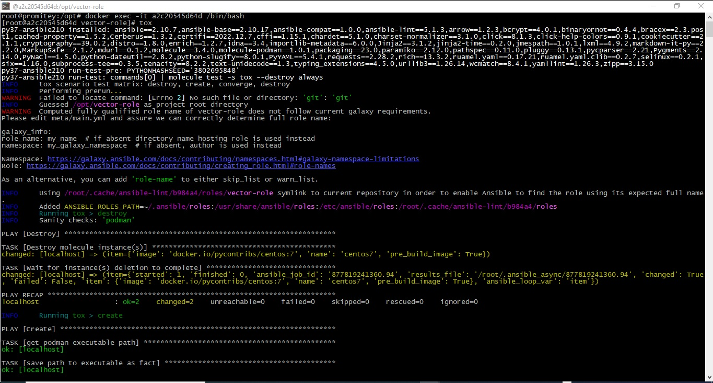

# Домашнее задание к занятию 5 «Тестирование roles»

## Подготовка к выполнению

1. Установите molecule: `pip3 install "molecule==3.5.2"`.
2. Выполните `docker pull aragast/netology:latest` —  это образ с podman, tox и несколькими пайтонами (3.7 и 3.9) внутри.

## Основная часть

Ваша цель — настроить тестирование ваших ролей. 

Задача — сделать сценарии тестирования для vector. 

Ожидаемый результат — все сценарии успешно проходят тестирование ролей.

### Molecule

1. Запустите  `molecule test -s centos_7` внутри корневой директории clickhouse-role, посмотрите на вывод команды. Данная команда может отработать с ошибками, это нормально. Наша цель - посмотреть как другие в реальном мире используют молекулу.
```
root@promitey:~/.ansible/roles/clickhouse# molecule --version
molecule 3.5.2 using python 3.10
    ansible:2.14.3
    delegated:3.5.2 from molecule
    docker:1.1.0 from molecule_docker requiring collections: community.docker>=1.9.1

```
```
root@promitey:~/.ansible/roles/clickhouse# molecule test -s centos_7
INFO     centos_7 scenario test matrix: dependency, lint, cleanup, destroy, syntax, create, prepare, converge, idempotence, side_effect, verify, cleanup, destroy
INFO     Performing prerun...
INFO     Set ANSIBLE_LIBRARY=/root/.cache/ansible-compat/7e099f/modules:/root/.ansible/plugins/modules:/usr/share/ansible/plugins/modules
INFO     Set ANSIBLE_COLLECTIONS_PATH=/root/.cache/ansible-compat/7e099f/collections:/root/.ansible/collections:/usr/share/ansible/collections
INFO     Set ANSIBLE_ROLES_PATH=/root/.cache/ansible-compat/7e099f/roles:/root/.ansible/roles:/usr/share/ansible/roles:/etc/ansible/roles
INFO     Inventory /root/.ansible/roles/clickhouse/molecule/centos_7/../resources/inventory/hosts.yml linked to /root/.cache/molecule/clickhouse/centos_7/inventory/hosts
INFO     Inventory /root/.ansible/roles/clickhouse/molecule/centos_7/../resources/inventory/group_vars/ linked to /root/.cache/molecule/clickhouse/centos_7/inventory/group_vars
INFO     Inventory /root/.ansible/roles/clickhouse/molecule/centos_7/../resources/inventory/host_vars/ linked to /root/.cache/molecule/clickhouse/centos_7/inventory/host_vars
INFO     Running centos_7 > dependency
INFO     Running from /root/.ansible/roles/clickhouse : ansible-galaxy collection install -vvv community.docker:>=1.9.1
WARNING  Skipping, missing the requirements file.
WARNING  Skipping, missing the requirements file.
INFO     Inventory /root/.ansible/roles/clickhouse/molecule/centos_7/../resources/inventory/hosts.yml linked to /root/.cache/molecule/clickhouse/centos_7/inventory/hosts
INFO     Inventory /root/.ansible/roles/clickhouse/molecule/centos_7/../resources/inventory/group_vars/ linked to /root/.cache/molecule/clickhouse/centos_7/inventory/group_vars
INFO     Inventory /root/.ansible/roles/clickhouse/molecule/centos_7/../resources/inventory/host_vars/ linked to /root/.cache/molecule/clickhouse/centos_7/inventory/host_vars
INFO     Running centos_7 > lint
COMMAND: yamllint .
ansible-lint
flake8

WARNING: PATH altered to include /usr/bin
WARNING  Loading custom .yamllint config file, this extends our internal yamllint config.
WARNING  Listing 1 violation(s) that are fatal
risky-file-permissions: File permissions unset or incorrect
tasks/install/apt.yml:45 Task/Handler: Hold specified version during APT upgrade | Package installation

You can skip specific rules or tags by adding them to your configuration file:
# .ansible-lint
warn_list:  # or 'skip_list' to silence them completely
  - experimental  # all rules tagged as experimental

Finished with 0 failure(s), 1 warning(s) on 53 files.
/bin/bash: line 3: flake8: command not found
CRITICAL Lint failed with error code 127
WARNING  An error occurred during the test sequence action: 'lint'. Cleaning up.
INFO     Inventory /root/.ansible/roles/clickhouse/molecule/centos_7/../resources/inventory/hosts.yml linked to /root/.cache/molecule/clickhouse/centos_7/inventory/hosts
INFO     Inventory /root/.ansible/roles/clickhouse/molecule/centos_7/../resources/inventory/group_vars/ linked to /root/.cache/molecule/clickhouse/centos_7/inventory/group_vars
INFO     Inventory /root/.ansible/roles/clickhouse/molecule/centos_7/../resources/inventory/host_vars/ linked to /root/.cache/molecule/clickhouse/centos_7/inventory/host_vars
INFO     Running centos_7 > cleanup
WARNING  Skipping, cleanup playbook not configured.
INFO     Inventory /root/.ansible/roles/clickhouse/molecule/centos_7/../resources/inventory/hosts.yml linked to /root/.cache/molecule/clickhouse/centos_7/inventory/hosts
INFO     Inventory /root/.ansible/roles/clickhouse/molecule/centos_7/../resources/inventory/group_vars/ linked to /root/.cache/molecule/clickhouse/centos_7/inventory/group_vars
INFO     Inventory /root/.ansible/roles/clickhouse/molecule/centos_7/../resources/inventory/host_vars/ linked to /root/.cache/molecule/clickhouse/centos_7/inventory/host_vars
INFO     Running centos_7 > destroy
INFO     Sanity checks: 'docker'

PLAY [Destroy] *****************************************************************

TASK [Destroy molecule instance(s)] ********************************************
changed: [localhost] => (item=centos_7)

TASK [Wait for instance(s) deletion to complete] *******************************
ok: [localhost] => (item=centos_7)

TASK [Delete docker networks(s)] ***********************************************
skipping: [localhost]

PLAY RECAP *********************************************************************
localhost                  : ok=2    changed=1    unreachable=0    failed=0    skipped=1    rescued=0    ignored=0

INFO     Pruning extra files from scenario ephemeral directory

```
2. Перейдите в каталог с ролью vector-role и создайте сценарий тестирования по умолчанию при помощи `molecule init scenario --driver-name docker`.
```
root@promitey:~/.ansible/roles/vector-role# molecule init scenario --driver-name docker
INFO     Initializing new scenario default...
INFO     Initialized scenario in /root/.ansible/roles/vector-role/molecule/default successfully.
root@promitey:~/.ansible/roles/vector-role#

```

3. Добавьте несколько разных дистрибутивов (centos:8, ubuntu:latest) для инстансов и протестируйте роль, исправьте найденные ошибки, если они есть.
```
root@promitey:~/.ansible/roles/vector-role# molecule test -s centos
INFO     centos scenario test matrix: dependency, lint, cleanup, destroy, syntax, create, prepare, converge, idempotence, side_effect, verify, cleanup, destroy
INFO     Performing prerun...
INFO     Set ANSIBLE_LIBRARY=/root/.cache/ansible-compat/f5bcd7/modules:/root/.ansible/plugins/modules:/usr/share/ansible/plugins/modules
INFO     Set ANSIBLE_COLLECTIONS_PATH=/root/.cache/ansible-compat/f5bcd7/collections:/root/.ansible/collections:/usr/share/ansible/collections
INFO     Set ANSIBLE_ROLES_PATH=/root/.cache/ansible-compat/f5bcd7/roles:/root/.ansible/roles:/usr/share/ansible/roles:/etc/ansible/roles
INFO     Running centos > dependency
INFO     Running from /root/.ansible/roles/vector-role : ansible-galaxy collection install -vvv community.docker:>=1.9.1
WARNING  Skipping, missing the requirements file.
WARNING  Skipping, missing the requirements file.
INFO     Running centos > lint
INFO     Lint is disabled.
INFO     Running centos > cleanup
WARNING  Skipping, cleanup playbook not configured.
INFO     Running centos > destroy
INFO     Sanity checks: 'docker'

PLAY [Destroy] *****************************************************************

TASK [Destroy molecule instance(s)] ********************************************
changed: [localhost] => (item=instance)

TASK [Wait for instance(s) deletion to complete] *******************************
ok: [localhost] => (item=instance)

TASK [Delete docker networks(s)] ***********************************************
skipping: [localhost]

PLAY RECAP *********************************************************************
localhost                  : ok=2    changed=1    unreachable=0    failed=0    skipped=1    rescued=0    ignored=0

INFO     Running centos > syntax

playbook: /root/.ansible/roles/vector-role/molecule/centos/converge.yml
INFO     Running centos > create

PLAY [Create] ******************************************************************

TASK [Log into a Docker registry] **********************************************
skipping: [localhost] => (item=None)
skipping: [localhost]

TASK [Check presence of custom Dockerfiles] ************************************
ok: [localhost] => (item={'image': 'docker.io/pycontribs/centos:7', 'name': 'instance', 'pre_build_image': True})

TASK [Create Dockerfiles from image names] *************************************
skipping: [localhost] => (item={'image': 'docker.io/pycontribs/centos:7', 'name': 'instance', 'pre_build_image': True})
skipping: [localhost]

TASK [Discover local Docker images] ********************************************
ok: [localhost] => (item={'changed': False, 'skipped': True, 'skip_reason': 'Conditional result was False', 'item': {'image': 'docker.io/pycontribs/centos:7', 'name': 'instance', 'pre_build_image': True}, 'ansible_loop_var': 'item', 'i': 0, 'ansible_index_var': 'i'})

TASK [Build an Ansible compatible image (new)] *********************************
skipping: [localhost] => (item=molecule_local/docker.io/pycontribs/centos:7)
skipping: [localhost]

TASK [Create docker network(s)] ************************************************
skipping: [localhost]

TASK [Determine the CMD directives] ********************************************
ok: [localhost] => (item={'image': 'docker.io/pycontribs/centos:7', 'name': 'instance', 'pre_build_image': True})

TASK [Create molecule instance(s)] *********************************************
changed: [localhost] => (item=instance)

TASK [Wait for instance(s) creation to complete] *******************************
failed: [localhost] (item={'failed': 0, 'started': 1, 'finished': 0, 'ansible_job_id': '339107725771.2343273', 'results_file': '/root/.ansible_async/339107725771.2343273', 'changed': True, 'item': {'image': 'docker.io/pycontribs/centos:7', 'name': 'instance', 'pre_build_image': True}, 'ansible_loop_var': 'item'}) => {"ansible_job_id": "339107725771.2343273", "ansible_loop_var": "item", "attempts": 1, "changed": false, "finished": 1, "item": {"ansible_job_id": "339107725771.2343273", "ansible_loop_var": "item", "changed": true, "failed": 0, "finished": 0, "item": {"image": "docker.io/pycontribs/centos:7", "name": "instance", "pre_build_image": true}, "results_file": "/root/.ansible_async/339107725771.2343273", "started": 1}, "msg": "Unsupported parameters for (community.docker.docker_container) module: command_handling. Supported parameters include: api_version, auto_remove, blkio_weight, ca_cert, cap_drop, capabilities, cgroup_parent, cleanup, client_cert, client_key, command, comparisons, container_default_behavior, cpu_period, cpu_quota, cpu_shares, cpus, cpuset_cpus, cpuset_mems, debug, default_host_ip, detach, device_read_bps, device_read_iops, device_requests, device_write_bps, device_write_iops, devices, dns_opts, dns_search_domains, dns_servers, docker_host, domainname, entrypoint, env, env_file, etc_hosts, exposed_ports, force_kill, groups, healthcheck, hostname, ignore_image, image, init, interactive, ipc_mode, keep_volumes, kernel_memory, kill_signal, labels, links, log_driver, log_options, mac_address, memory, memory_reservation, memory_swap, memory_swappiness, mounts, name, network_mode, networks, networks_cli_compatible, oom_killer, oom_score_adj, output_logs, paused, pid_mode, pids_limit, privileged, published_ports, pull, purge_networks, read_only, recreate, removal_wait_timeout, restart, restart_policy, restart_retries, runtime, security_opts, shm_size, ssl_version, state, stop_signal, stop_timeout, sysctls, timeout, tls, tls_hostname, tmpfs, tty, ulimits, user, userns_mode, uts, validate_certs, volume_driver, volumes, volumes_from, working_dir (cacert_path, cert_path, docker_api_version, docker_url, expose, exposed, forcekill, key_path, log_opt, ports, tls_ca_cert, tls_client_cert, tls_client_key, tls_verify).", "results_file": "/root/.ansible_async/339107725771.2343273", "started": 1, "stderr": "/tmp/ansible_community.docker.docker_container_payload_85i0_w66/ansible_community.docker.docker_container_payload.zip/ansible_collections/community/docker/plugins/modules/docker_container.py:1169: DeprecationWarning: The distutils package is deprecated and slated for removal in Python 3.12. Use setuptools or check PEP 632 for potential alternatives\n", "stderr_lines": ["/tmp/ansible_community.docker.docker_container_payload_85i0_w66/ansible_community.docker.docker_container_payload.zip/ansible_collections/community/docker/plugins/modules/docker_container.py:1169: DeprecationWarning: The distutils package is deprecated and slated for removal in Python 3.12. Use setuptools or check PEP 632 for potential alternatives"], "stdout": "", "stdout_lines": []}

PLAY RECAP *********************************************************************
localhost                  : ok=4    changed=1    unreachable=0    failed=1    skipped=4    rescued=0    ignored=0

CRITICAL Ansible return code was 2, command was: ['ansible-playbook', '--inventory', '/root/.cache/molecule/vector-role/centos/inventory', '--skip-tags', 'molecule-notest,notest', '/usr/local/lib/python3.10/dist-packages/molecule_docker/playbooks/create.yml']
WARNING  An error occurred during the test sequence action: 'create'. Cleaning up.
INFO     Running centos > cleanup
WARNING  Skipping, cleanup playbook not configured.
INFO     Running centos > destroy

PLAY [Destroy] *****************************************************************

TASK [Destroy molecule instance(s)] ********************************************
changed: [localhost] => (item=instance)

TASK [Wait for instance(s) deletion to complete] *******************************
ok: [localhost] => (item=instance)

TASK [Delete docker networks(s)] ***********************************************
skipping: [localhost]

PLAY RECAP *********************************************************************
localhost                  : ok=2    changed=1    unreachable=0    failed=0    skipped=1    rescued=0    ignored=0

INFO     Pruning extra files from scenario ephemeral directory
root@promitey:~/.ansible/roles/vector-role#


```
```
root@promitey:~/.ansible/roles/vector-role# molecule test -s ubuntu
INFO     ubuntu scenario test matrix: dependency, lint, cleanup, destroy, syntax, create, prepare, converge, idempotence, side_effect, verify, cleanup, destroy
INFO     Performing prerun...
INFO     Set ANSIBLE_LIBRARY=/root/.cache/ansible-compat/f5bcd7/modules:/root/.ansible/plugins/modules:/usr/share/ansible/plugins/modules
INFO     Set ANSIBLE_COLLECTIONS_PATH=/root/.cache/ansible-compat/f5bcd7/collections:/root/.ansible/collections:/usr/share/ansible/collections
INFO     Set ANSIBLE_ROLES_PATH=/root/.cache/ansible-compat/f5bcd7/roles:/root/.ansible/roles:/usr/share/ansible/roles:/etc/ansible/roles
INFO     Running ubuntu > dependency
WARNING  Skipping, missing the requirements file.
WARNING  Skipping, missing the requirements file.
INFO     Running ubuntu > lint
INFO     Lint is disabled.
INFO     Running ubuntu > cleanup
WARNING  Skipping, cleanup playbook not configured.
INFO     Running ubuntu > destroy
INFO     Sanity checks: 'docker'

PLAY [Destroy] *****************************************************************

TASK [Destroy molecule instance(s)] ********************************************
changed: [localhost] => (item=instance)

TASK [Wait for instance(s) deletion to complete] *******************************
ok: [localhost] => (item=instance)

TASK [Delete docker networks(s)] ***********************************************
skipping: [localhost]

PLAY RECAP *********************************************************************
localhost                  : ok=2    changed=1    unreachable=0    failed=0    skipped=1    rescued=0    ignored=0

INFO     Running ubuntu > syntax

playbook: /root/.ansible/roles/vector-role/molecule/ubuntu/converge.yml
INFO     Running ubuntu > create

PLAY [Create] ******************************************************************

TASK [Log into a Docker registry] **********************************************
skipping: [localhost] => (item=None)
skipping: [localhost]

TASK [Check presence of custom Dockerfiles] ************************************
ok: [localhost] => (item={'image': 'pycontribs/ubuntu:latest', 'name': 'instance', 'pre_build_image': True})

TASK [Create Dockerfiles from image names] *************************************
skipping: [localhost] => (item={'image': 'pycontribs/ubuntu:latest', 'name': 'instance', 'pre_build_image': True})
skipping: [localhost]

TASK [Discover local Docker images] ********************************************
ok: [localhost] => (item={'changed': False, 'skipped': True, 'skip_reason': 'Conditional result was False', 'item': {'image': 'pycontribs/ubuntu:latest', 'name': 'instance', 'pre_build_image': True}, 'ansible_loop_var': 'item', 'i': 0, 'ansible_index_var': 'i'})

TASK [Build an Ansible compatible image (new)] *********************************
skipping: [localhost] => (item=molecule_local/pycontribs/ubuntu:latest)
skipping: [localhost]

TASK [Create docker network(s)] ************************************************
skipping: [localhost]

TASK [Determine the CMD directives] ********************************************
ok: [localhost] => (item={'image': 'pycontribs/ubuntu:latest', 'name': 'instance', 'pre_build_image': True})

TASK [Create molecule instance(s)] *********************************************
changed: [localhost] => (item=instance)

TASK [Wait for instance(s) creation to complete] *******************************
failed: [localhost] (item={'failed': 0, 'started': 1, 'finished': 0, 'ansible_job_id': '168691444397.2344178', 'results_file': '/root/.ansible_async/168691444397.2344178', 'changed': True, 'item': {'image': 'pycontribs/ubuntu:latest', 'name': 'instance', 'pre_build_image': True}, 'ansible_loop_var': 'item'}) => {"ansible_job_id": "168691444397.2344178", "ansible_loop_var": "item", "attempts": 1, "changed": false, "finished": 1, "item": {"ansible_job_id": "168691444397.2344178", "ansible_loop_var": "item", "changed": true, "failed": 0, "finished": 0, "item": {"image": "pycontribs/ubuntu:latest", "name": "instance", "pre_build_image": true}, "results_file": "/root/.ansible_async/168691444397.2344178", "started": 1}, "msg": "Unsupported parameters for (community.docker.docker_container) module: command_handling. Supported parameters include: api_version, auto_remove, blkio_weight, ca_cert, cap_drop, capabilities, cgroup_parent, cleanup, client_cert, client_key, command, comparisons, container_default_behavior, cpu_period, cpu_quota, cpu_shares, cpus, cpuset_cpus, cpuset_mems, debug, default_host_ip, detach, device_read_bps, device_read_iops, device_requests, device_write_bps, device_write_iops, devices, dns_opts, dns_search_domains, dns_servers, docker_host, domainname, entrypoint, env, env_file, etc_hosts, exposed_ports, force_kill, groups, healthcheck, hostname, ignore_image, image, init, interactive, ipc_mode, keep_volumes, kernel_memory, kill_signal, labels, links, log_driver, log_options, mac_address, memory, memory_reservation, memory_swap, memory_swappiness, mounts, name, network_mode, networks, networks_cli_compatible, oom_killer, oom_score_adj, output_logs, paused, pid_mode, pids_limit, privileged, published_ports, pull, purge_networks, read_only, recreate, removal_wait_timeout, restart, restart_policy, restart_retries, runtime, security_opts, shm_size, ssl_version, state, stop_signal, stop_timeout, sysctls, timeout, tls, tls_hostname, tmpfs, tty, ulimits, user, userns_mode, uts, validate_certs, volume_driver, volumes, volumes_from, working_dir (cacert_path, cert_path, docker_api_version, docker_url, expose, exposed, forcekill, key_path, log_opt, ports, tls_ca_cert, tls_client_cert, tls_client_key, tls_verify).", "results_file": "/root/.ansible_async/168691444397.2344178", "started": 1, "stderr": "/tmp/ansible_community.docker.docker_container_payload_h3p70bk6/ansible_community.docker.docker_container_payload.zip/ansible_collections/community/docker/plugins/modules/docker_container.py:1169: DeprecationWarning: The distutils package is deprecated and slated for removal in Python 3.12. Use setuptools or check PEP 632 for potential alternatives\n", "stderr_lines": ["/tmp/ansible_community.docker.docker_container_payload_h3p70bk6/ansible_community.docker.docker_container_payload.zip/ansible_collections/community/docker/plugins/modules/docker_container.py:1169: DeprecationWarning: The distutils package is deprecated and slated for removal in Python 3.12. Use setuptools or check PEP 632 for potential alternatives"], "stdout": "", "stdout_lines": []}

PLAY RECAP *********************************************************************
localhost                  : ok=4    changed=1    unreachable=0    failed=1    skipped=4    rescued=0    ignored=0

CRITICAL Ansible return code was 2, command was: ['ansible-playbook', '--inventory', '/root/.cache/molecule/vector-role/ubuntu/inventory', '--skip-tags', 'molecule-notest,notest', '/usr/local/lib/python3.10/dist-packages/molecule_docker/playbooks/create.yml']
WARNING  An error occurred during the test sequence action: 'create'. Cleaning up.
INFO     Running ubuntu > cleanup
WARNING  Skipping, cleanup playbook not configured.
INFO     Running ubuntu > destroy

PLAY [Destroy] *****************************************************************

TASK [Destroy molecule instance(s)] ********************************************
changed: [localhost] => (item=instance)

TASK [Wait for instance(s) deletion to complete] *******************************
ok: [localhost] => (item=instance)

TASK [Delete docker networks(s)] ***********************************************
skipping: [localhost]

PLAY RECAP *********************************************************************
localhost                  : ok=2    changed=1    unreachable=0    failed=0    skipped=1    rescued=0    ignored=0

INFO     Pruning extra files from scenario ephemeral directory
root@promitey:~/.ansible/roles/vector-role#

```
4. Добавьте несколько assert в verify.yml-файл для  проверки работоспособности vector-role (проверка, что конфиг валидный, проверка успешности запуска и др.). 
[verify.yml](https://github.com/awertoss/vector-role/blob/main/molecule/centos/verify.yml)

5. Запустите тестирование роли повторно и проверьте, что оно прошло успешно.
```
root@promitey:~/.ansible/roles/vector-role# molecule test -s centos
INFO     centos scenario test matrix: dependency, lint, cleanup, destroy, syntax, create, prepare, converge, idempotence, side_effect, verify, cleanup, destroy
INFO     Performing prerun...
INFO     Set ANSIBLE_LIBRARY=/root/.cache/ansible-compat/f5bcd7/modules:/root/.ansible/plugins/modules:/usr/share/ansible/plugins/modules
INFO     Set ANSIBLE_COLLECTIONS_PATH=/root/.cache/ansible-compat/f5bcd7/collections:/root/.ansible/collections:/usr/share/ansible/collections
INFO     Set ANSIBLE_ROLES_PATH=/root/.cache/ansible-compat/f5bcd7/roles:/root/.ansible/roles:/usr/share/ansible/roles:/etc/ansible/roles
INFO     Running centos > dependency
WARNING  Skipping, missing the requirements file.
WARNING  Skipping, missing the requirements file.
INFO     Running centos > lint
INFO     Lint is disabled.
INFO     Running centos > cleanup
WARNING  Skipping, cleanup playbook not configured.
INFO     Running centos > destroy
INFO     Sanity checks: 'docker'

PLAY [Destroy] *****************************************************************

TASK [Destroy molecule instance(s)] ********************************************
changed: [localhost] => (item=instance)

TASK [Wait for instance(s) deletion to complete] *******************************
ok: [localhost] => (item=instance)

TASK [Delete docker networks(s)] ***********************************************
skipping: [localhost]

PLAY RECAP *********************************************************************
localhost                  : ok=2    changed=1    unreachable=0    failed=0    skipped=1    rescued=0    ignored=0

INFO     Running centos > syntax

playbook: /root/.ansible/roles/vector-role/molecule/centos/converge.yml
INFO     Running centos > create

PLAY [Create] ******************************************************************

TASK [Log into a Docker registry] **********************************************
skipping: [localhost] => (item=None)
skipping: [localhost]

TASK [Check presence of custom Dockerfiles] ************************************
ok: [localhost] => (item={'image': 'docker.io/pycontribs/centos:7', 'name': 'instance', 'pre_build_image': True})

TASK [Create Dockerfiles from image names] *************************************
skipping: [localhost] => (item={'image': 'docker.io/pycontribs/centos:7', 'name': 'instance', 'pre_build_image': True})
skipping: [localhost]

TASK [Discover local Docker images] ********************************************
ok: [localhost] => (item={'changed': False, 'skipped': True, 'skip_reason': 'Conditional result was False', 'item': {'image': 'docker.io/pycontribs/centos:7', 'name': 'instance', 'pre_build_image': True}, 'ansible_loop_var': 'item', 'i': 0, 'ansible_index_var': 'i'})

TASK [Build an Ansible compatible image (new)] *********************************
skipping: [localhost] => (item=molecule_local/docker.io/pycontribs/centos:7)
skipping: [localhost]

TASK [Create docker network(s)] ************************************************
skipping: [localhost]

TASK [Determine the CMD directives] ********************************************
ok: [localhost] => (item={'image': 'docker.io/pycontribs/centos:7', 'name': 'instance', 'pre_build_image': True})

TASK [Create molecule instance(s)] *********************************************
changed: [localhost] => (item=instance)

TASK [Wait for instance(s) creation to complete] *******************************
failed: [localhost] (item={'failed': 0, 'started': 1, 'finished': 0, 'ansible_job_id': '73776083288.2345136', 'results_file': '/root/.ansible_async/73776083288.2345136', 'changed': True, 'item': {'image': 'docker.io/pycontribs/centos:7', 'name': 'instance', 'pre_build_image': True}, 'ansible_loop_var': 'item'}) => {"ansible_job_id": "73776083288.2345136", "ansible_loop_var": "item", "attempts": 1, "changed": false, "finished": 1, "item": {"ansible_job_id": "73776083288.2345136", "ansible_loop_var": "item", "changed": true, "failed": 0, "finished": 0, "item": {"image": "docker.io/pycontribs/centos:7", "name": "instance", "pre_build_image": true}, "results_file": "/root/.ansible_async/73776083288.2345136", "started": 1}, "msg": "Unsupported parameters for (community.docker.docker_container) module: command_handling. Supported parameters include: api_version, auto_remove, blkio_weight, ca_cert, cap_drop, capabilities, cgroup_parent, cleanup, client_cert, client_key, command, comparisons, container_default_behavior, cpu_period, cpu_quota, cpu_shares, cpus, cpuset_cpus, cpuset_mems, debug, default_host_ip, detach, device_read_bps, device_read_iops, device_requests, device_write_bps, device_write_iops, devices, dns_opts, dns_search_domains, dns_servers, docker_host, domainname, entrypoint, env, env_file, etc_hosts, exposed_ports, force_kill, groups, healthcheck, hostname, ignore_image, image, init, interactive, ipc_mode, keep_volumes, kernel_memory, kill_signal, labels, links, log_driver, log_options, mac_address, memory, memory_reservation, memory_swap, memory_swappiness, mounts, name, network_mode, networks, networks_cli_compatible, oom_killer, oom_score_adj, output_logs, paused, pid_mode, pids_limit, privileged, published_ports, pull, purge_networks, read_only, recreate, removal_wait_timeout, restart, restart_policy, restart_retries, runtime, security_opts, shm_size, ssl_version, state, stop_signal, stop_timeout, sysctls, timeout, tls, tls_hostname, tmpfs, tty, ulimits, user, userns_mode, uts, validate_certs, volume_driver, volumes, volumes_from, working_dir (cacert_path, cert_path, docker_api_version, docker_url, expose, exposed, forcekill, key_path, log_opt, ports, tls_ca_cert, tls_client_cert, tls_client_key, tls_verify).", "results_file": "/root/.ansible_async/73776083288.2345136", "started": 1, "stderr": "/tmp/ansible_community.docker.docker_container_payload_t11tf5fd/ansible_community.docker.docker_container_payload.zip/ansible_collections/community/docker/plugins/modules/docker_container.py:1169: DeprecationWarning: The distutils package is deprecated and slated for removal in Python 3.12. Use setuptools or check PEP 632 for potential alternatives\n", "stderr_lines": ["/tmp/ansible_community.docker.docker_container_payload_t11tf5fd/ansible_community.docker.docker_container_payload.zip/ansible_collections/community/docker/plugins/modules/docker_container.py:1169: DeprecationWarning: The distutils package is deprecated and slated for removal in Python 3.12. Use setuptools or check PEP 632 for potential alternatives"], "stdout": "", "stdout_lines": []}

PLAY RECAP *********************************************************************
localhost                  : ok=4    changed=1    unreachable=0    failed=1    skipped=4    rescued=0    ignored=0

CRITICAL Ansible return code was 2, command was: ['ansible-playbook', '--inventory', '/root/.cache/molecule/vector-role/centos/inventory', '--skip-tags', 'molecule-notest,notest', '/usr/local/lib/python3.10/dist-packages/molecule_docker/playbooks/create.yml']
WARNING  An error occurred during the test sequence action: 'create'. Cleaning up.
INFO     Running centos > cleanup
WARNING  Skipping, cleanup playbook not configured.
INFO     Running centos > destroy

PLAY [Destroy] *****************************************************************

TASK [Destroy molecule instance(s)] ********************************************
changed: [localhost] => (item=instance)

TASK [Wait for instance(s) deletion to complete] *******************************
ok: [localhost] => (item=instance)

TASK [Delete docker networks(s)] ***********************************************
skipping: [localhost]

PLAY RECAP *********************************************************************
localhost                  : ok=2    changed=1    unreachable=0    failed=0    skipped=1    rescued=0    ignored=0

INFO     Pruning extra files from scenario ephemeral directory
root@promitey:~/.ansible/roles/vector-role#


```

6. Добавьте новый тег на коммит с рабочим сценарием в соответствии с семантическим версионированием.
[vector-role v1.1.0](https://github.com/awertoss/vector-role/tree/1.1.0)


### Tox

1. Добавьте в директорию с vector-role файлы из директории.
2. Запустите `docker run --privileged=True -v <path_to_repo>:/opt/vector-role -w /opt/vector-role -it aragast/netology:latest /bin/bash`, где path_to_repo — путь до корня репозитория с vector-role на вашей файловой системе.
```
root@promitey:/home/srg/vector-rol/vector-role# docker run --privileged=True -v /home/srg/0805/playbook/vector-role/:/opt/vector-role -w /opt/vector-role -it aragast/netology:latest /bin/bash
[root@cb583217fbd7 vector-role]#

```

3. Внутри контейнера выполните команду `tox`, посмотрите на вывод.
```
[root@a2c20545d64d vector-role]# tox
py37-ansible210 installed: ansible==2.10.7,ansible-base==2.10.17,ansible-compat==1.0.0,ansible-lint==5.1.3,arrow==1.2.3,bcrypt==4.0.1,binaryornot==0.4.4,bracex==2.3.post1,cached-property==1.5.2,Cerberus==1.3.2,certifi==2022.12.7,cffi==1.15.1,chardet==5.1.0,charset-normalizer==3.1.0,click==8.1.3,click-help-colors==0.9.1,cookiecutter==2.1.1,cryptography==39.0.2,distro==1.8.0,enrich==1.2.7,idna==3.4,importlib-metadata==6.0.0,Jinja2==3.1.2,jinja2-time==0.2.0,jmespath==1.0.1,lxml==4.9.2,markdown-it-py==2.2.0,MarkupSafe==2.1.2,mdurl==0.1.2,molecule==3.4.0,molecule-podman==1.0.1,packaging==23.0,paramiko==2.12.0,pathspec==0.11.0,pluggy==0.13.1,pycparser==2.21,Pygments==2.14.0,PyNaCl==1.5.0,python-dateutil==2.8.2,python-slugify==8.0.1,PyYAML==5.4.1,requests==2.28.2,rich==13.3.2,ruamel.yaml==0.17.21,ruamel.yaml.clib==0.2.7,selinux==0.2.1,six==1.16.0,subprocess-tee==0.3.5,tenacity==8.2.2,text-unidecode==1.3,typing_extensions==4.5.0,urllib3==1.26.14,wcmatch==8.4.1,yamllint==1.26.3,zipp==3.15.0
py37-ansible210 run-test-pre: PYTHONHASHSEED='237127801'
py37-ansible210 run-test: commands[0] | molecule test -s centos --destroy always
---
dependency:
  name: galaxy
driver:
  name: docker
platforms:
  - image: docker.io/pycontribs/centos:7
    name: instance
    pre_build_image: true
provisioner:
  name: ansible
verifier:
  name: ansible

CRITICAL Failed to pre-validate.

{'driver': [{'name': ['unallowed value docker']}]}
ERROR: InvocationError for command /opt/vector-role/.tox/py37-ansible210/bin/molecule test -s centos --destroy always (exited with code 1)
py37-ansible30 installed: ansible==3.0.0,ansible-base==2.10.17,ansible-compat==1.0.0,ansible-lint==5.1.3,arrow==1.2.3,bcrypt==4.0.1,binaryornot==0.4.4,bracex==2.3.post1,cached-property==1.5.2,Cerberus==1.3.2,certifi==2022.12.7,cffi==1.15.1,chardet==5.1.0,charset-normalizer==3.1.0,click==8.1.3,click-help-colors==0.9.1,cookiecutter==2.1.1,cryptography==39.0.2,distro==1.8.0,enrich==1.2.7,idna==3.4,importlib-metadata==6.0.0,Jinja2==3.1.2,jinja2-time==0.2.0,jmespath==1.0.1,lxml==4.9.2,markdown-it-py==2.2.0,MarkupSafe==2.1.2,mdurl==0.1.2,molecule==3.4.0,molecule-podman==1.0.1,packaging==23.0,paramiko==2.12.0,pathspec==0.11.0,pluggy==0.13.1,pycparser==2.21,Pygments==2.14.0,PyNaCl==1.5.0,python-dateutil==2.8.2,python-slugify==8.0.1,PyYAML==5.4.1,requests==2.28.2,rich==13.3.2,ruamel.yaml==0.17.21,ruamel.yaml.clib==0.2.7,selinux==0.2.1,six==1.16.0,subprocess-tee==0.3.5,tenacity==8.2.2,text-unidecode==1.3,typing_extensions==4.5.0,urllib3==1.26.14,wcmatch==8.4.1,yamllint==1.26.3,zipp==3.15.0
py37-ansible30 run-test-pre: PYTHONHASHSEED='237127801'
py37-ansible30 run-test: commands[0] | molecule test -s centos --destroy always
---
dependency:
  name: galaxy
driver:
  name: docker
platforms:
  - image: docker.io/pycontribs/centos:7
    name: instance
    pre_build_image: true
provisioner:
  name: ansible
verifier:
  name: ansible

CRITICAL Failed to pre-validate.

{'driver': [{'name': ['unallowed value docker']}]}
ERROR: InvocationError for command /opt/vector-role/.tox/py37-ansible30/bin/molecule test -s centos --destroy always (exited with code 1)
py39-ansible210 installed: ansible==2.10.7,ansible-base==2.10.17,ansible-compat==3.0.1,ansible-core==2.14.3,ansible-lint==5.1.3,arrow==1.2.3,attrs==22.2.0,bcrypt==4.0.1,binaryornot==0.4.4,bracex==2.3.post1,Cerberus==1.3.2,certifi==2022.12.7,cffi==1.15.1,chardet==5.1.0,charset-normalizer==3.1.0,click==8.1.3,click-help-colors==0.9.1,cookiecutter==2.1.1,cryptography==39.0.2,distro==1.8.0,enrich==1.2.7,idna==3.4,Jinja2==3.1.2,jinja2-time==0.2.0,jmespath==1.0.1,jsonschema==4.17.3,lxml==4.9.2,markdown-it-py==2.2.0,MarkupSafe==2.1.2,mdurl==0.1.2,molecule==3.4.0,molecule-podman==1.0.1,packaging==23.0,paramiko==2.12.0,pathspec==0.11.0,pluggy==0.13.1,pycparser==2.21,Pygments==2.14.0,PyNaCl==1.5.0,pyrsistent==0.19.3,python-dateutil==2.8.2,python-slugify==8.0.1,PyYAML==5.4.1,requests==2.28.2,resolvelib==0.8.1,rich==13.3.2,ruamel.yaml==0.17.21,ruamel.yaml.clib==0.2.7,selinux==0.3.0,six==1.16.0,subprocess-tee==0.4.1,tenacity==8.2.2,text-unidecode==1.3,urllib3==1.26.14,wcmatch==8.4.1,yamllint==1.26.3
py39-ansible210 run-test-pre: PYTHONHASHSEED='237127801'
py39-ansible210 run-test: commands[0] | molecule test -s centos --destroy always
---
dependency:
  name: galaxy
driver:
  name: docker
platforms:
  - image: docker.io/pycontribs/centos:7
    name: instance
    pre_build_image: true
provisioner:
  name: ansible
verifier:
  name: ansible

CRITICAL Failed to pre-validate.

{'driver': [{'name': ['unallowed value docker']}]}
ERROR: InvocationError for command /opt/vector-role/.tox/py39-ansible210/bin/molecule test -s centos --destroy always (exited with code 1)
py39-ansible30 installed: ansible==3.0.0,ansible-base==2.10.17,ansible-compat==3.0.1,ansible-core==2.14.3,ansible-lint==5.1.3,arrow==1.2.3,attrs==22.2.0,bcrypt==4.0.1,binaryornot==0.4.4,bracex==2.3.post1,Cerberus==1.3.2,certifi==2022.12.7,cffi==1.15.1,chardet==5.1.0,charset-normalizer==3.1.0,click==8.1.3,click-help-colors==0.9.1,cookiecutter==2.1.1,cryptography==39.0.2,distro==1.8.0,enrich==1.2.7,idna==3.4,Jinja2==3.1.2,jinja2-time==0.2.0,jmespath==1.0.1,jsonschema==4.17.3,lxml==4.9.2,markdown-it-py==2.2.0,MarkupSafe==2.1.2,mdurl==0.1.2,molecule==3.4.0,molecule-podman==1.0.1,packaging==23.0,paramiko==2.12.0,pathspec==0.11.0,pluggy==0.13.1,pycparser==2.21,Pygments==2.14.0,PyNaCl==1.5.0,pyrsistent==0.19.3,python-dateutil==2.8.2,python-slugify==8.0.1,PyYAML==5.4.1,requests==2.28.2,resolvelib==0.8.1,rich==13.3.2,ruamel.yaml==0.17.21,ruamel.yaml.clib==0.2.7,selinux==0.3.0,six==1.16.0,subprocess-tee==0.4.1,tenacity==8.2.2,text-unidecode==1.3,urllib3==1.26.14,wcmatch==8.4.1,yamllint==1.26.3
py39-ansible30 run-test-pre: PYTHONHASHSEED='237127801'
py39-ansible30 run-test: commands[0] | molecule test -s centos --destroy always
---
dependency:
  name: galaxy
driver:
  name: docker
platforms:
  - image: docker.io/pycontribs/centos:7
    name: instance
    pre_build_image: true
provisioner:
  name: ansible
verifier:
  name: ansible

CRITICAL Failed to pre-validate.

{'driver': [{'name': ['unallowed value docker']}]}
ERROR: InvocationError for command /opt/vector-role/.tox/py39-ansible30/bin/molecule test -s centos --destroy always (exited with code 1)
______________________________________________________________________________ summary _______________________________________________________________________________
ERROR:   py37-ansible210: commands failed
ERROR:   py37-ansible30: commands failed
ERROR:   py39-ansible210: commands failed
ERROR:   py39-ansible30: commands failed
[root@a2c20545d64d vector-role]#
```
4. Создайте облегчённый сценарий для `molecule` с драйвером `molecule_podman`. Проверьте его на исполнимость.
```


#yum -y install podman

-----------------------------------
scenario:
  test_sequence:
  - destroy
  - create                                                                                                                                         >
  - converge
  - destroy


```

5. Пропишите правильную команду в `tox.ini`, чтобы запускался облегчённый сценарий.
```
[tox]
minversion = 1.8
basepython = python3.6
envlist = py{37,39}-ansible{210,30}
skipsdist = true

[testenv]
passenv = *
deps =
    -r tox-requirements.txt
    ansible210: ansible<3.0
    ansible30: ansible<3.1
commands =
    {posargs:molecule test -s tox --destroy always}

```

6. Запустите команду `tox`. Убедитесь, что всё отработало успешно.
<details>

[root@a2c20545d64d vector-role]# tox
py37-ansible210 installed: ansible==2.10.7,ansible-base==2.10.17,ansible-compat==1.0.0,ansible-lint==5.1.3,arrow==1.2.3,bcrypt==4.0.1,binaryornot==0.4.4,bracex==2.3.post1,cached-property==1.5.2,Cerberus==1.3.2,certifi==2022.12.7,cffi==1.15.1,chardet==5.1.0,charset-normalizer==3.1.0,click==8.1.3,click-help-colors==0.9.1,cookiecutter==2.1.1,cryptography==39.0.2,distro==1.8.0,enrich==1.2.7,idna==3.4,importlib-metadata==6.0.0,Jinja2==3.1.2,jinja2-time==0.2.0,jmespath==1.0.1,lxml==4.9.2,markdown-it-py==2.2.0,MarkupSafe==2.1.2,mdurl==0.1.2,molecule==3.4.0,molecule-podman==1.0.1,packaging==23.0,paramiko==2.12.0,pathspec==0.11.0,pluggy==0.13.1,pycparser==2.21,Pygments==2.14.0,PyNaCl==1.5.0,python-dateutil==2.8.2,python-slugify==8.0.1,PyYAML==5.4.1,requests==2.28.2,rich==13.3.2,ruamel.yaml==0.17.21,ruamel.yaml.clib==0.2.7,selinux==0.2.1,six==1.16.0,subprocess-tee==0.3.5,tenacity==8.2.2,text-unidecode==1.3,typing_extensions==4.5.0,urllib3==1.26.14,wcmatch==8.4.1,yamllint==1.26.3,zipp==3.15.0
py37-ansible210 run-test-pre: PYTHONHASHSEED='3802695848'
py37-ansible210 run-test: commands[0] | molecule test -s tox --destroy always
INFO     tox scenario test matrix: destroy, create, converge, destroy
INFO     Performing prerun...
WARNING  Failed to locate command: [Errno 2] No such file or directory: 'git': 'git'
INFO     Guessed /opt/vector-role as project root directory
WARNING  Computed fully qualified role name of vector-role does not follow current galaxy requirements.
Please edit meta/main.yml and assure we can correctly determine full role name:

galaxy_info:
role_name: my_name  # if absent directory name hosting role is used instead
namespace: my_galaxy_namespace  # if absent, author is used instead

Namespace: https://galaxy.ansible.com/docs/contributing/namespaces.html#galaxy-namespace-limitations
Role: https://galaxy.ansible.com/docs/contributing/creating_role.html#role-names

As an alternative, you can add 'role-name' to either skip_list or warn_list.

INFO     Using /root/.cache/ansible-lint/b984a4/roles/vector-role symlink to current repository in order to enable Ansible to find the role using its expected full name.
INFO     Added ANSIBLE_ROLES_PATH=~/.ansible/roles:/usr/share/ansible/roles:/etc/ansible/roles:/root/.cache/ansible-lint/b984a4/roles
INFO     Running tox > destroy
INFO     Sanity checks: 'podman'

PLAY [Destroy] *****************************************************************

TASK [Destroy molecule instance(s)] ********************************************
changed: [localhost] => (item={'image': 'docker.io/pycontribs/centos:7', 'name': 'centos7', 'pre_build_image': True})

TASK [Wait for instance(s) deletion to complete] *******************************
changed: [localhost] => (item={'started': 1, 'finished': 0, 'ansible_job_id': '877819241360.94', 'results_file': '/root/.ansible_async/877819241360.94', 'changed': True, 'failed': False, 'item': {'image': 'docker.io/pycontribs/centos:7', 'name': 'centos7', 'pre_build_image': True}, 'ansible_loop_var': 'item'})

PLAY RECAP *********************************************************************
localhost                  : ok=2    changed=2    unreachable=0    failed=0    skipped=0    rescued=0    ignored=0

INFO     Running tox > create

PLAY [Create] ******************************************************************

TASK [get podman executable path] **********************************************
ok: [localhost]

TASK [save path to executable as fact] *****************************************
ok: [localhost]

TASK [Log into a container registry] *******************************************
skipping: [localhost] => (item="centos7 registry username: None specified")

TASK [Check presence of custom Dockerfiles] ************************************
ok: [localhost] => (item=Dockerfile: None specified)

TASK [Create Dockerfiles from image names] *************************************
skipping: [localhost] => (item="Dockerfile: None specified; Image: docker.io/pycontribs/centos:7")

TASK [Discover local Podman images] ********************************************
ok: [localhost] => (item=centos7)

TASK [Build an Ansible compatible image] ***************************************
skipping: [localhost] => (item=docker.io/pycontribs/centos:7)

TASK [Determine the CMD directives] ********************************************
ok: [localhost] => (item="centos7 command: None specified")

TASK [Remove possible pre-existing containers] *********************************
changed: [localhost]

TASK [Discover local podman networks] ******************************************
skipping: [localhost] => (item=centos7: None specified)

TASK [Create podman network dedicated to this scenario] ************************
skipping: [localhost]

TASK [Create molecule instance(s)] *********************************************
changed: [localhost] => (item=centos7)

TASK [Wait for instance(s) creation to complete] *******************************
FAILED - RETRYING: Wait for instance(s) creation to complete (300 retries left).
changed: [localhost] => (item=centos7)

PLAY RECAP *********************************************************************
localhost                  : ok=8    changed=3    unreachable=0    failed=0    skipped=5    rescued=0    ignored=0

INFO     Running tox > converge

PLAY [Converge] ****************************************************************

TASK [Gathering Facts] *********************************************************
ok: [centos7]

TASK [Include vector-role] *****************************************************
ERROR! We were unable to read either as JSON nor YAML, these are the errors we got from each:
JSON: Expecting value: line 1 column 1 (char 0)

Syntax Error while loading YAML.
  mapping values are not allowed in this context

The error appears to be in '/opt/vector-role/tasks/main.yml': line 4, column 30, but may
be elsewhere in the file depending on the exact syntax problem.

The offending line appears to be:

 name: Get vector distrib
      ansible.builtin.get_url:
                             ^ here

PLAY RECAP *********************************************************************
centos7                    : ok=1    changed=0    unreachable=0    failed=0    skipped=0    rescued=0    ignored=0

CRITICAL Ansible return code was 2, command was: ['ansible-playbook', '--inventory', '/root/.cache/molecule/vector-role/tox/inventory', '--skip-tags', 'molecule-notest,notest', '/opt/vector-role/molecule/tox/converge.yml']
WARNING  An error occurred during the test sequence action: 'converge'. Cleaning up.
INFO     Running tox > cleanup
WARNING  Skipping, cleanup playbook not configured.
INFO     Running tox > destroy

PLAY [Destroy] *****************************************************************

TASK [Destroy molecule instance(s)] ********************************************
changed: [localhost] => (item={'image': 'docker.io/pycontribs/centos:7', 'name': 'centos7', 'pre_build_image': True})

TASK [Wait for instance(s) deletion to complete] *******************************
FAILED - RETRYING: Wait for instance(s) deletion to complete (300 retries left).
FAILED - RETRYING: Wait for instance(s) deletion to complete (299 retries left).
changed: [localhost] => (item={'started': 1, 'finished': 0, 'ansible_job_id': '562734764501.590', 'results_file': '/root/.ansible_async/562734764501.590', 'changed': True, 'failed': False, 'item': {'image': 'docker.io/pycontribs/centos:7', 'name': 'centos7', 'pre_build_image': True}, 'ansible_loop_var': 'item'})

PLAY RECAP *********************************************************************
localhost                  : ok=2    changed=2    unreachable=0    failed=0    skipped=0    rescued=0    ignored=0

INFO     Pruning extra files from scenario ephemeral directory
ERROR: InvocationError for command /opt/vector-role/.tox/py37-ansible210/bin/molecule test -s tox --destroy always (exited with code 1)
py37-ansible30 installed: ansible==3.0.0,ansible-base==2.10.17,ansible-compat==1.0.0,ansible-lint==5.1.3,arrow==1.2.3,bcrypt==4.0.1,binaryornot==0.4.4,bracex==2.3.post1,cached-property==1.5.2,Cerberus==1.3.2,certifi==2022.12.7,cffi==1.15.1,chardet==5.1.0,charset-normalizer==3.1.0,click==8.1.3,click-help-colors==0.9.1,cookiecutter==2.1.1,cryptography==39.0.2,distro==1.8.0,enrich==1.2.7,idna==3.4,importlib-metadata==6.0.0,Jinja2==3.1.2,jinja2-time==0.2.0,jmespath==1.0.1,lxml==4.9.2,markdown-it-py==2.2.0,MarkupSafe==2.1.2,mdurl==0.1.2,molecule==3.4.0,molecule-podman==1.0.1,packaging==23.0,paramiko==2.12.0,pathspec==0.11.0,pluggy==0.13.1,pycparser==2.21,Pygments==2.14.0,PyNaCl==1.5.0,python-dateutil==2.8.2,python-slugify==8.0.1,PyYAML==5.4.1,requests==2.28.2,rich==13.3.2,ruamel.yaml==0.17.21,ruamel.yaml.clib==0.2.7,selinux==0.2.1,six==1.16.0,subprocess-tee==0.3.5,tenacity==8.2.2,text-unidecode==1.3,typing_extensions==4.5.0,urllib3==1.26.14,wcmatch==8.4.1,yamllint==1.26.3,zipp==3.15.0
py37-ansible30 run-test-pre: PYTHONHASHSEED='3802695848'
py37-ansible30 run-test: commands[0] | molecule test -s tox --destroy always
INFO     tox scenario test matrix: destroy, create, converge, destroy
INFO     Performing prerun...
WARNING  Failed to locate command: [Errno 2] No such file or directory: 'git': 'git'
INFO     Guessed /opt/vector-role as project root directory
WARNING  Computed fully qualified role name of vector-role does not follow current galaxy requirements.
Please edit meta/main.yml and assure we can correctly determine full role name:

galaxy_info:
role_name: my_name  # if absent directory name hosting role is used instead
namespace: my_galaxy_namespace  # if absent, author is used instead

Namespace: https://galaxy.ansible.com/docs/contributing/namespaces.html#galaxy-namespace-limitations
Role: https://galaxy.ansible.com/docs/contributing/creating_role.html#role-names

As an alternative, you can add 'role-name' to either skip_list or warn_list.

INFO     Using /root/.cache/ansible-lint/b984a4/roles/vector-role symlink to current repository in order to enable Ansible to find the role using its expected full name.
INFO     Added ANSIBLE_ROLES_PATH=~/.ansible/roles:/usr/share/ansible/roles:/etc/ansible/roles:/root/.cache/ansible-lint/b984a4/roles
INFO     Running tox > destroy
INFO     Sanity checks: 'podman'

PLAY [Destroy] *****************************************************************

TASK [Destroy molecule instance(s)] ********************************************
changed: [localhost] => (item={'image': 'docker.io/pycontribs/centos:7', 'name': 'centos7', 'pre_build_image': True})

TASK [Wait for instance(s) deletion to complete] *******************************
changed: [localhost] => (item={'started': 1, 'finished': 0, 'ansible_job_id': '647994099734.726', 'results_file': '/root/.ansible_async/647994099734.726', 'changed': True, 'failed': False, 'item': {'image': 'docker.io/pycontribs/centos:7', 'name': 'centos7', 'pre_build_image': True}, 'ansible_loop_var': 'item'})

PLAY RECAP *********************************************************************
localhost                  : ok=2    changed=2    unreachable=0    failed=0    skipped=0    rescued=0    ignored=0

INFO     Running tox > create

PLAY [Create] ******************************************************************

TASK [get podman executable path] **********************************************
ok: [localhost]

TASK [save path to executable as fact] *****************************************
ok: [localhost]

TASK [Log into a container registry] *******************************************
skipping: [localhost] => (item="centos7 registry username: None specified")

TASK [Check presence of custom Dockerfiles] ************************************
ok: [localhost] => (item=Dockerfile: None specified)

TASK [Create Dockerfiles from image names] *************************************
skipping: [localhost] => (item="Dockerfile: None specified; Image: docker.io/pycontribs/centos:7")

TASK [Discover local Podman images] ********************************************
ok: [localhost] => (item=centos7)

TASK [Build an Ansible compatible image] ***************************************
skipping: [localhost] => (item=docker.io/pycontribs/centos:7)

TASK [Determine the CMD directives] ********************************************
ok: [localhost] => (item="centos7 command: None specified")

TASK [Remove possible pre-existing containers] *********************************
changed: [localhost]

TASK [Discover local podman networks] ******************************************
skipping: [localhost] => (item=centos7: None specified)

TASK [Create podman network dedicated to this scenario] ************************
skipping: [localhost]

TASK [Create molecule instance(s)] *********************************************
changed: [localhost] => (item=centos7)

TASK [Wait for instance(s) creation to complete] *******************************
FAILED - RETRYING: Wait for instance(s) creation to complete (300 retries left).
changed: [localhost] => (item=centos7)

PLAY RECAP *********************************************************************
localhost                  : ok=8    changed=3    unreachable=0    failed=0    skipped=5    rescued=0    ignored=0

INFO     Running tox > converge

PLAY [Converge] ****************************************************************

TASK [Gathering Facts] *********************************************************
ok: [centos7]

TASK [Include vector-role] *****************************************************
ERROR! We were unable to read either as JSON nor YAML, these are the errors we got from each:
JSON: Expecting value: line 1 column 1 (char 0)

Syntax Error while loading YAML.
  mapping values are not allowed in this context

The error appears to be in '/opt/vector-role/tasks/main.yml': line 4, column 30, but may
be elsewhere in the file depending on the exact syntax problem.

The offending line appears to be:

 name: Get vector distrib
      ansible.builtin.get_url:
                             ^ here

PLAY RECAP *********************************************************************
centos7                    : ok=1    changed=0    unreachable=0    failed=0    skipped=0    rescued=0    ignored=0

CRITICAL Ansible return code was 2, command was: ['ansible-playbook', '--inventory', '/root/.cache/molecule/vector-role/tox/inventory', '--skip-tags', 'molecule-notest,notest', '/opt/vector-role/molecule/tox/converge.yml']
WARNING  An error occurred during the test sequence action: 'converge'. Cleaning up.
INFO     Running tox > cleanup
WARNING  Skipping, cleanup playbook not configured.
INFO     Running tox > destroy

PLAY [Destroy] *****************************************************************

TASK [Destroy molecule instance(s)] ********************************************
changed: [localhost] => (item={'image': 'docker.io/pycontribs/centos:7', 'name': 'centos7', 'pre_build_image': True})

TASK [Wait for instance(s) deletion to complete] *******************************
FAILED - RETRYING: Wait for instance(s) deletion to complete (300 retries left).
FAILED - RETRYING: Wait for instance(s) deletion to complete (299 retries left).
changed: [localhost] => (item={'started': 1, 'finished': 0, 'ansible_job_id': '260101975520.1222', 'results_file': '/root/.ansible_async/260101975520.1222', 'changed': True, 'failed': False, 'item': {'image': 'docker.io/pycontribs/centos:7', 'name': 'centos7', 'pre_build_image': True}, 'ansible_loop_var': 'item'})

PLAY RECAP *********************************************************************
localhost                  : ok=2    changed=2    unreachable=0    failed=0    skipped=0    rescued=0    ignored=0

INFO     Pruning extra files from scenario ephemeral directory
ERROR: InvocationError for command /opt/vector-role/.tox/py37-ansible30/bin/molecule test -s tox --destroy always (exited with code 1)
py39-ansible210 installed: ansible==2.10.7,ansible-base==2.10.17,ansible-compat==3.0.1,ansible-core==2.14.3,ansible-lint==5.1.3,arrow==1.2.3,attrs==22.2.0,bcrypt==4.0.1,binaryornot==0.4.4,bracex==2.3.post1,Cerberus==1.3.2,certifi==2022.12.7,cffi==1.15.1,chardet==5.1.0,charset-normalizer==3.1.0,click==8.1.3,click-help-colors==0.9.1,cookiecutter==2.1.1,cryptography==39.0.2,distro==1.8.0,enrich==1.2.7,idna==3.4,Jinja2==3.1.2,jinja2-time==0.2.0,jmespath==1.0.1,jsonschema==4.17.3,lxml==4.9.2,markdown-it-py==2.2.0,MarkupSafe==2.1.2,mdurl==0.1.2,molecule==3.4.0,molecule-podman==1.0.1,packaging==23.0,paramiko==2.12.0,pathspec==0.11.0,pluggy==0.13.1,pycparser==2.21,Pygments==2.14.0,PyNaCl==1.5.0,pyrsistent==0.19.3,python-dateutil==2.8.2,python-slugify==8.0.1,PyYAML==5.4.1,requests==2.28.2,resolvelib==0.8.1,rich==13.3.2,ruamel.yaml==0.17.21,ruamel.yaml.clib==0.2.7,selinux==0.3.0,six==1.16.0,subprocess-tee==0.4.1,tenacity==8.2.2,text-unidecode==1.3,urllib3==1.26.14,wcmatch==8.4.1,yamllint==1.26.3
py39-ansible210 run-test-pre: PYTHONHASHSEED='3802695848'
py39-ansible210 run-test: commands[0] | molecule test -s tox --destroy always
INFO     tox scenario test matrix: destroy, create, converge, destroy
INFO     Performing prerun...
WARNING  Failed to locate command: [Errno 2] No such file or directory: 'git'
INFO     Guessed /opt/vector-role as project root directory
WARNING  Computed fully qualified role name of vector-role does not follow current galaxy requirements.
Please edit meta/main.yml and assure we can correctly determine full role name:

galaxy_info:
role_name: my_name  # if absent directory name hosting role is used instead
namespace: my_galaxy_namespace  # if absent, author is used instead

Namespace: https://galaxy.ansible.com/docs/contributing/namespaces.html#galaxy-namespace-limitations
Role: https://galaxy.ansible.com/docs/contributing/creating_role.html#role-names

As an alternative, you can add 'role-name' to either skip_list or warn_list.

INFO     Using /root/.cache/ansible-lint/b984a4/roles/vector-role symlink to current repository in order to enable Ansible to find the role using its expected full name.
INFO     Added ANSIBLE_ROLES_PATH=~/.ansible/roles:/usr/share/ansible/roles:/etc/ansible/roles:/root/.cache/ansible-lint/b984a4/roles
INFO     Running tox > destroy
INFO     Sanity checks: 'podman'
Traceback (most recent call last):
  File "/opt/vector-role/.tox/py39-ansible210/bin/molecule", line 8, in <module>
    sys.exit(main())
  File "/opt/vector-role/.tox/py39-ansible210/lib/python3.9/site-packages/click/core.py", line 1130, in __call__
    return self.main(*args, **kwargs)
  File "/opt/vector-role/.tox/py39-ansible210/lib/python3.9/site-packages/click/core.py", line 1055, in main
    rv = self.invoke(ctx)
  File "/opt/vector-role/.tox/py39-ansible210/lib/python3.9/site-packages/click/core.py", line 1657, in invoke
    return _process_result(sub_ctx.command.invoke(sub_ctx))
  File "/opt/vector-role/.tox/py39-ansible210/lib/python3.9/site-packages/click/core.py", line 1404, in invoke
    return ctx.invoke(self.callback, **ctx.params)
  File "/opt/vector-role/.tox/py39-ansible210/lib/python3.9/site-packages/click/core.py", line 760, in invoke
    return __callback(*args, **kwargs)
  File "/opt/vector-role/.tox/py39-ansible210/lib/python3.9/site-packages/click/decorators.py", line 26, in new_func
    return f(get_current_context(), *args, **kwargs)
  File "/opt/vector-role/.tox/py39-ansible210/lib/python3.9/site-packages/molecule/command/test.py", line 159, in test
    base.execute_cmdline_scenarios(scenario_name, args, command_args, ansible_args)
  File "/opt/vector-role/.tox/py39-ansible210/lib/python3.9/site-packages/molecule/command/base.py", line 119, in execute_cmdline_scenarios
    execute_scenario(scenario)
  File "/opt/vector-role/.tox/py39-ansible210/lib/python3.9/site-packages/molecule/command/base.py", line 161, in execute_scenario
    execute_subcommand(scenario.config, action)
  File "/opt/vector-role/.tox/py39-ansible210/lib/python3.9/site-packages/molecule/command/base.py", line 150, in execute_subcommand
    return command(config).execute()
  File "/opt/vector-role/.tox/py39-ansible210/lib/python3.9/site-packages/molecule/logger.py", line 187, in wrapper
    rt = func(*args, **kwargs)
  File "/opt/vector-role/.tox/py39-ansible210/lib/python3.9/site-packages/molecule/command/destroy.py", line 107, in execute
    self._config.provisioner.destroy()
  File "/opt/vector-role/.tox/py39-ansible210/lib/python3.9/site-packages/molecule/provisioner/ansible.py", line 705, in destroy
    pb.execute()
  File "/opt/vector-role/.tox/py39-ansible210/lib/python3.9/site-packages/molecule/provisioner/ansible_playbook.py", line 106, in execute
    self._config.driver.sanity_checks()
  File "/opt/vector-role/.tox/py39-ansible210/lib/python3.9/site-packages/molecule_podman/driver.py", line 212, in sanity_checks
    if runtime.version < Version("2.10.0") and runtime.config.ansible_pipelining:
  File "/opt/vector-role/.tox/py39-ansible210/lib/python3.9/site-packages/ansible_compat/runtime.py", line 208, in version
    self._version = parse_ansible_version(proc.stdout)
  File "/opt/vector-role/.tox/py39-ansible210/lib/python3.9/site-packages/ansible_compat/config.py", line 39, in parse_ansible_version
    raise InvalidPrerequisiteError(
ansible_compat.errors.InvalidPrerequisiteError: Unable to parse ansible cli version: ansible 2.10.17
  config file = None
  configured module search path = ['/root/.ansible/plugins/modules', '/usr/share/ansible/plugins/modules']
  ansible python module location = /opt/vector-role/.tox/py39-ansible210/lib/python3.9/site-packages/ansible
  executable location = /opt/vector-role/.tox/py39-ansible210/bin/ansible
  python version = 3.9.2 (default, Jun 13 2022, 19:42:33) [GCC 8.5.0 20210514 (Red Hat 8.5.0-10)]

Keep in mind that only 2.12 or newer are supported.
ERROR: InvocationError for command /opt/vector-role/.tox/py39-ansible210/bin/molecule test -s tox --destroy always (exited with code 1)
py39-ansible30 installed: ansible==3.0.0,ansible-base==2.10.17,ansible-compat==3.0.1,ansible-core==2.14.3,ansible-lint==5.1.3,arrow==1.2.3,attrs==22.2.0,bcrypt==4.0.1,binaryornot==0.4.4,bracex==2.3.post1,Cerberus==1.3.2,certifi==2022.12.7,cffi==1.15.1,chardet==5.1.0,charset-normalizer==3.1.0,click==8.1.3,click-help-colors==0.9.1,cookiecutter==2.1.1,cryptography==39.0.2,distro==1.8.0,enrich==1.2.7,idna==3.4,Jinja2==3.1.2,jinja2-time==0.2.0,jmespath==1.0.1,jsonschema==4.17.3,lxml==4.9.2,markdown-it-py==2.2.0,MarkupSafe==2.1.2,mdurl==0.1.2,molecule==3.4.0,molecule-podman==1.0.1,packaging==23.0,paramiko==2.12.0,pathspec==0.11.0,pluggy==0.13.1,pycparser==2.21,Pygments==2.14.0,PyNaCl==1.5.0,pyrsistent==0.19.3,python-dateutil==2.8.2,python-slugify==8.0.1,PyYAML==5.4.1,requests==2.28.2,resolvelib==0.8.1,rich==13.3.2,ruamel.yaml==0.17.21,ruamel.yaml.clib==0.2.7,selinux==0.3.0,six==1.16.0,subprocess-tee==0.4.1,tenacity==8.2.2,text-unidecode==1.3,urllib3==1.26.14,wcmatch==8.4.1,yamllint==1.26.3
py39-ansible30 run-test-pre: PYTHONHASHSEED='3802695848'
py39-ansible30 run-test: commands[0] | molecule test -s tox --destroy always
INFO     tox scenario test matrix: destroy, create, converge, destroy
INFO     Performing prerun...
WARNING  Failed to locate command: [Errno 2] No such file or directory: 'git'
INFO     Guessed /opt/vector-role as project root directory
WARNING  Computed fully qualified role name of vector-role does not follow current galaxy requirements.
Please edit meta/main.yml and assure we can correctly determine full role name:

galaxy_info:
role_name: my_name  # if absent directory name hosting role is used instead
namespace: my_galaxy_namespace  # if absent, author is used instead

Namespace: https://galaxy.ansible.com/docs/contributing/namespaces.html#galaxy-namespace-limitations
Role: https://galaxy.ansible.com/docs/contributing/creating_role.html#role-names

As an alternative, you can add 'role-name' to either skip_list or warn_list.

INFO     Using /root/.cache/ansible-lint/b984a4/roles/vector-role symlink to current repository in order to enable Ansible to find the role using its expected full name.
INFO     Added ANSIBLE_ROLES_PATH=~/.ansible/roles:/usr/share/ansible/roles:/etc/ansible/roles:/root/.cache/ansible-lint/b984a4/roles
INFO     Running tox > destroy
INFO     Sanity checks: 'podman'
Traceback (most recent call last):
  File "/opt/vector-role/.tox/py39-ansible30/bin/molecule", line 8, in <module>
    sys.exit(main())
  File "/opt/vector-role/.tox/py39-ansible30/lib/python3.9/site-packages/click/core.py", line 1130, in __call__
    return self.main(*args, **kwargs)
  File "/opt/vector-role/.tox/py39-ansible30/lib/python3.9/site-packages/click/core.py", line 1055, in main
    rv = self.invoke(ctx)
  File "/opt/vector-role/.tox/py39-ansible30/lib/python3.9/site-packages/click/core.py", line 1657, in invoke
    return _process_result(sub_ctx.command.invoke(sub_ctx))
  File "/opt/vector-role/.tox/py39-ansible30/lib/python3.9/site-packages/click/core.py", line 1404, in invoke
    return ctx.invoke(self.callback, **ctx.params)
  File "/opt/vector-role/.tox/py39-ansible30/lib/python3.9/site-packages/click/core.py", line 760, in invoke
    return __callback(*args, **kwargs)
  File "/opt/vector-role/.tox/py39-ansible30/lib/python3.9/site-packages/click/decorators.py", line 26, in new_func
    return f(get_current_context(), *args, **kwargs)
  File "/opt/vector-role/.tox/py39-ansible30/lib/python3.9/site-packages/molecule/command/test.py", line 159, in test
    base.execute_cmdline_scenarios(scenario_name, args, command_args, ansible_args)
  File "/opt/vector-role/.tox/py39-ansible30/lib/python3.9/site-packages/molecule/command/base.py", line 119, in execute_cmdline_scenarios
    execute_scenario(scenario)
  File "/opt/vector-role/.tox/py39-ansible30/lib/python3.9/site-packages/molecule/command/base.py", line 161, in execute_scenario
    execute_subcommand(scenario.config, action)
  File "/opt/vector-role/.tox/py39-ansible30/lib/python3.9/site-packages/molecule/command/base.py", line 150, in execute_subcommand
    return command(config).execute()
  File "/opt/vector-role/.tox/py39-ansible30/lib/python3.9/site-packages/molecule/logger.py", line 187, in wrapper
    rt = func(*args, **kwargs)
  File "/opt/vector-role/.tox/py39-ansible30/lib/python3.9/site-packages/molecule/command/destroy.py", line 107, in execute
    self._config.provisioner.destroy()
  File "/opt/vector-role/.tox/py39-ansible30/lib/python3.9/site-packages/molecule/provisioner/ansible.py", line 705, in destroy
    pb.execute()
  File "/opt/vector-role/.tox/py39-ansible30/lib/python3.9/site-packages/molecule/provisioner/ansible_playbook.py", line 106, in execute
    self._config.driver.sanity_checks()
  File "/opt/vector-role/.tox/py39-ansible30/lib/python3.9/site-packages/molecule_podman/driver.py", line 212, in sanity_checks
    if runtime.version < Version("2.10.0") and runtime.config.ansible_pipelining:
  File "/opt/vector-role/.tox/py39-ansible30/lib/python3.9/site-packages/ansible_compat/runtime.py", line 208, in version
    self._version = parse_ansible_version(proc.stdout)
  File "/opt/vector-role/.tox/py39-ansible30/lib/python3.9/site-packages/ansible_compat/config.py", line 39, in parse_ansible_version
    raise InvalidPrerequisiteError(
ansible_compat.errors.InvalidPrerequisiteError: Unable to parse ansible cli version: ansible 2.10.17
  config file = None
  configured module search path = ['/root/.ansible/plugins/modules', '/usr/share/ansible/plugins/modules']
  ansible python module location = /opt/vector-role/.tox/py39-ansible30/lib/python3.9/site-packages/ansible
  executable location = /opt/vector-role/.tox/py39-ansible30/bin/ansible
  python version = 3.9.2 (default, Jun 13 2022, 19:42:33) [GCC 8.5.0 20210514 (Red Hat 8.5.0-10)]

Keep in mind that only 2.12 or newer are supported.
ERROR: InvocationError for command /opt/vector-role/.tox/py39-ansible30/bin/molecule test -s tox --destroy always (exited with code 1)
_______________________________________________________________________________ summary ________________________________________________________________________________
ERROR:   py37-ansible210: commands failed
ERROR:   py37-ansible30: commands failed
ERROR:   py39-ansible210: commands failed
ERROR:   py39-ansible30: commands failed
[root@a2c20545d64d vector-role]#


</details>
7. Добавьте новый тег на коммит с рабочим сценарием в соответствии с семантическим версионированием.
   После выполнения у вас должно получится два сценария molecule и один tox.ini файл в репозитории. Не забудьте указать в ответе теги решений Tox и Molecule заданий. В качестве решения пришлите ссылку на  ваш репозиторий и скриншоты этапов выполнения задания. 
 <p align="center">
  
</p>
Tox [https://github.com/awertoss/vector-role/tree/1.2.0]
 <br/>
 Molecule [https://github.com/awertoss/vector-role/tree/1.1.0]   
## Необязательная часть

1. Проделайте схожие манипуляции для создания роли LightHouse.
2. Создайте сценарий внутри любой из своих ролей, который умеет поднимать весь стек при помощи всех ролей.
3. Убедитесь в работоспособности своего стека. Создайте отдельный verify.yml, который будет проверять работоспособность интеграции всех инструментов между ними.
4. Выложите свои roles в репозитории.

В качестве решения пришлите ссылки и скриншоты этапов выполнения задания.

---

### Как оформить решение задания

Выполненное домашнее задание пришлите в виде ссылки на .md-файл в вашем репозитории.
