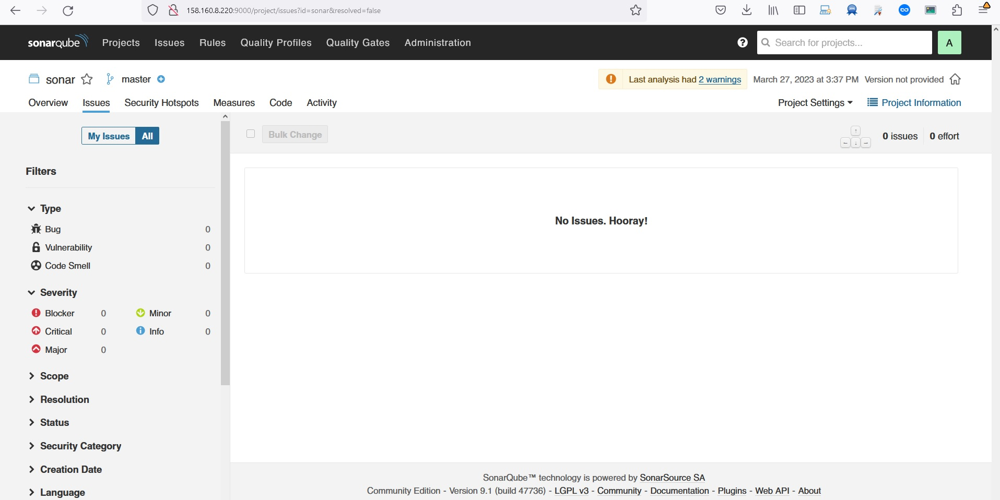

# Домашнее задание к занятию 9 «Процессы CI/CD»

## Подготовка к выполнению

1. Создайте два VM в Yandex Cloud с параметрами: 2CPU 4RAM Centos7 (остальное по минимальным требованиям).
2. Пропишите в [inventory](./infrastructure/inventory/cicd/hosts.yml) [playbook](./infrastructure/site.yml) созданные хосты.
3. Добавьте в [files](./infrastructure/files/) файл со своим публичным ключом (id_rsa.pub). Если ключ называется иначе — найдите таску в плейбуке, которая использует id_rsa.pub имя, и исправьте на своё.
4. Запустите playbook, ожидайте успешного завершения.
5. Проверьте готовность SonarQube через [браузер](http://localhost:9000).
6. Зайдите под admin\admin, поменяйте пароль на свой.
7.  Проверьте готовность Nexus через [бразуер](http://localhost:8081).
8. Подключитесь под admin\admin123, поменяйте пароль, сохраните анонимный доступ.

## Знакомоство с SonarQube
```
ansible-playbook site.yml -i inventory/cicd/hosts.yml

[WARNING]: Collection ansible.posix does not support Ansible version 2.14.3

PLAY [Get OpenJDK installed] *******************************************************************************************************************************************************************

TASK [Gathering Facts] *************************************************************************************************************************************************************************
ok: [sonar-01]

TASK [install unzip] ***************************************************************************************************************************************************************************
ok: [sonar-01]

TASK [Upload .tar.gz file conaining binaries from remote storage] ******************************************************************************************************************************
ok: [sonar-01]

TASK [Ensure installation dir exists] **********************************************************************************************************************************************************
ok: [sonar-01]

TASK [Extract java in the installation directory] **********************************************************************************************************************************************
skipping: [sonar-01]

TASK [Export environment variables] ************************************************************************************************************************************************************
ok: [sonar-01]

PLAY [Get PostgreSQL installed] ****************************************************************************************************************************************************************

TASK [Gathering Facts] *************************************************************************************************************************************************************************
ok: [sonar-01]

TASK [Change repo file] ************************************************************************************************************************************************************************
ok: [sonar-01]

TASK [Install PostgreSQL repos] ****************************************************************************************************************************************************************
ok: [sonar-01]

TASK [Install PostgreSQL] **********************************************************************************************************************************************************************
ok: [sonar-01]

TASK [Init template1 DB] ***********************************************************************************************************************************************************************
changed: [sonar-01]

TASK [Start pgsql service] *********************************************************************************************************************************************************************
ok: [sonar-01]

TASK [Create user in system] *******************************************************************************************************************************************************************
ok: [sonar-01]

TASK [Create user for Sonar in PostgreSQL] *****************************************************************************************************************************************************
changed: [sonar-01]

TASK [Change password for Sonar user in PostgreSQL] ********************************************************************************************************************************************
changed: [sonar-01]

TASK [Create Sonar DB] *************************************************************************************************************************************************************************
changed: [sonar-01]

TASK [Copy pg_hba.conf] ************************************************************************************************************************************************************************
ok: [sonar-01]

PLAY [Prepare Sonar host] **********************************************************************************************************************************************************************

TASK [Gathering Facts] *************************************************************************************************************************************************************************
ok: [sonar-01]

TASK [Create group in system] ******************************************************************************************************************************************************************
ok: [sonar-01]

TASK [Create user in system] *******************************************************************************************************************************************************************
ok: [sonar-01]

TASK [Set up ssh key to access for managed node] ***********************************************************************************************************************************************
ok: [sonar-01]

TASK [Allow group to have passwordless sudo] ***************************************************************************************************************************************************
ok: [sonar-01]

TASK [Increase Virtual Memory] *****************************************************************************************************************************************************************
ok: [sonar-01]

TASK [Reboot VM] *******************************************************************************************************************************************************************************
changed: [sonar-01]

PLAY [Get Sonarqube installed] *****************************************************************************************************************************************************************

TASK [Gathering Facts] *************************************************************************************************************************************************************************
ok: [sonar-01]

TASK [Get distrib ZIP] *************************************************************************************************************************************************************************
ok: [sonar-01]

TASK [Unzip Sonar] *****************************************************************************************************************************************************************************
skipping: [sonar-01]

TASK [Move Sonar into place.] ******************************************************************************************************************************************************************
changed: [sonar-01]

TASK [Configure SonarQube JDBC settings for PostgreSQL.] ***************************************************************************************************************************************
changed: [sonar-01] => (item={'regexp': '^sonar.jdbc.username', 'line': 'sonar.jdbc.username=sonar'})
changed: [sonar-01] => (item={'regexp': '^sonar.jdbc.password', 'line': 'sonar.jdbc.password=sonar'})
changed: [sonar-01] => (item={'regexp': '^sonar.jdbc.url', 'line': 'sonar.jdbc.url=jdbc:postgresql://localhost:5432/sonar?useUnicode=true&characterEncoding=utf8&rewriteBatchedStatements=true&useConfigs=maxPerformance'})
changed: [sonar-01] => (item={'regexp': '^sonar.web.context', 'line': 'sonar.web.context='})

TASK [Generate wrapper.conf] *******************************************************************************************************************************************************************
changed: [sonar-01]

TASK [Symlink sonar bin.] **********************************************************************************************************************************************************************
ok: [sonar-01]

TASK [Copy SonarQube systemd unit file into place (for systemd systems).] **********************************************************************************************************************
ok: [sonar-01]

TASK [Ensure Sonar is running and set to start on boot.] ***************************************************************************************************************************************
changed: [sonar-01]

TASK [Allow Sonar time to build on first start.] ***********************************************************************************************************************************************
skipping: [sonar-01]

TASK [Make sure Sonar is responding on the configured port.] ***********************************************************************************************************************************
ok: [sonar-01]

PLAY [Get Nexus installed] *********************************************************************************************************************************************************************

TASK [Gathering Facts] *************************************************************************************************************************************************************************
ok: [nexus-01]

TASK [Create Nexus group] **********************************************************************************************************************************************************************
changed: [nexus-01]

TASK [Create Nexus user] ***********************************************************************************************************************************************************************
changed: [nexus-01]

TASK [Install JDK] *****************************************************************************************************************************************************************************
changed: [nexus-01]

TASK [Create Nexus directories] ****************************************************************************************************************************************************************
changed: [nexus-01] => (item=/home/nexus/log)
changed: [nexus-01] => (item=/home/nexus/sonatype-work/nexus3)
changed: [nexus-01] => (item=/home/nexus/sonatype-work/nexus3/etc)
changed: [nexus-01] => (item=/home/nexus/pkg)
changed: [nexus-01] => (item=/home/nexus/tmp)

TASK [Download Nexus] **************************************************************************************************************************************************************************
[WARNING]: Module remote_tmp /home/nexus/.ansible/tmp did not exist and was created with a mode of 0700, this may cause issues when running as another user. To avoid this, create the
remote_tmp dir with the correct permissions manually
changed: [nexus-01]

TASK [Unpack Nexus] ****************************************************************************************************************************************************************************
changed: [nexus-01]

TASK [Link to Nexus Directory] *****************************************************************************************************************************************************************
changed: [nexus-01]

TASK [Add NEXUS_HOME for Nexus user] ***********************************************************************************************************************************************************
changed: [nexus-01]

TASK [Add run_as_user to Nexus.rc] *************************************************************************************************************************************************************
changed: [nexus-01]

TASK [Raise nofile limit for Nexus user] *******************************************************************************************************************************************************
changed: [nexus-01]

TASK [Create Nexus service for SystemD] ********************************************************************************************************************************************************
changed: [nexus-01]

TASK [Ensure Nexus service is enabled for SystemD] *********************************************************************************************************************************************
changed: [nexus-01]

TASK [Create Nexus vmoptions] ******************************************************************************************************************************************************************
changed: [nexus-01]

TASK [Create Nexus properties] *****************************************************************************************************************************************************************
changed: [nexus-01]

TASK [Lower Nexus disk space threshold] ********************************************************************************************************************************************************
skipping: [nexus-01]

TASK [Start Nexus service if enabled] **********************************************************************************************************************************************************
changed: [nexus-01]

TASK [Ensure Nexus service is restarted] *******************************************************************************************************************************************************
skipping: [nexus-01]

TASK [Wait for Nexus port if started] **********************************************************************************************************************************************************
ok: [nexus-01]

PLAY RECAP *************************************************************************************************************************************************************************************
nexus-01                   : ok=17   changed=15   unreachable=0    failed=0    skipped=2    rescued=0    ignored=0
sonar-01                   : ok=32   changed=9    unreachable=0    failed=0    skipped=3    rescued=0    ignored=0

```

### Основная часть

1. Создайте новый проект, название произвольное.
2. Скачайте пакет sonar-scanner, который вам предлагает скачать SonarQube.
```
[https://docs.sonarqube.org/latest/analyzing-source-code/scanners/sonarscanner/]
```
3. Сделайте так, чтобы binary был доступен через вызов в shell (или поменяйте переменную PATH, или любой другой, удобный вам способ).
```
root@promitey:/home/srg/0903/sonar-scanner-4.8.0.2856-linux/bin# export PATH=$(pwd):$PATH

```

4. Проверьте `sonar-scanner --version`.
```
root@promitey:/home/srg/0903# sonar-scanner --version
INFO: Scanner configuration file: /home/srg/0903/sonar-scanner-4.8.0.2856-linux/conf/sonar-scanner.properties
INFO: Project root configuration file: NONE
INFO: SonarScanner 4.8.0.2856
INFO: Java 11.0.17 Eclipse Adoptium (64-bit)
INFO: Linux 5.15.0-56-generic amd64

```

5. Запустите анализатор против кода из директории [example](./example) с дополнительным ключом `-Dsonar.coverage.exclusions=fail.py`.
```
root@promitey:/home/srg/0903# sonar-scanner \
>   -Dsonar.projectKey=sonar \
>   -Dsonar.sources=. \
>   -Dsonar.host.url=http://158.160.8.220:9000 \
>   -Dsonar.login=8543de283d94a381ab6609436c14a21500429c0c -Dsonar.coverage.exclusions=fail.py
INFO: Scanner configuration file: /home/srg/0903/sonar-scanner-4.8.0.2856-linux/conf/sonar-scanner.properties
INFO: Project root configuration file: NONE
INFO: SonarScanner 4.8.0.2856
INFO: Java 11.0.17 Eclipse Adoptium (64-bit)
INFO: Linux 5.15.0-56-generic amd64
INFO: User cache: /root/.sonar/cache
INFO: Analyzing on SonarQube server 9.1.0
INFO: Default locale: "ru_RU", source code encoding: "UTF-8" (analysis is platform dependent)
INFO: Load global settings
INFO: Load global settings (done) | time=193ms
INFO: Server id: 9CFC3560-AYciBQZs3akxO-DPNFwD
INFO: User cache: /root/.sonar/cache
INFO: Load/download plugins
INFO: Load plugins index
INFO: Load plugins index (done) | time=147ms
INFO: Load/download plugins (done) | time=21760ms
INFO: Process project properties
INFO: Process project properties (done) | time=14ms
INFO: Execute project builders
INFO: Execute project builders (done) | time=2ms
INFO: Project key: sonar
INFO: Base dir: /home/srg/0903
INFO: Working dir: /home/srg/0903/.scannerwork
INFO: Load project settings for component key: 'sonar'
INFO: Load project settings for component key: 'sonar' (done) | time=47ms
INFO: Load quality profiles
INFO: Load quality profiles (done) | time=532ms
INFO: Load active rules
INFO: Load active rules (done) | time=3641ms
WARN: SCM provider autodetection failed. Please use "sonar.scm.provider" to define SCM of your project, or disable the SCM Sensor in the project settings.
INFO: Indexing files...
INFO: Project configuration:
INFO:   Excluded sources for coverage: fail.py
INFO: 284 files indexed
INFO: Quality profile for py: Sonar way
INFO: Quality profile for xml: Sonar way
INFO: ------------- Run sensors on module sonar
INFO: Load metrics repository
INFO: Load metrics repository (done) | time=67ms
INFO: Sensor Python Sensor [python]
WARN: Your code is analyzed as compatible with python 2 and 3 by default. This will prevent the detection of issues specific to python 2 or python 3. You can get a more precise analysis by setting a python version in your configuration via the parameter "sonar.python.version"
INFO: Starting global symbols computation
INFO: 1 source file to be analyzed
INFO: Load project repositories
INFO: Load project repositories (done) | time=42ms
INFO: 1/1 source file has been analyzed
INFO: Starting rules execution
INFO: 1 source file to be analyzed
INFO: 1/1 source file has been analyzed
INFO: Sensor Python Sensor [python] (done) | time=2132ms
INFO: Sensor Cobertura Sensor for Python coverage [python]
INFO: Sensor Cobertura Sensor for Python coverage [python] (done) | time=29ms
INFO: Sensor PythonXUnitSensor [python]
INFO: Sensor PythonXUnitSensor [python] (done) | time=12ms
INFO: Sensor CSS Rules [cssfamily]
INFO: No CSS, PHP, HTML or VueJS files are found in the project. CSS analysis is skipped.
INFO: Sensor CSS Rules [cssfamily] (done) | time=2ms
INFO: Sensor JaCoCo XML Report Importer [jacoco]
INFO: 'sonar.coverage.jacoco.xmlReportPaths' is not defined. Using default locations: target/site/jacoco/jacoco.xml,target/site/jacoco-it/jacoco.xml,build/reports/jacoco/test/jacocoTestReport.xml
INFO: No report imported, no coverage information will be imported by JaCoCo XML Report Importer
INFO: Sensor JaCoCo XML Report Importer [jacoco] (done) | time=7ms
INFO: Sensor C# Project Type Information [csharp]
INFO: Sensor C# Project Type Information [csharp] (done) | time=3ms
INFO: Sensor C# Analysis Log [csharp]
INFO: Sensor C# Analysis Log [csharp] (done) | time=24ms
INFO: Sensor C# Properties [csharp]
INFO: Sensor C# Properties [csharp] (done) | time=0ms
INFO: Sensor JavaXmlSensor [java]
INFO: 1 source file to be analyzed
INFO: 1/1 source file has been analyzed
INFO: Sensor JavaXmlSensor [java] (done) | time=312ms
INFO: Sensor HTML [web]
INFO: Sensor HTML [web] (done) | time=7ms
INFO: Sensor XML Sensor [xml]
INFO: 1 source file to be analyzed
INFO: 1/1 source file has been analyzed
INFO: Sensor XML Sensor [xml] (done) | time=277ms
INFO: Sensor VB.NET Project Type Information [vbnet]
INFO: Sensor VB.NET Project Type Information [vbnet] (done) | time=2ms
INFO: Sensor VB.NET Analysis Log [vbnet]
INFO: Sensor VB.NET Analysis Log [vbnet] (done) | time=24ms
INFO: Sensor VB.NET Properties [vbnet]
INFO: Sensor VB.NET Properties [vbnet] (done) | time=0ms
INFO: ------------- Run sensors on project
INFO: Sensor Zero Coverage Sensor
INFO: Sensor Zero Coverage Sensor (done) | time=20ms
INFO: SCM Publisher No SCM system was detected. You can use the 'sonar.scm.provider' property to explicitly specify it.
INFO: CPD Executor Calculating CPD for 1 file
INFO: CPD Executor CPD calculation finished (done) | time=16ms
INFO: Analysis report generated in 124ms, dir size=104,5 kB
INFO: Analysis report compressed in 33ms, zip size=15,7 kB
INFO: Analysis report uploaded in 74ms
INFO: ANALYSIS SUCCESSFUL, you can browse http://158.160.8.220:9000/dashboard?id=sonar
INFO: Note that you will be able to access the updated dashboard once the server has processed the submitted analysis report
INFO: More about the report processing at http://158.160.8.220:9000/api/ce/task?id=AYcjEnx5EfVhGhjjjdRx
INFO: Analysis total time: 10.958 s
INFO: ------------------------------------------------------------------------
INFO: EXECUTION SUCCESS
INFO: ------------------------------------------------------------------------
INFO: Total time: 38.268s
INFO: Final Memory: 17M/60M
INFO: ------------------------------------------------------------------------
root@promitey:/home/srg/0903#
```

6. Посмотрите результат в интерфейсе.
7. Исправьте ошибки, которые он выявил, включая warnings.
8. Запустите анализатор повторно — проверьте, что QG пройдены успешно.
9. Сделайте скриншот успешного прохождения анализа, приложите к решению ДЗ.

<p align="center">
  
</p>
<p align="center">
  
</p>

## Знакомство с Nexus

### Основная часть

1. В репозиторий `maven-public` загрузите артефакт с GAV-параметрами:

 *    groupId: netology;
 *    artifactId: java;
 *    version: 8_282;
 *    classifier: distrib;
 *    type: tar.gz.
   
2. В него же загрузите такой же артефакт, но с version: 8_102.
3. Проверьте, что все файлы загрузились успешно.
4. В ответе пришлите файл `maven-metadata.xml` для этого артефекта.
<p>
[https://github.com/awertoss/devops-netology/blob/main/09-ci-03-cicd/maven-metadata.xml]  
</p>


### Знакомство с Maven

### Подготовка к выполнению

1. Скачайте дистрибутив с [maven](https://maven.apache.org/download.cgi).
2. Разархивируйте, сделайте так, чтобы binary был доступен через вызов в shell (или поменяйте переменную PATH, или любой другой, удобный вам способ).
```
root@promitey:/home/srg/0903/apache-maven-3.9.1/bin# export PATH=$(pwd):$PATH

```
3. Удалите из `apache-maven-<version>/conf/settings.xml` упоминание о правиле, отвергающем HTTP- соединение — раздел mirrors —> id: my-repository-http-unblocker.
4. Проверьте `mvn --version`.
```
root@promitey:/home/srg/0903/apache-maven-3.9.1/bin# mvn -version
Apache Maven 3.9.1 (2e178502fcdbffc201671fb2537d0cb4b4cc58f8)
Maven home: /home/srg/0903/apache-maven-3.9.1
Java version: 11.0.18, vendor: Ubuntu, runtime: /usr/lib/jvm/java-11-openjdk-amd64
Default locale: ru_RU, platform encoding: UTF-8
OS name: "linux", version: "5.15.0-56-generic", arch: "amd64", family: "unix"

```

5. Заберите директорию [mvn](./mvn) с pom.

### Основная часть

1. Поменяйте в `pom.xml` блок с зависимостями под ваш артефакт из первого пункта задания для Nexus (java с версией 8_282).
2. Запустите команду `mvn package` в директории с `pom.xml`, ожидайте успешного окончания.
3. Проверьте директорию `~/.m2/repository/`, найдите ваш артефакт.
4. В ответе пришлите исправленный файл `pom.xml`.
<p>
[https://github.com/awertoss/devops-netology/blob/main/09-ci-03-cicd/pom.xml]
</p>

---

### Как оформить решение задания

Выполненное домашнее задание пришлите в виде ссылки на .md-файл в вашем репозитории.

---
