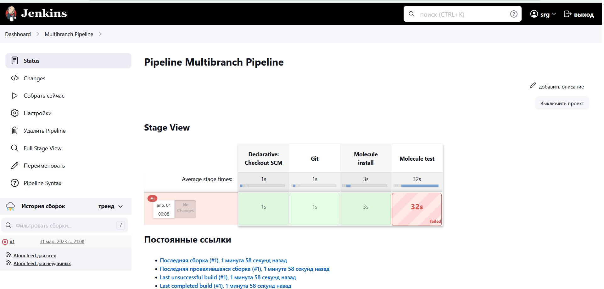
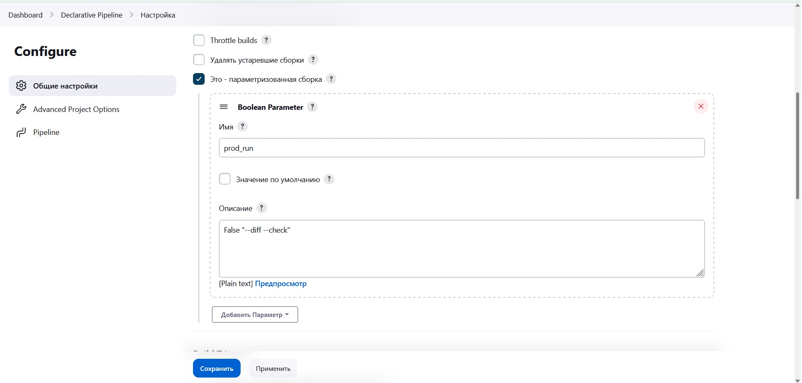
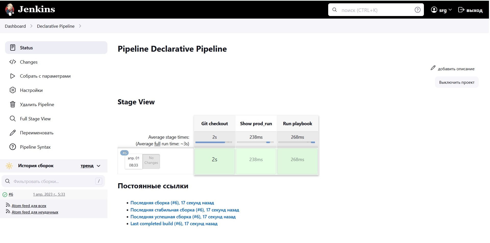

# Домашнее задание к занятию 10 «Jenkins»

## Подготовка к выполнению

1. Создать два VM: для jenkins-master и jenkins-agent.
2. Установить Jenkins при помощи playbook.
3. Запустить и проверить работоспособность.
4. Сделать первоначальную настройку.
```
srg@promitey:~/0904/infrastructure$ ansible-playbook site.yml -i inventory/cicd/hosts.yml
[WARNING]: Collection ansible.posix does not support Ansible version 2.14.3

PLAY [Preapre all hosts] ***********************************************************************************************************************************************

TASK [Gathering Facts] *************************************************************************************************************************************************
ok: [jenkins-agent-01]
ok: [jenkins-master-01]

TASK [Create group] ****************************************************************************************************************************************************
changed: [jenkins-master-01]
changed: [jenkins-agent-01]

TASK [Create user] *****************************************************************************************************************************************************
changed: [jenkins-master-01]
changed: [jenkins-agent-01]

TASK [Install JDK] *****************************************************************************************************************************************************
changed: [jenkins-agent-01]
changed: [jenkins-master-01]

PLAY [Get Jenkins master installed] ************************************************************************************************************************************

TASK [Gathering Facts] *************************************************************************************************************************************************
ok: [jenkins-master-01]

TASK [Get repo Jenkins] ************************************************************************************************************************************************
changed: [jenkins-master-01]

TASK [Add Jenkins key] *************************************************************************************************************************************************
changed: [jenkins-master-01]

TASK [Install epel-release] ********************************************************************************************************************************************
changed: [jenkins-master-01]

TASK [Install Jenkins and requirements] ********************************************************************************************************************************
changed: [jenkins-master-01]

TASK [Ensure jenkins agents are present in known_hosts file] ***********************************************************************************************************
# 158.160.17.138:22 SSH-2.0-OpenSSH_7.4
# 158.160.17.138:22 SSH-2.0-OpenSSH_7.4
# 158.160.17.138:22 SSH-2.0-OpenSSH_7.4
# 158.160.17.138:22 SSH-2.0-OpenSSH_7.4
# 158.160.17.138:22 SSH-2.0-OpenSSH_7.4
changed: [jenkins-master-01] => (item=jenkins-agent-01)
[WARNING]: Module remote_tmp /home/jenkins/.ansible/tmp did not exist and was created with a mode of 0700, this may cause issues when running as another user. To avoid
this, create the remote_tmp dir with the correct permissions manually

TASK [Start Jenkins] ***************************************************************************************************************************************************
changed: [jenkins-master-01]

PLAY [Prepare jenkins agent] *******************************************************************************************************************************************

TASK [Gathering Facts] *************************************************************************************************************************************************
ok: [jenkins-agent-01]

TASK [Add master publickey into authorized_key] ************************************************************************************************************************
changed: [jenkins-agent-01]

TASK [Create agent_dir] ************************************************************************************************************************************************
changed: [jenkins-agent-01]

TASK [Add docker repo] *************************************************************************************************************************************************
changed: [jenkins-agent-01]

TASK [Install some required] *******************************************************************************************************************************************
changed: [jenkins-agent-01]

TASK [Update pip] ******************************************************************************************************************************************************
changed: [jenkins-agent-01]

TASK [Install Ansible] *************************************************************************************************************************************************
changed: [jenkins-agent-01]

TASK [Reinstall Selinux] ***********************************************************************************************************************************************
changed: [jenkins-agent-01]

TASK [Add local to PATH] ***********************************************************************************************************************************************
changed: [jenkins-agent-01]

TASK [Create docker group] *********************************************************************************************************************************************
ok: [jenkins-agent-01]

TASK [Add jenkinsuser to dockergroup] **********************************************************************************************************************************
changed: [jenkins-agent-01]

TASK [Restart docker] **************************************************************************************************************************************************
changed: [jenkins-agent-01]

TASK [Install agent.jar] ***********************************************************************************************************************************************
changed: [jenkins-agent-01]

PLAY RECAP *************************************************************************************************************************************************************
jenkins-agent-01           : ok=17   changed=14   unreachable=0    failed=0    skipped=0    rescued=0    ignored=0
jenkins-master-01          : ok=11   changed=9    unreachable=0    failed=0    skipped=0    rescued=0    ignored=0

srg@promitey:~/0904/infrastructure$

```
## Основная часть

1. Сделать Freestyle Job, который будет запускать `molecule test` из любого вашего репозитория с ролью.

Были ошибки подключения к github. В мастере изменил файл known_hosts

```
su - jenkins
ssh-keyscan github.com >> ~/.ssh/known_hosts
```
Были ошибки в molecule "Unsupported parametrs".
```
Обновил python.

jenkins@promitey:~$ python3 -V
Python 3.10.6


```

```
jenkins@promitey:~$ ansible --version
ansible [core 2.14.4]
  config file = None
  configured module search path = ['/home/jenkins/.ansible/plugins/modules', '/usr/share/ansible/plugins/modules']
  ansible python module location = /home/jenkins/.local/lib/python3.10/site-packages/ansible
  ansible collection location = /home/jenkins/.ansible/collections:/usr/share/ansible/collections
  executable location = /home/jenkins/.local/bin/ansible
  python version = 3.10.6 (main, Mar 10 2023, 10:55:28) [GCC 11.3.0] (/usr/bin/python3)
  jinja version = 3.0.3
  libyaml = True

```

Переустановил виртуальные машины мастера и агента.

<p>
Шаги сборки:
</p>

```
pip3 install "molecule==3.5.2" "molecule_docker"
#python pip install molecule==3.5.2 molecule_docker
molecule --version
#docker pull aragast/netology:latest
pwd
ls -l
#molecule init scenario --driver-name docker
molecule test -s centos
```

<details><summary>Logs</summary>
 
```
Started by user srg
Running as SYSTEM
Building remotely on agent2 (linux2) in workspace /opt/jenkins_agent/workspace/Freestyle
The recommended git tool is: NONE
using credential 7b188317-b12a-4e64-9c1f-933df2cedf29
 > git rev-parse --resolve-git-dir /opt/jenkins_agent/workspace/Freestyle/.git # timeout=10
Fetching changes from the remote Git repository
 > git config remote.origin.url git@github.com:awertoss/vector-role.git # timeout=10
Fetching upstream changes from git@github.com:awertoss/vector-role.git
 > git --version # timeout=10
 > git --version # 'git version 2.34.1'
using GIT_SSH to set credentials 
Verifying host key using known hosts file
 > git fetch --tags --force --progress -- git@github.com:awertoss/vector-role.git +refs/heads/*:refs/remotes/origin/* # timeout=10
 > git rev-parse refs/remotes/origin/main^{commit} # timeout=10
Checking out Revision beff809904acf042c48489d055526fda0e2005fb (refs/remotes/origin/main)
 > git config core.sparsecheckout # timeout=10
 > git checkout -f beff809904acf042c48489d055526fda0e2005fb # timeout=10
Commit message: "Create Jenkinsfile"
 > git rev-list --no-walk beff809904acf042c48489d055526fda0e2005fb # timeout=10
[Freestyle] $ /bin/sh -xe /tmp/jenkins1690886110135707391.sh
+ whoami
jenkins
+ ansible --version
ansible [core 2.14.4]
  config file = None
  configured module search path = ['/home/jenkins/.ansible/plugins/modules', '/usr/share/ansible/plugins/modules']
  ansible python module location = /home/jenkins/.local/lib/python3.10/site-packages/ansible
  ansible collection location = /home/jenkins/.ansible/collections:/usr/share/ansible/collections
  executable location = /usr/local/bin/ansible
  python version = 3.10.6 (main, Mar 10 2023, 10:55:28) [GCC 11.3.0] (/usr/bin/python3)
  jinja version = 3.0.3
  libyaml = True
+ pip3 install molecule==3.5.2 molecule_docker
Requirement already satisfied: molecule==3.5.2 in /usr/local/lib/python3.10/dist-packages (3.5.2)
Requirement already satisfied: molecule_docker in /usr/local/lib/python3.10/dist-packages (1.1.0)
Requirement already satisfied: cerberus!=1.3.3,!=1.3.4,>=1.3.1 in /usr/local/lib/python3.10/dist-packages (from molecule==3.5.2) (1.3.2)
Requirement already satisfied: pluggy<2.0,>=0.7.1 in /usr/local/lib/python3.10/dist-packages (from molecule==3.5.2) (1.0.0)
Requirement already satisfied: paramiko<3,>=2.5.0 in /usr/local/lib/python3.10/dist-packages (from molecule==3.5.2) (2.12.0)
Requirement already satisfied: selinux in /usr/lib/python3/dist-packages (from molecule==3.5.2) (3.3)
Requirement already satisfied: Jinja2>=2.11.3 in /usr/lib/python3/dist-packages (from molecule==3.5.2) (3.0.3)
Requirement already satisfied: subprocess-tee>=0.3.5 in /usr/local/lib/python3.10/dist-packages (from molecule==3.5.2) (0.4.1)
Requirement already satisfied: click<9,>=8.0 in /usr/local/lib/python3.10/dist-packages (from molecule==3.5.2) (8.1.3)
Requirement already satisfied: ansible-compat>=0.5.0 in /usr/local/lib/python3.10/dist-packages (from molecule==3.5.2) (3.0.1)
Requirement already satisfied: PyYAML<6,>=5.1 in /usr/lib/python3/dist-packages (from molecule==3.5.2) (5.4.1)
Requirement already satisfied: cookiecutter>=1.7.3 in /usr/local/lib/python3.10/dist-packages (from molecule==3.5.2) (2.1.1)
Requirement already satisfied: click-help-colors>=0.9 in /usr/local/lib/python3.10/dist-packages (from molecule==3.5.2) (0.9.1)
Requirement already satisfied: enrich>=1.2.5 in /usr/local/lib/python3.10/dist-packages (from molecule==3.5.2) (1.2.7)
Requirement already satisfied: packaging in /usr/local/lib/python3.10/dist-packages (from molecule==3.5.2) (23.0)
Requirement already satisfied: rich>=9.5.1 in /usr/lib/python3/dist-packages (from molecule==3.5.2) (11.2.0)
Requirement already satisfied: docker>=4.3.1 in /usr/local/lib/python3.10/dist-packages (from molecule_docker) (6.0.1)
Requirement already satisfied: requests in /usr/local/lib/python3.10/dist-packages (from molecule_docker) (2.28.2)
Requirement already satisfied: ansible-core>=2.12 in /home/jenkins/.local/lib/python3.10/site-packages (from ansible-compat>=0.5.0->molecule==3.5.2) (2.14.4)
Requirement already satisfied: jsonschema>=4.6.0 in /usr/local/lib/python3.10/dist-packages (from ansible-compat>=0.5.0->molecule==3.5.2) (4.17.3)
Requirement already satisfied: setuptools in /usr/lib/python3/dist-packages (from cerberus!=1.3.3,!=1.3.4,>=1.3.1->molecule==3.5.2) (59.6.0)
Requirement already satisfied: python-slugify>=4.0.0 in /usr/local/lib/python3.10/dist-packages (from cookiecutter>=1.7.3->molecule==3.5.2) (8.0.1)
Requirement already satisfied: binaryornot>=0.4.4 in /usr/local/lib/python3.10/dist-packages (from cookiecutter>=1.7.3->molecule==3.5.2) (0.4.4)
Requirement already satisfied: jinja2-time>=0.2.0 in /usr/local/lib/python3.10/dist-packages (from cookiecutter>=1.7.3->molecule==3.5.2) (0.2.0)
Requirement already satisfied: urllib3>=1.26.0 in /usr/lib/python3/dist-packages (from docker>=4.3.1->molecule_docker) (1.26.5)
Requirement already satisfied: websocket-client>=0.32.0 in /usr/local/lib/python3.10/dist-packages (from docker>=4.3.1->molecule_docker) (1.5.1)
Requirement already satisfied: bcrypt>=3.1.3 in /usr/lib/python3/dist-packages (from paramiko<3,>=2.5.0->molecule==3.5.2) (3.2.0)
Requirement already satisfied: pynacl>=1.0.1 in /usr/local/lib/python3.10/dist-packages (from paramiko<3,>=2.5.0->molecule==3.5.2) (1.5.0)
Requirement already satisfied: cryptography>=2.5 in /usr/lib/python3/dist-packages (from paramiko<3,>=2.5.0->molecule==3.5.2) (3.4.8)
Requirement already satisfied: six in /usr/lib/python3/dist-packages (from paramiko<3,>=2.5.0->molecule==3.5.2) (1.16.0)
Requirement already satisfied: charset-normalizer<4,>=2 in /usr/local/lib/python3.10/dist-packages (from requests->molecule_docker) (3.0.1)
Requirement already satisfied: idna<4,>=2.5 in /usr/lib/python3/dist-packages (from requests->molecule_docker) (3.3)
Requirement already satisfied: certifi>=2017.4.17 in /usr/lib/python3/dist-packages (from requests->molecule_docker) (2020.6.20)
Requirement already satisfied: colorama<0.5.0,>=0.4.0 in /usr/local/lib/python3.10/dist-packages (from rich>=9.5.1->molecule==3.5.2) (0.4.6)
Requirement already satisfied: pygments<3.0.0,>=2.6.0 in /usr/lib/python3/dist-packages (from rich>=9.5.1->molecule==3.5.2) (2.11.2)
Requirement already satisfied: commonmark<0.10.0,>=0.9.0 in /usr/lib/python3/dist-packages (from rich>=9.5.1->molecule==3.5.2) (0.9.1)
Requirement already satisfied: resolvelib<0.9.0,>=0.5.3 in /usr/local/lib/python3.10/dist-packages (from ansible-core>=2.12->ansible-compat>=0.5.0->molecule==3.5.2) (0.8.1)
Requirement already satisfied: chardet>=3.0.2 in /usr/local/lib/python3.10/dist-packages (from binaryornot>=0.4.4->cookiecutter>=1.7.3->molecule==3.5.2) (5.1.0)
Requirement already satisfied: arrow in /usr/local/lib/python3.10/dist-packages (from jinja2-time>=0.2.0->cookiecutter>=1.7.3->molecule==3.5.2) (1.2.3)
Requirement already satisfied: attrs>=17.4.0 in /usr/lib/python3/dist-packages (from jsonschema>=4.6.0->ansible-compat>=0.5.0->molecule==3.5.2) (21.2.0)
Requirement already satisfied: pyrsistent!=0.17.0,!=0.17.1,!=0.17.2,>=0.14.0 in /usr/lib/python3/dist-packages (from jsonschema>=4.6.0->ansible-compat>=0.5.0->molecule==3.5.2) (0.18.1)
Requirement already satisfied: cffi>=1.4.1 in /usr/local/lib/python3.10/dist-packages (from pynacl>=1.0.1->paramiko<3,>=2.5.0->molecule==3.5.2) (1.15.1)
Requirement already satisfied: text-unidecode>=1.3 in /usr/local/lib/python3.10/dist-packages (from python-slugify>=4.0.0->cookiecutter>=1.7.3->molecule==3.5.2) (1.3)
Requirement already satisfied: pycparser in /usr/local/lib/python3.10/dist-packages (from cffi>=1.4.1->pynacl>=1.0.1->paramiko<3,>=2.5.0->molecule==3.5.2) (2.21)
Requirement already satisfied: python-dateutil>=2.7.0 in /usr/local/lib/python3.10/dist-packages (from arrow->jinja2-time>=0.2.0->cookiecutter>=1.7.3->molecule==3.5.2) (2.8.2)
+ molecule --version
molecule 3.5.2 using python 3.10 
    ansible:2.14.4
    delegated:3.5.2 from molecule
    docker:1.1.0 from molecule_docker requiring collections: community.docker>=1.9.1
+ molecule test -s centos
INFO     centos scenario test matrix: dependency, lint, cleanup, destroy, syntax, create, prepare, converge, idempotence, side_effect, verify, cleanup, destroy
INFO     Performing prerun...
INFO     Set ANSIBLE_LIBRARY=/home/jenkins/.cache/ansible-compat/d13231/modules:/home/jenkins/.ansible/plugins/modules:/usr/share/ansible/plugins/modules
INFO     Set ANSIBLE_COLLECTIONS_PATH=/home/jenkins/.cache/ansible-compat/d13231/collections:/home/jenkins/.ansible/collections:/usr/share/ansible/collections
INFO     Set ANSIBLE_ROLES_PATH=/home/jenkins/.cache/ansible-compat/d13231/roles:/home/jenkins/.ansible/roles:/usr/share/ansible/roles:/etc/ansible/roles
INFO     Running centos > dependency
WARNING  Skipping, missing the requirements file.
WARNING  Skipping, missing the requirements file.
INFO     Running centos > lint
INFO     Lint is disabled.
INFO     Running centos > cleanup
WARNING  Skipping, cleanup playbook not configured.
INFO     Running centos > destroy
INFO     Sanity checks: 'docker'

PLAY [Destroy] *****************************************************************

TASK [Destroy molecule instance(s)] ********************************************
changed: [localhost] => (item=instance)

TASK [Wait for instance(s) deletion to complete] *******************************
failed: [localhost] (item=instance) => {"ansible_job_id": "107679263264.3311", "ansible_loop_var": "item", "attempts": 1, "changed": false, "finished": 1, "item": {"ansible_job_id": "107679263264.3311", "ansible_loop_var": "item", "changed": true, "failed": 0, "finished": 0, "item": {"image": "docker.io/pycontribs/centos:7", "name": "instance", "pre_build_image": true}, "results_file": "/home/jenkins/.ansible_async/107679263264.3311", "started": 1}, "msg": "could not find job", "results_file": "/home/jenkins/.ansible_async/107679263264.3311", "started": 1, "stderr": "", "stderr_lines": [], "stdout": "", "stdout_lines": []}

PLAY RECAP *********************************************************************
localhost                  : ok=1    changed=1    unreachable=0    failed=1    skipped=0    rescued=0    ignored=0

CRITICAL Ansible return code was 2, command was: ['ansible-playbook', '--inventory', '/home/jenkins/.cache/molecule/Freestyle/centos/inventory', '--skip-tags', 'molecule-notest,notest', '/usr/local/lib/python3.10/dist-packages/molecule_docker/playbooks/destroy.yml']
WARNING  An error occurred during the test sequence action: 'destroy'. Cleaning up.
INFO     Running centos > cleanup
WARNING  Skipping, cleanup playbook not configured.
INFO     Running centos > destroy

PLAY [Destroy] *****************************************************************

TASK [Destroy molecule instance(s)] ********************************************
changed: [localhost] => (item=instance)

TASK [Wait for instance(s) deletion to complete] *******************************
failed: [localhost] (item=instance) => {"ansible_job_id": "620509806375.3371", "ansible_loop_var": "item", "attempts": 1, "changed": false, "finished": 1, "item": {"ansible_job_id": "620509806375.3371", "ansible_loop_var": "item", "changed": true, "failed": 0, "finished": 0, "item": {"image": "docker.io/pycontribs/centos:7", "name": "instance", "pre_build_image": true}, "results_file": "/home/jenkins/.ansible_async/620509806375.3371", "started": 1}, "msg": "could not find job", "results_file": "/home/jenkins/.ansible_async/620509806375.3371", "started": 1, "stderr": "", "stderr_lines": [], "stdout": "", "stdout_lines": []}

PLAY RECAP *********************************************************************
localhost                  : ok=1    changed=1    unreachable=0    failed=1    skipped=0    rescued=0    ignored=0

CRITICAL Ansible return code was 2, command was: ['ansible-playbook', '--inventory', '/home/jenkins/.cache/molecule/Freestyle/centos/inventory', '--skip-tags', 'molecule-notest,notest', '/usr/local/lib/python3.10/dist-packages/molecule_docker/playbooks/destroy.yml']
Build step 'Execute shell' marked build as failure
Finished: FAILURE

```
 
 </details>
 
2. Сделать Declarative Pipeline Job, который будет запускать `molecule test` из любого вашего репозитория с ролью.
 <p>
  Cкрипт:
  </p>
 
 ```
 pipeline {
    agent {
        label 'linux'
    }
    stages {
        stage('Git') {
            steps{
                git branch: 'main', credentialsId: '6808eaf8-e5cd-438d-8757-73bf421b5b47', url: 'git@github.com:awertoss/vector-role.git'
            }
        }
        stage('Molecule install') {
            steps{
                sh 'pip install molecule==3.5.2'
                sh 'pip install "ansible-lint<6.0.0"'
                sh 'pip install molecule_docker'
            }
        }
        stage('Molecule test'){
            steps{
                sh 'molecule test -s centos'
                cleanWs()
            }
        }
    }
}
 ```
 <p>
  Тест завершился с ошибкой.
  </p>
<details>
 
 ```
 Started by user srg
[Pipeline] Start of Pipeline
[Pipeline] node
Running on agent in /opt/jenkins_agent/workspace/Declarative Pipeline
[Pipeline] {
[Pipeline] stage
[Pipeline] { (Git)
[Pipeline] git
Selected Git installation does not exist. Using Default
The recommended git tool is: NONE
using credential 6808eaf8-e5cd-438d-8757-73bf421b5b47
Cloning the remote Git repository
Cloning repository git@github.com:awertoss/vector-role.git
 > git init /opt/jenkins_agent/workspace/Declarative Pipeline # timeout=10
Fetching upstream changes from git@github.com:awertoss/vector-role.git
 > git --version # timeout=10
 > git --version # 'git version 1.8.3.1'
using GIT_SSH to set credentials 
[INFO] Currently running in a labeled security context
[INFO] Currently SELinux is 'enforcing' on the host
 > /usr/bin/chcon --type=ssh_home_t /opt/jenkins_agent/workspace/Declarative Pipeline@tmp/jenkins-gitclient-ssh6751431708866755502.key
Verifying host key using known hosts file
 > git fetch --tags --progress git@github.com:awertoss/vector-role.git +refs/heads/*:refs/remotes/origin/* # timeout=10
Avoid second fetch
Checking out Revision 77f117afa2127f9c5aedda74259c0683d72e3d75 (refs/remotes/origin/main)
Commit message: "	new file:   molecule/tox/converge.yml 	new file:   molecule/tox/molecule.yml 	new file:   molecule/tox/verify.yml 	new file:   tox-requirements.txt 	new file:   tox.ini"
First time build. Skipping changelog.
[Pipeline] }
 > git config remote.origin.url git@github.com:awertoss/vector-role.git # timeout=10
 > git config --add remote.origin.fetch +refs/heads/*:refs/remotes/origin/* # timeout=10
 > git rev-parse refs/remotes/origin/main^{commit} # timeout=10
 > git config core.sparsecheckout # timeout=10
 > git checkout -f 77f117afa2127f9c5aedda74259c0683d72e3d75 # timeout=10
 > git branch -a -v --no-abbrev # timeout=10
 > git checkout -b main 77f117afa2127f9c5aedda74259c0683d72e3d75 # timeout=10
[Pipeline] // stage
[Pipeline] stage
[Pipeline] { (Molecule install)
[Pipeline] sh
+ pip install molecule==3.5.2
Defaulting to user installation because normal site-packages is not writeable
Requirement already satisfied: molecule==3.5.2 in /home/jenkins/.local/lib/python3.6/site-packages (3.5.2)
Requirement already satisfied: Jinja2>=2.11.3 in /usr/local/lib/python3.6/site-packages (from molecule==3.5.2) (3.0.3)
Requirement already satisfied: pluggy<2.0,>=0.7.1 in /home/jenkins/.local/lib/python3.6/site-packages (from molecule==3.5.2) (1.0.0)
Requirement already satisfied: click-help-colors>=0.9 in /home/jenkins/.local/lib/python3.6/site-packages (from molecule==3.5.2) (0.9.1)
Requirement already satisfied: cerberus!=1.3.3,!=1.3.4,>=1.3.1 in /home/jenkins/.local/lib/python3.6/site-packages (from molecule==3.5.2) (1.3.2)
Requirement already satisfied: selinux in /usr/local/lib/python3.6/site-packages (from molecule==3.5.2) (0.2.1)
Requirement already satisfied: importlib-metadata in /home/jenkins/.local/lib/python3.6/site-packages (from molecule==3.5.2) (4.8.3)
Requirement already satisfied: paramiko<3,>=2.5.0 in /home/jenkins/.local/lib/python3.6/site-packages (from molecule==3.5.2) (2.12.0)
Requirement already satisfied: subprocess-tee>=0.3.5 in /home/jenkins/.local/lib/python3.6/site-packages (from molecule==3.5.2) (0.3.5)
Requirement already satisfied: cookiecutter>=1.7.3 in /home/jenkins/.local/lib/python3.6/site-packages (from molecule==3.5.2) (1.7.3)
Requirement already satisfied: click<9,>=8.0 in /home/jenkins/.local/lib/python3.6/site-packages (from molecule==3.5.2) (8.0.4)
Requirement already satisfied: dataclasses in /home/jenkins/.local/lib/python3.6/site-packages (from molecule==3.5.2) (0.8)
Requirement already satisfied: packaging in /usr/local/lib/python3.6/site-packages (from molecule==3.5.2) (21.3)
Requirement already satisfied: enrich>=1.2.5 in /home/jenkins/.local/lib/python3.6/site-packages (from molecule==3.5.2) (1.2.7)
Requirement already satisfied: PyYAML<6,>=5.1 in /home/jenkins/.local/lib/python3.6/site-packages (from molecule==3.5.2) (5.4.1)
Requirement already satisfied: rich>=9.5.1 in /home/jenkins/.local/lib/python3.6/site-packages (from molecule==3.5.2) (12.6.0)
Requirement already satisfied: ansible-compat>=0.5.0 in /home/jenkins/.local/lib/python3.6/site-packages (from molecule==3.5.2) (1.0.0)
Requirement already satisfied: cached-property~=1.5 in /home/jenkins/.local/lib/python3.6/site-packages (from ansible-compat>=0.5.0->molecule==3.5.2) (1.5.2)
Requirement already satisfied: setuptools in /usr/local/lib/python3.6/site-packages (from cerberus!=1.3.3,!=1.3.4,>=1.3.1->molecule==3.5.2) (59.6.0)
Requirement already satisfied: python-slugify>=4.0.0 in /home/jenkins/.local/lib/python3.6/site-packages (from cookiecutter>=1.7.3->molecule==3.5.2) (6.1.2)
Requirement already satisfied: requests>=2.23.0 in /home/jenkins/.local/lib/python3.6/site-packages (from cookiecutter>=1.7.3->molecule==3.5.2) (2.27.1)
Requirement already satisfied: poyo>=0.5.0 in /home/jenkins/.local/lib/python3.6/site-packages (from cookiecutter>=1.7.3->molecule==3.5.2) (0.5.0)
Requirement already satisfied: jinja2-time>=0.2.0 in /home/jenkins/.local/lib/python3.6/site-packages (from cookiecutter>=1.7.3->molecule==3.5.2) (0.2.0)
Requirement already satisfied: binaryornot>=0.4.4 in /home/jenkins/.local/lib/python3.6/site-packages (from cookiecutter>=1.7.3->molecule==3.5.2) (0.4.4)
Requirement already satisfied: six>=1.10 in /home/jenkins/.local/lib/python3.6/site-packages (from cookiecutter>=1.7.3->molecule==3.5.2) (1.16.0)
Requirement already satisfied: MarkupSafe>=2.0 in /usr/local/lib64/python3.6/site-packages (from Jinja2>=2.11.3->molecule==3.5.2) (2.0.1)
Requirement already satisfied: bcrypt>=3.1.3 in /home/jenkins/.local/lib/python3.6/site-packages (from paramiko<3,>=2.5.0->molecule==3.5.2) (4.0.1)
Requirement already satisfied: cryptography>=2.5 in /usr/local/lib64/python3.6/site-packages (from paramiko<3,>=2.5.0->molecule==3.5.2) (40.0.1)
Requirement already satisfied: pynacl>=1.0.1 in /home/jenkins/.local/lib/python3.6/site-packages (from paramiko<3,>=2.5.0->molecule==3.5.2) (1.5.0)
Requirement already satisfied: zipp>=0.5 in /home/jenkins/.local/lib/python3.6/site-packages (from importlib-metadata->molecule==3.5.2) (3.6.0)
Requirement already satisfied: typing-extensions>=3.6.4 in /home/jenkins/.local/lib/python3.6/site-packages (from importlib-metadata->molecule==3.5.2) (4.1.1)
Requirement already satisfied: pygments<3.0.0,>=2.6.0 in /home/jenkins/.local/lib/python3.6/site-packages (from rich>=9.5.1->molecule==3.5.2) (2.14.0)
Requirement already satisfied: commonmark<0.10.0,>=0.9.0 in /home/jenkins/.local/lib/python3.6/site-packages (from rich>=9.5.1->molecule==3.5.2) (0.9.1)
Requirement already satisfied: pyparsing!=3.0.5,>=2.0.2 in /usr/local/lib/python3.6/site-packages (from packaging->molecule==3.5.2) (3.0.9)
Requirement already satisfied: distro>=1.3.0 in /usr/local/lib/python3.6/site-packages (from selinux->molecule==3.5.2) (1.8.0)
Requirement already satisfied: chardet>=3.0.2 in /home/jenkins/.local/lib/python3.6/site-packages (from binaryornot>=0.4.4->cookiecutter>=1.7.3->molecule==3.5.2) (5.0.0)
Requirement already satisfied: cffi>=1.12 in /usr/local/lib64/python3.6/site-packages (from cryptography>=2.5->paramiko<3,>=2.5.0->molecule==3.5.2) (1.15.1)
Requirement already satisfied: arrow in /home/jenkins/.local/lib/python3.6/site-packages (from jinja2-time>=0.2.0->cookiecutter>=1.7.3->molecule==3.5.2) (1.2.3)
Requirement already satisfied: text-unidecode>=1.3 in /home/jenkins/.local/lib/python3.6/site-packages (from python-slugify>=4.0.0->cookiecutter>=1.7.3->molecule==3.5.2) (1.3)
Requirement already satisfied: idna<4,>=2.5 in /home/jenkins/.local/lib/python3.6/site-packages (from requests>=2.23.0->cookiecutter>=1.7.3->molecule==3.5.2) (3.4)
Requirement already satisfied: charset-normalizer~=2.0.0 in /home/jenkins/.local/lib/python3.6/site-packages (from requests>=2.23.0->cookiecutter>=1.7.3->molecule==3.5.2) (2.0.12)
Requirement already satisfied: certifi>=2017.4.17 in /home/jenkins/.local/lib/python3.6/site-packages (from requests>=2.23.0->cookiecutter>=1.7.3->molecule==3.5.2) (2022.12.7)
Requirement already satisfied: urllib3<1.27,>=1.21.1 in /home/jenkins/.local/lib/python3.6/site-packages (from requests>=2.23.0->cookiecutter>=1.7.3->molecule==3.5.2) (1.26.15)
Requirement already satisfied: pycparser in /usr/local/lib/python3.6/site-packages (from cffi>=1.12->cryptography>=2.5->paramiko<3,>=2.5.0->molecule==3.5.2) (2.21)
Requirement already satisfied: python-dateutil>=2.7.0 in /home/jenkins/.local/lib/python3.6/site-packages (from arrow->jinja2-time>=0.2.0->cookiecutter>=1.7.3->molecule==3.5.2) (2.8.2)
[Pipeline] sh
+ pip install 'ansible-lint<6.0.0'
Defaulting to user installation because normal site-packages is not writeable
Collecting ansible-lint<6.0.0
  Downloading ansible_lint-5.4.0-py3-none-any.whl (119 kB)
Requirement already satisfied: packaging in /usr/local/lib/python3.6/site-packages (from ansible-lint<6.0.0) (21.3)
Requirement already satisfied: pyyaml in /home/jenkins/.local/lib/python3.6/site-packages (from ansible-lint<6.0.0) (5.4.1)
Requirement already satisfied: rich>=9.5.1 in /home/jenkins/.local/lib/python3.6/site-packages (from ansible-lint<6.0.0) (12.6.0)
Collecting wcmatch>=7.0
  Downloading wcmatch-8.3-py3-none-any.whl (42 kB)
Requirement already satisfied: typing-extensions in /home/jenkins/.local/lib/python3.6/site-packages (from ansible-lint<6.0.0) (4.1.1)
Collecting tenacity
  Downloading tenacity-8.2.2-py3-none-any.whl (24 kB)
Collecting ruamel.yaml<1,>=0.15.34
  Downloading ruamel.yaml-0.17.21-py3-none-any.whl (109 kB)
Requirement already satisfied: enrich>=1.2.6 in /home/jenkins/.local/lib/python3.6/site-packages (from ansible-lint<6.0.0) (1.2.7)
Requirement already satisfied: pygments<3.0.0,>=2.6.0 in /home/jenkins/.local/lib/python3.6/site-packages (from rich>=9.5.1->ansible-lint<6.0.0) (2.14.0)
Requirement already satisfied: commonmark<0.10.0,>=0.9.0 in /home/jenkins/.local/lib/python3.6/site-packages (from rich>=9.5.1->ansible-lint<6.0.0) (0.9.1)
Requirement already satisfied: dataclasses<0.9,>=0.7 in /home/jenkins/.local/lib/python3.6/site-packages (from rich>=9.5.1->ansible-lint<6.0.0) (0.8)
Collecting ruamel.yaml.clib>=0.2.6
  Downloading ruamel.yaml.clib-0.2.7-cp36-cp36m-manylinux_2_17_x86_64.manylinux2014_x86_64.manylinux_2_24_x86_64.whl (503 kB)
Collecting bracex>=2.1.1
  Downloading bracex-2.2.1-py3-none-any.whl (12 kB)
Requirement already satisfied: pyparsing!=3.0.5,>=2.0.2 in /usr/local/lib/python3.6/site-packages (from packaging->ansible-lint<6.0.0) (3.0.9)
Installing collected packages: ruamel.yaml.clib, bracex, wcmatch, tenacity, ruamel.yaml, ansible-lint
Successfully installed ansible-lint-5.4.0 bracex-2.2.1 ruamel.yaml-0.17.21 ruamel.yaml.clib-0.2.7 tenacity-8.2.2 wcmatch-8.3
[Pipeline] sh
+ pip install molecule_docker
Defaulting to user installation because normal site-packages is not writeable
Requirement already satisfied: molecule_docker in /home/jenkins/.local/lib/python3.6/site-packages (1.1.0)
Requirement already satisfied: docker>=4.3.1 in /home/jenkins/.local/lib/python3.6/site-packages (from molecule_docker) (5.0.3)
Requirement already satisfied: requests in /home/jenkins/.local/lib/python3.6/site-packages (from molecule_docker) (2.27.1)
Requirement already satisfied: selinux in /usr/local/lib/python3.6/site-packages (from molecule_docker) (0.2.1)
Requirement already satisfied: ansible-compat>=0.5.0 in /home/jenkins/.local/lib/python3.6/site-packages (from molecule_docker) (1.0.0)
Requirement already satisfied: molecule>=3.4.0 in /home/jenkins/.local/lib/python3.6/site-packages (from molecule_docker) (3.5.2)
Requirement already satisfied: cached-property~=1.5 in /home/jenkins/.local/lib/python3.6/site-packages (from ansible-compat>=0.5.0->molecule_docker) (1.5.2)
Requirement already satisfied: PyYAML in /home/jenkins/.local/lib/python3.6/site-packages (from ansible-compat>=0.5.0->molecule_docker) (5.4.1)
Requirement already satisfied: subprocess-tee>=0.3.5 in /home/jenkins/.local/lib/python3.6/site-packages (from ansible-compat>=0.5.0->molecule_docker) (0.3.5)
Requirement already satisfied: websocket-client>=0.32.0 in /home/jenkins/.local/lib/python3.6/site-packages (from docker>=4.3.1->molecule_docker) (1.3.1)
Requirement already satisfied: paramiko<3,>=2.5.0 in /home/jenkins/.local/lib/python3.6/site-packages (from molecule>=3.4.0->molecule_docker) (2.12.0)
Requirement already satisfied: Jinja2>=2.11.3 in /usr/local/lib/python3.6/site-packages (from molecule>=3.4.0->molecule_docker) (3.0.3)
Requirement already satisfied: pluggy<2.0,>=0.7.1 in /home/jenkins/.local/lib/python3.6/site-packages (from molecule>=3.4.0->molecule_docker) (1.0.0)
Requirement already satisfied: cerberus!=1.3.3,!=1.3.4,>=1.3.1 in /home/jenkins/.local/lib/python3.6/site-packages (from molecule>=3.4.0->molecule_docker) (1.3.2)
Requirement already satisfied: click-help-colors>=0.9 in /home/jenkins/.local/lib/python3.6/site-packages (from molecule>=3.4.0->molecule_docker) (0.9.1)
Requirement already satisfied: rich>=9.5.1 in /home/jenkins/.local/lib/python3.6/site-packages (from molecule>=3.4.0->molecule_docker) (12.6.0)
Requirement already satisfied: click<9,>=8.0 in /home/jenkins/.local/lib/python3.6/site-packages (from molecule>=3.4.0->molecule_docker) (8.0.4)
Requirement already satisfied: dataclasses in /home/jenkins/.local/lib/python3.6/site-packages (from molecule>=3.4.0->molecule_docker) (0.8)
Requirement already satisfied: cookiecutter>=1.7.3 in /home/jenkins/.local/lib/python3.6/site-packages (from molecule>=3.4.0->molecule_docker) (1.7.3)
Requirement already satisfied: enrich>=1.2.5 in /home/jenkins/.local/lib/python3.6/site-packages (from molecule>=3.4.0->molecule_docker) (1.2.7)
Requirement already satisfied: packaging in /usr/local/lib/python3.6/site-packages (from molecule>=3.4.0->molecule_docker) (21.3)
Requirement already satisfied: importlib-metadata in /home/jenkins/.local/lib/python3.6/site-packages (from molecule>=3.4.0->molecule_docker) (4.8.3)
Requirement already satisfied: urllib3<1.27,>=1.21.1 in /home/jenkins/.local/lib/python3.6/site-packages (from requests->molecule_docker) (1.26.15)
Requirement already satisfied: idna<4,>=2.5 in /home/jenkins/.local/lib/python3.6/site-packages (from requests->molecule_docker) (3.4)
Requirement already satisfied: charset-normalizer~=2.0.0 in /home/jenkins/.local/lib/python3.6/site-packages (from requests->molecule_docker) (2.0.12)
Requirement already satisfied: certifi>=2017.4.17 in /home/jenkins/.local/lib/python3.6/site-packages (from requests->molecule_docker) (2022.12.7)
Requirement already satisfied: distro>=1.3.0 in /usr/local/lib/python3.6/site-packages (from selinux->molecule_docker) (1.8.0)
Requirement already satisfied: setuptools>=39.0 in /usr/local/lib/python3.6/site-packages (from selinux->molecule_docker) (59.6.0)
Requirement already satisfied: binaryornot>=0.4.4 in /home/jenkins/.local/lib/python3.6/site-packages (from cookiecutter>=1.7.3->molecule>=3.4.0->molecule_docker) (0.4.4)
Requirement already satisfied: python-slugify>=4.0.0 in /home/jenkins/.local/lib/python3.6/site-packages (from cookiecutter>=1.7.3->molecule>=3.4.0->molecule_docker) (6.1.2)
Requirement already satisfied: jinja2-time>=0.2.0 in /home/jenkins/.local/lib/python3.6/site-packages (from cookiecutter>=1.7.3->molecule>=3.4.0->molecule_docker) (0.2.0)
Requirement already satisfied: poyo>=0.5.0 in /home/jenkins/.local/lib/python3.6/site-packages (from cookiecutter>=1.7.3->molecule>=3.4.0->molecule_docker) (0.5.0)
Requirement already satisfied: six>=1.10 in /home/jenkins/.local/lib/python3.6/site-packages (from cookiecutter>=1.7.3->molecule>=3.4.0->molecule_docker) (1.16.0)
Requirement already satisfied: MarkupSafe>=2.0 in /usr/local/lib64/python3.6/site-packages (from Jinja2>=2.11.3->molecule>=3.4.0->molecule_docker) (2.0.1)
Requirement already satisfied: cryptography>=2.5 in /usr/local/lib64/python3.6/site-packages (from paramiko<3,>=2.5.0->molecule>=3.4.0->molecule_docker) (40.0.1)
Requirement already satisfied: pynacl>=1.0.1 in /home/jenkins/.local/lib/python3.6/site-packages (from paramiko<3,>=2.5.0->molecule>=3.4.0->molecule_docker) (1.5.0)
Requirement already satisfied: bcrypt>=3.1.3 in /home/jenkins/.local/lib/python3.6/site-packages (from paramiko<3,>=2.5.0->molecule>=3.4.0->molecule_docker) (4.0.1)
Requirement already satisfied: typing-extensions>=3.6.4 in /home/jenkins/.local/lib/python3.6/site-packages (from importlib-metadata->molecule>=3.4.0->molecule_docker) (4.1.1)
Requirement already satisfied: zipp>=0.5 in /home/jenkins/.local/lib/python3.6/site-packages (from importlib-metadata->molecule>=3.4.0->molecule_docker) (3.6.0)
Requirement already satisfied: commonmark<0.10.0,>=0.9.0 in /home/jenkins/.local/lib/python3.6/site-packages (from rich>=9.5.1->molecule>=3.4.0->molecule_docker) (0.9.1)
Requirement already satisfied: pygments<3.0.0,>=2.6.0 in /home/jenkins/.local/lib/python3.6/site-packages (from rich>=9.5.1->molecule>=3.4.0->molecule_docker) (2.14.0)
Requirement already satisfied: pyparsing!=3.0.5,>=2.0.2 in /usr/local/lib/python3.6/site-packages (from packaging->molecule>=3.4.0->molecule_docker) (3.0.9)
Requirement already satisfied: chardet>=3.0.2 in /home/jenkins/.local/lib/python3.6/site-packages (from binaryornot>=0.4.4->cookiecutter>=1.7.3->molecule>=3.4.0->molecule_docker) (5.0.0)
Requirement already satisfied: cffi>=1.12 in /usr/local/lib64/python3.6/site-packages (from cryptography>=2.5->paramiko<3,>=2.5.0->molecule>=3.4.0->molecule_docker) (1.15.1)
Requirement already satisfied: arrow in /home/jenkins/.local/lib/python3.6/site-packages (from jinja2-time>=0.2.0->cookiecutter>=1.7.3->molecule>=3.4.0->molecule_docker) (1.2.3)
Requirement already satisfied: text-unidecode>=1.3 in /home/jenkins/.local/lib/python3.6/site-packages (from python-slugify>=4.0.0->cookiecutter>=1.7.3->molecule>=3.4.0->molecule_docker) (1.3)
Requirement already satisfied: pycparser in /usr/local/lib/python3.6/site-packages (from cffi>=1.12->cryptography>=2.5->paramiko<3,>=2.5.0->molecule>=3.4.0->molecule_docker) (2.21)
Requirement already satisfied: python-dateutil>=2.7.0 in /home/jenkins/.local/lib/python3.6/site-packages (from arrow->jinja2-time>=0.2.0->cookiecutter>=1.7.3->molecule>=3.4.0->molecule_docker) (2.8.2)
[Pipeline] }
[Pipeline] // stage
[Pipeline] stage
[Pipeline] { (Molecule test)
[Pipeline] sh
+ molecule test -s centos
/home/jenkins/.local/lib/python3.6/site-packages/requests/__init__.py:104: RequestsDependencyWarning: urllib3 (1.26.15) or chardet (5.0.0)/charset_normalizer (2.0.12) doesn't match a supported version!
  RequestsDependencyWarning)
/usr/local/lib/python3.6/site-packages/ansible/parsing/vault/__init__.py:44: CryptographyDeprecationWarning: Python 3.6 is no longer supported by the Python core team. Therefore, support for it is deprecated in cryptography. The next release of cryptography will remove support for Python 3.6.
  from cryptography.exceptions import InvalidSignature
INFO     centos scenario test matrix: dependency, lint, cleanup, destroy, syntax, create, prepare, converge, idempotence, side_effect, verify, cleanup, destroy
INFO     Performing prerun...
INFO     Set ANSIBLE_LIBRARY=/home/jenkins/.cache/ansible-compat/668096/modules:/home/jenkins/.ansible/plugins/modules:/usr/share/ansible/plugins/modules
INFO     Set ANSIBLE_COLLECTIONS_PATH=/home/jenkins/.cache/ansible-compat/668096/collections:/home/jenkins/.ansible/collections:/usr/share/ansible/collections
INFO     Set ANSIBLE_ROLES_PATH=/home/jenkins/.cache/ansible-compat/668096/roles:/home/jenkins/.ansible/roles:/usr/share/ansible/roles:/etc/ansible/roles
INFO     Running centos > dependency
INFO     Running ansible-galaxy collection install -v --force community.docker:>=1.9.1
WARNING  Skipping, missing the requirements file.
WARNING  Skipping, missing the requirements file.
INFO     Running centos > lint
INFO     Lint is disabled.
INFO     Running centos > cleanup
WARNING  Skipping, cleanup playbook not configured.
INFO     Running centos > destroy
INFO     Sanity checks: 'docker'

PLAY [Destroy] *****************************************************************

TASK [Destroy molecule instance(s)] ********************************************
/usr/local/lib/python3.6/site-packages/ansible/parsing/vault/__init__.py:44: CryptographyDeprecationWarning: Python 3.6 is no longer supported by the Python core team. Therefore, support for it is deprecated in cryptography. The next release of cryptography will remove support for Python 3.6.
  from cryptography.exceptions import InvalidSignature
changed: [localhost] => (item=instance)

TASK [Wait for instance(s) deletion to complete] *******************************
FAILED - RETRYING: Wait for instance(s) deletion to complete (300 retries left).
ok: [localhost] => (item=instance)

TASK [Delete docker networks(s)] ***********************************************

PLAY RECAP *********************************************************************
localhost                  : ok=2    changed=1    unreachable=0    failed=0    skipped=1    rescued=0    ignored=0

INFO     Running centos > syntax

playbook: /opt/jenkins_agent/workspace/Declarative Pipeline/molecule/centos/converge.yml
/usr/local/lib/python3.6/site-packages/ansible/parsing/vault/__init__.py:44: CryptographyDeprecationWarning: Python 3.6 is no longer supported by the Python core team. Therefore, support for it is deprecated in cryptography. The next release of cryptography will remove support for Python 3.6.
  from cryptography.exceptions import InvalidSignature
INFO     Running centos > create

PLAY [Create] ******************************************************************

TASK [Log into a Docker registry] **********************************************
/usr/local/lib/python3.6/site-packages/ansible/parsing/vault/__init__.py:44: CryptographyDeprecationWarning: Python 3.6 is no longer supported by the Python core team. Therefore, support for it is deprecated in cryptography. The next release of cryptography will remove support for Python 3.6.
  from cryptography.exceptions import InvalidSignature
skipping: [localhost] => (item=None)
skipping: [localhost]

TASK [Check presence of custom Dockerfiles] ************************************
ok: [localhost] => (item={'image': 'docker.io/pycontribs/centos:7', 'name': 'instance', 'pre_build_image': True})

TASK [Create Dockerfiles from image names] *************************************
skipping: [localhost] => (item={'image': 'docker.io/pycontribs/centos:7', 'name': 'instance', 'pre_build_image': True})

TASK [Discover local Docker images] ********************************************
ok: [localhost] => (item={'changed': False, 'skipped': True, 'skip_reason': 'Conditional result was False', 'item': {'image': 'docker.io/pycontribs/centos:7', 'name': 'instance', 'pre_build_image': True}, 'ansible_loop_var': 'item', 'i': 0, 'ansible_index_var': 'i'})

TASK [Build an Ansible compatible image (new)] *********************************
skipping: [localhost] => (item=molecule_local/docker.io/pycontribs/centos:7)

TASK [Create docker network(s)] ************************************************

TASK [Determine the CMD directives] ********************************************
ok: [localhost] => (item={'image': 'docker.io/pycontribs/centos:7', 'name': 'instance', 'pre_build_image': True})

TASK [Create molecule instance(s)] *********************************************
changed: [localhost] => (item=instance)

TASK [Wait for instance(s) creation to complete] *******************************
FAILED - RETRYING: Wait for instance(s) creation to complete (300 retries left).
failed: [localhost] (item={'started': 1, 'finished': 0, 'ansible_job_id': '892069927415.10316', 'results_file': '/home/jenkins/.ansible_async/892069927415.10316', 'changed': True, 'failed': False, 'item': {'image': 'docker.io/pycontribs/centos:7', 'name': 'instance', 'pre_build_image': True}, 'ansible_loop_var': 'item'}) => {"ansible_job_id": "892069927415.10316", "ansible_loop_var": "item", "attempts": 2, "changed": false, "finished": 1, "item": {"ansible_job_id": "892069927415.10316", "ansible_loop_var": "item", "changed": true, "failed": false, "finished": 0, "item": {"image": "docker.io/pycontribs/centos:7", "name": "instance", "pre_build_image": true}, "results_file": "/home/jenkins/.ansible_async/892069927415.10316", "started": 1}, "msg": "Unsupported parameters for (community.docker.docker_container) module: command_handling Supported parameters include: api_version, auto_remove, blkio_weight, ca_cert, cap_drop, capabilities, cgroup_parent, cleanup, client_cert, client_key, command, comparisons, container_default_behavior, cpu_period, cpu_quota, cpu_shares, cpus, cpuset_cpus, cpuset_mems, debug, default_host_ip, detach, device_read_bps, device_read_iops, device_requests, device_write_bps, device_write_iops, devices, dns_opts, dns_search_domains, dns_servers, docker_host, domainname, entrypoint, env, env_file, etc_hosts, exposed_ports, force_kill, groups, healthcheck, hostname, ignore_image, image, init, interactive, ipc_mode, keep_volumes, kernel_memory, kill_signal, labels, links, log_driver, log_options, mac_address, memory, memory_reservation, memory_swap, memory_swappiness, mounts, name, network_mode, networks, networks_cli_compatible, oom_killer, oom_score_adj, output_logs, paused, pid_mode, pids_limit, privileged, published_ports, pull, purge_networks, read_only, recreate, removal_wait_timeout, restart, restart_policy, restart_retries, runtime, security_opts, shm_size, ssl_version, state, stop_signal, stop_timeout, sysctls, timeout, tls, tls_hostname, tmpfs, tty, ulimits, user, userns_mode, uts, validate_certs, volume_driver, volumes, volumes_from, working_dir", "stderr": "/home/jenkins/.local/lib/python3.6/site-packages/requests/__init__.py:104: RequestsDependencyWarning: urllib3 (1.26.15) or chardet (5.0.0)/charset_normalizer (2.0.12) doesn't match a supported version!\n  RequestsDependencyWarning)\n/home/jenkins/.local/lib/python3.6/site-packages/paramiko/transport.py:33: CryptographyDeprecationWarning: Python 3.6 is no longer supported by the Python core team. Therefore, support for it is deprecated in cryptography. The next release of cryptography will remove support for Python 3.6.\n  from cryptography.hazmat.backends import default_backend\n", "stderr_lines": ["/home/jenkins/.local/lib/python3.6/site-packages/requests/__init__.py:104: RequestsDependencyWarning: urllib3 (1.26.15) or chardet (5.0.0)/charset_normalizer (2.0.12) doesn't match a supported version!", "  RequestsDependencyWarning)", "/home/jenkins/.local/lib/python3.6/site-packages/paramiko/transport.py:33: CryptographyDeprecationWarning: Python 3.6 is no longer supported by the Python core team. Therefore, support for it is deprecated in cryptography. The next release of cryptography will remove support for Python 3.6.", "  from cryptography.hazmat.backends import default_backend"]}

PLAY RECAP *********************************************************************
localhost                  : ok=4    changed=1    unreachable=0    failed=1    skipped=4    rescued=0    ignored=0

CRITICAL Ansible return code was 2, command was: ['ansible-playbook', '--inventory', '/home/jenkins/.cache/molecule/Declarative Pipeline/centos/inventory', '--skip-tags', 'molecule-notest,notest', '/home/jenkins/.local/lib/python3.6/site-packages/molecule_docker/playbooks/create.yml']
WARNING  An error occurred during the test sequence action: 'create'. Cleaning up.
INFO     Running centos > cleanup
WARNING  Skipping, cleanup playbook not configured.
INFO     Running centos > destroy

PLAY [Destroy] *****************************************************************

TASK [Destroy molecule instance(s)] ********************************************
/usr/local/lib/python3.6/site-packages/ansible/parsing/vault/__init__.py:44: CryptographyDeprecationWarning: Python 3.6 is no longer supported by the Python core team. Therefore, support for it is deprecated in cryptography. The next release of cryptography will remove support for Python 3.6.
  from cryptography.exceptions import InvalidSignature
changed: [localhost] => (item=instance)

TASK [Wait for instance(s) deletion to complete] *******************************
FAILED - RETRYING: Wait for instance(s) deletion to complete (300 retries left).
ok: [localhost] => (item=instance)

TASK [Delete docker networks(s)] ***********************************************

PLAY RECAP *********************************************************************
localhost                  : ok=2    changed=1    unreachable=0    failed=0    skipped=1    rescued=0    ignored=0

INFO     Pruning extra files from scenario ephemeral directory
[Pipeline] }
[Pipeline] // stage
[Pipeline] }
[Pipeline] // node
[Pipeline] End of Pipeline
ERROR: script returned exit code 1
Finished: FAILURE
 ```
 </details>
3. Перенести Declarative Pipeline в репозиторий в файл `Jenkinsfile`.<
<p>
[https://github.com/awertoss/vector-role/blob/main/Jenkinsfile]
</p>
4. Создать Multibranch Pipeline на запуск `Jenkinsfile` из репозитория.
                <p>
                 Тест тоже завершился с ошибкой.
                 </p>
                 <p align="center">
  
</p>
5. Создать Scripted Pipeline, наполнить его скриптом из [pipeline](./pipeline).
                 <p>
                 [https://github.com/awertoss/devops-netology/blob/main/09-ci-04-jenkins/pipeline/Jenkinsfile]
                 </p>
6. Внести необходимые изменения, чтобы Pipeline запускал `ansible-playbook` без флагов `--check --diff`, если не установлен параметр при запуске джобы (prod_run = True). По умолчанию параметр имеет значение False и запускает прогон с флагами `--check --diff`.
 
 ```
      node("linux"){
    stage("Git checkout"){
        git credentialsId: '5ac0095d-0185-431b-94da-09a0ad9b0e2c', url: 'git@github.com:aragastmatb/example-playbook.git'
    }
    stage("Show prod_run"){
        echo prod_run
    }
    stage("Run playbook"){
        if (prod_run == 'True'){
            echo " sh 'ansible-playbook site.yml -i inventory/prod.yml' "
        }
        else{
            echo " sh 'ansible-playbook site.yml -i inventory/prod.yml --diff --check' "
        }
    }
}
```
                 
7. Проверить работоспособность, исправить ошибки, исправленный Pipeline вложить в репозиторий в файл `ScriptedJenkinsfile`.
<p align="center">
  
</p>
 <p align="center">
  
</p>
8. Отправить ссылку на репозиторий с ролью и Declarative Pipeline и Scripted Pipeline.
<p>
[https://github.com/awertoss/devops-netology/blob/main/09-ci-04-jenkins/ScriptedJenkinsfile]
</p>
<p>
 [https://github.com/awertoss/devops-netology/blob/main/09-ci-04-jenkins/Jenkinsfile]   
</p>
                 
## Необязательная часть

1. Создать скрипт на groovy, который будет собирать все Job, завершившиеся хотя бы раз неуспешно. Добавить скрипт в репозиторий с решением и названием `AllJobFailure.groovy`.
2. Создать Scripted Pipeline так, чтобы он мог сначала запустить через Yandex Cloud CLI необходимое количество инстансов, прописать их в инвентори плейбука и после этого запускать плейбук. Мы должны при нажатии кнопки получить готовую к использованию систему.

---

### Как оформить решение задания

Выполненное домашнее задание пришлите в виде ссылки на .md-файл в вашем репозитории.

---
