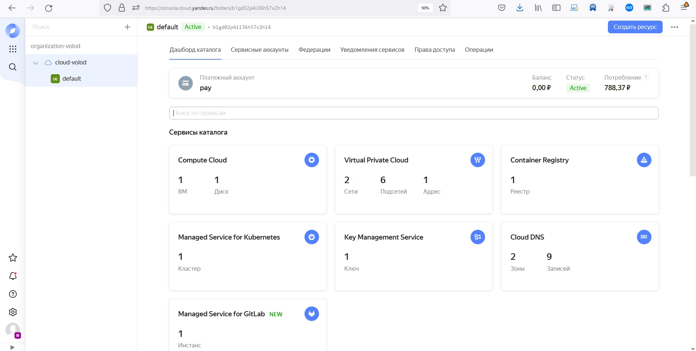
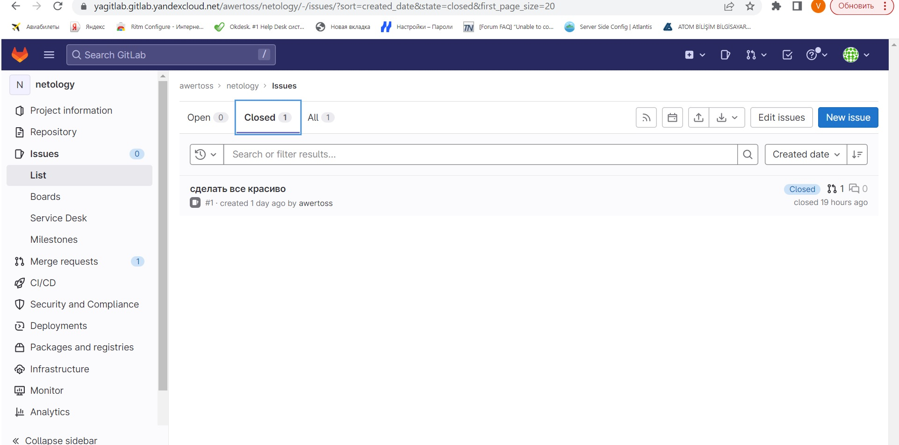
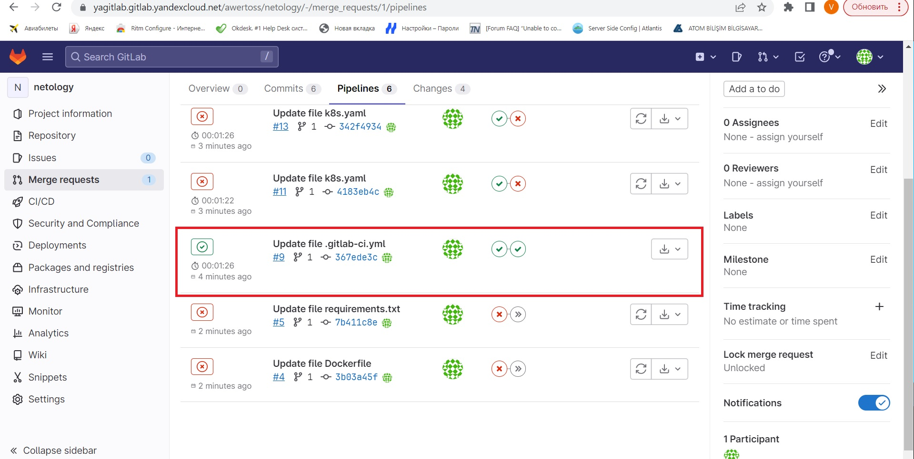
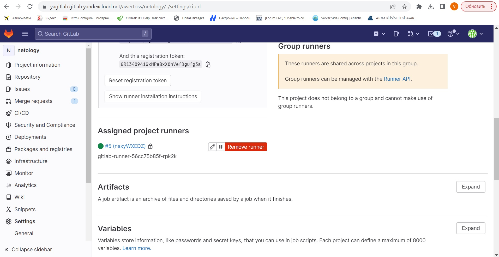

# Домашнее задание к занятию 12 «GitLab»

## Подготовка к выполнению

1. Подготовьте к работе GitLab [по инструкции](https://cloud.yandex.ru/docs/tutorials/infrastructure-management/gitlab-containers).
2. Создайте свой новый проект.
3. Создайте новый репозиторий в GitLab, наполните его [файлами](./repository).
4. Проект должен быть публичным, остальные настройки по желанию.
<p align="center">
  
</p>

## Основная часть

### DevOps

В репозитории содержится код проекта на Python. Проект — RESTful API сервис. Ваша задача — автоматизировать сборку образа с выполнением python-скрипта:

1. Образ собирается на основе [centos:7](https://hub.docker.com/_/centos?tab=tags&page=1&ordering=last_updated).
2. Python версии не ниже 3.7.
3. Установлены зависимости: `flask` `flask-jsonpify` `flask-restful`.
4. Создана директория `/python_api`.
5. Скрипт из репозитория размещён в /python_api.
6. Точка вызова: запуск скрипта.
7. Если сборка происходит на ветке `master`: должен подняться pod kubernetes на основе образа `python-api`, иначе этот шаг нужно пропустить.

### Product Owner

Вашему проекту нужна бизнесовая доработка: нужно поменять JSON ответа на вызов метода GET `/rest/api/get_info`, необходимо создать Issue в котором указать:

1. Какой метод необходимо исправить.
2. Текст с `{ "message": "Already started" }` на `{ "message": "Running"}`.
3. Issue поставить label: feature.

### Developer

Пришёл новый Issue на доработку, вам нужно:

1. Создать отдельную ветку, связанную с этим Issue.
2. Внести изменения по тексту из задания.
3. Подготовить Merge Request, влить необходимые изменения в `master`, проверить, что сборка прошла успешно.


### Tester

Разработчики выполнили новый Issue, необходимо проверить валидность изменений:

1. Поднять докер-контейнер с образом `python-api:latest` и проверить возврат метода на корректность.
2. Закрыть Issue с комментарием об успешности прохождения, указав желаемый результат и фактически достигнутый.

## Итог

```
kubectl create clusterrolebinding default-admin --clusterrole cluster-admin --serviceaccount=default:default
clusterrolebinding.rbac.authorization.k8s.io/default-admin created
root@cl14olqo5m1pdms451vk-iqar:/home/srg#

```
В качестве ответа пришлите подробные скриншоты по каждому пункту задания:

- файл gitlab-ci.yml;
- Dockerfile; 
- лог успешного выполнения пайплайна;
- решённый Issue.
<p align="center">
  
</p>

[https://github.com/awertoss/devops-netology/blob/main/12-ci-gitlab/Dockerfile]
</br>
[https://github.com/awertoss/devops-netology/blob/main/12-ci-gitlab/gitlab-ci.yml]

<p align="center">
  
</p>

<p align="center">
  
</p>

### Важно 
После выполнения задания выключите и удалите все задействованные ресурсы в Yandex Cloud.

## Необязательная часть

Автомазируйте работу тестировщика — пусть у вас будет отдельный конвейер, который автоматически поднимает контейнер и выполняет проверку, например, при помощи curl. На основе вывода будет приниматься решение об успешности прохождения тестирования.

---
