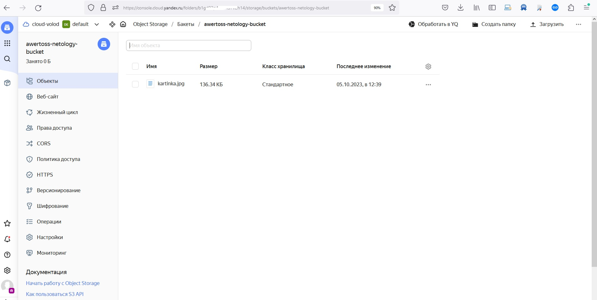
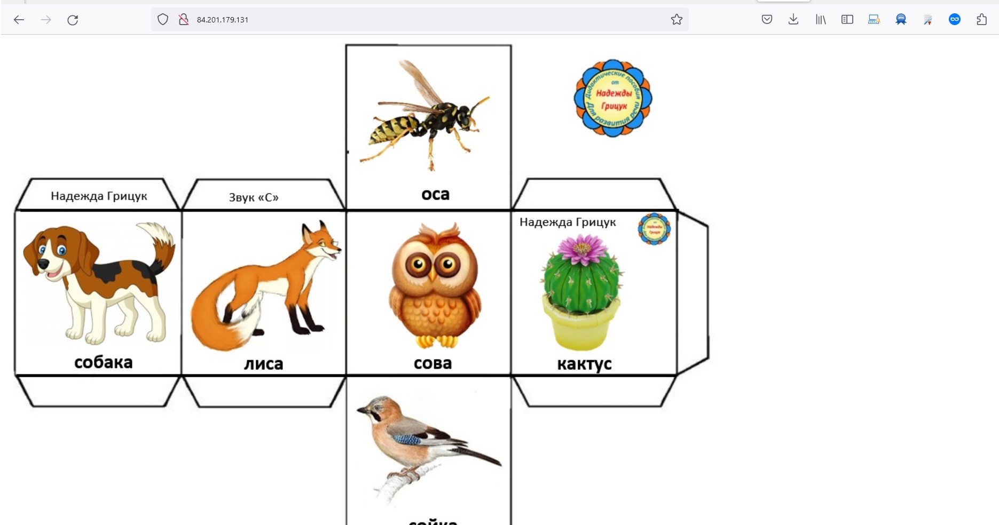
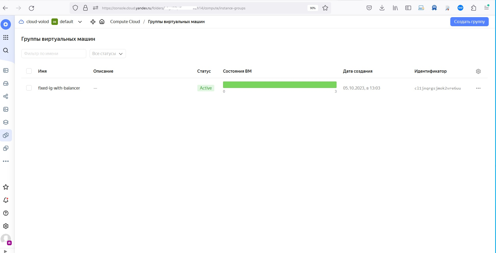

# Домашнее задание к занятию «Вычислительные мощности. Балансировщики нагрузки»  

### Подготовка к выполнению задания

1. Домашнее задание состоит из обязательной части, которую нужно выполнить на провайдере Yandex Cloud, и дополнительной части в AWS (выполняется по желанию). 
2. Все домашние задания в блоке 15 связаны друг с другом и в конце представляют пример законченной инфраструктуры.  
3. Все задания нужно выполнить с помощью Terraform. Результатом выполненного домашнего задания будет код в репозитории. 
4. Перед началом работы настройте доступ к облачным ресурсам из Terraform, используя материалы прошлых лекций и домашних заданий.

---
## Задание 1. Yandex Cloud 

**Что нужно сделать**

1. Создать бакет Object Storage и разместить в нём файл с картинкой:

 - Создать бакет в Object Storage с произвольным именем (например, _имя_студента_дата_).
 - Положить в бакет файл с картинкой.
 - Сделать файл доступным из интернета.

Конфиг: [bucket](terraform/bucket.tf)

<p align="center">
  
</p>


```
terraform init
terraform apply

root@ubuntuserver:/home/srg/terraform/152# mc


root@ubuntuserver:/home/srg/terraform/152# terraform apply
yandex_iam_service_account.sa-ig: Refreshing state... [id=aje107ubfcv1802snhgb]
yandex_iam_service_account.sa-bucket: Refreshing state... [id=aje26cbb2uk6kf89qij1]
yandex_iam_service_account_static_access_key.sa-static-key: Refreshing state... [id=ajef04bbvc6gmg2s2noq]
yandex_resourcemanager_folder_iam_member.bucket-editor: Refreshing state... [id=b1gd02p4ii36h57v2h14/storage.editor/serviceAccount:aje26cbb2uk6kf89qij1]
yandex_resourcemanager_folder_iam_member.ig-editor: Refreshing state... [id=b1gd02p4ii36h57v2h14/editor/serviceAccount:aje107ubfcv1802snhgb]
yandex_storage_bucket.netology-bucket: Refreshing state... [id=awertoss-netology-bucket]
yandex_storage_object.object-1: Refreshing state... [id=kartinka.jpg]

Terraform used the selected providers to generate the following execution plan. Resource actions are indicated with the following symbols:
  + create

Terraform will perform the following actions:

  # yandex_compute_instance_group.ig-1 will be created
  + resource "yandex_compute_instance_group" "ig-1" {
      + created_at          = (known after apply)
      + deletion_protection = false
      + folder_id           = "b1gd02p4ii36h57v2h14"
      + id                  = (known after apply)
      + instances           = (known after apply)
      + name                = "fixed-ig-with-balancer"
      + service_account_id  = "aje107ubfcv1802snhgb"
      + status              = (known after apply)

      + allocation_policy {
          + zones = [
              + "ru-central1-b",
            ]
        }

      + deploy_policy {
          + max_creating     = 3
          + max_deleting     = 1
          + max_expansion    = 1
          + max_unavailable  = 1
          + startup_duration = 3
          + strategy         = (known after apply)
        }

      + health_check {
          + healthy_threshold   = 2
          + unhealthy_threshold = 2

          + http_options {
              + path = "/"
              + port = 80
            }
        }

      + instance_template {
          + labels      = (known after apply)
          + metadata    = {
              + "ssh-keys"  = <<-EOT
                    ubuntu:ssh-rsa AAAAB3NzaC1yc2EAAAADAQABAAABgQChagP/ru7i2nsezPZ+D+re2Yi/jSQ7e5BF7VpB8N94I4oknRQtvALakYzvMHmeGhfsT2swHG1MUxwPHpSANzYrDsz9IM49tybjTG7hUAjP1/wzQoEpzj0SS58q/G2EwuxJxgziUXTC/j9kpUgZ45h5w6U7gipzYWf1Xy0AAPCGI9CUKPc7uooPK2MZ4xM0VMSTdLrU6svToAdkefMqlyR0Ou4NlP6/6CFIrn5II03vT9LFJYcQvAttZyRTX9OsmIKZWSEDe82xPitVKGgur3ERGdzWXkaVYQeoGTwqL1c4pd7L02uAXylWwiyHQ5/DdhK5qMPWzl590KpG8QqFOVNoYEFntuQjHm0oGz3ftxnxjx9ZtnkiSo/lzSjlMXM1XzhOQd2hrjifKTXdC9gR0FVjkGCzvCoIkWzufriP2JncS1gseCBbrHwxQ7Ohlwzjf5NovfaGHdfD66BGHFxx4mLHjd9lQbl+vJgVUuJUNrleT0UTkOlrrIN5jRXrbkrPHDk= srg@ubuntuserver
                EOT
              + "user-data" = <<-EOT
                    #!/bin/bash
                    apt install httpd -y
                    cd /var/www/html
                    echo '<html></html>' > index.html
                    service httpd start
                EOT
            }
          + platform_id = "standard-v1"

          + boot_disk {
              + device_name = (known after apply)
              + mode        = "READ_WRITE"

              + initialize_params {
                  + image_id    = "fd827b91d99psvq5fjit"
                  + size        = (known after apply)
                  + snapshot_id = (known after apply)
                  + type        = "network-hdd"
                }
            }

          + network_interface {
              + ip_address   = (known after apply)
              + ipv4         = true
              + ipv6         = (known after apply)
              + ipv6_address = (known after apply)
              + nat          = true
              + network_id   = (known after apply)
              + subnet_ids   = (known after apply)
            }

          + resources {
              + core_fraction = 20
              + cores         = 2
              + memory        = 1
            }

          + scheduling_policy {
              + preemptible = true
            }
        }

      + load_balancer {
          + status_message    = (known after apply)
          + target_group_id   = (known after apply)
          + target_group_name = "target-group"
        }

      + scale_policy {
          + fixed_scale {
              + size = 3
            }
        }
    }

  # yandex_lb_network_load_balancer.load-balancer-1 will be created
  + resource "yandex_lb_network_load_balancer" "load-balancer-1" {
      + created_at          = (known after apply)
      + deletion_protection = (known after apply)
      + folder_id           = (known after apply)
      + id                  = (known after apply)
      + name                = "network-load-balancer"
      + region_id           = (known after apply)
      + type                = "external"

      + attached_target_group {
          + target_group_id = (known after apply)

          + healthcheck {
              + healthy_threshold   = 2
              + interval            = 2
              + name                = "http"
              + timeout             = 1
              + unhealthy_threshold = 2

              + http_options {
                  + path = "/"
                  + port = 80
                }
            }
        }

      + listener {
          + name        = "lb-listener"
          + port        = 80
          + protocol    = (known after apply)
          + target_port = (known after apply)

          + external_address_spec {
              + address    = (known after apply)
              + ip_version = "ipv4"
            }
        }
    }

  # yandex_vpc_network.network-1 will be created
  + resource "yandex_vpc_network" "network-1" {
      + created_at                = (known after apply)
      + default_security_group_id = (known after apply)
      + folder_id                 = (known after apply)
      + id                        = (known after apply)
      + labels                    = (known after apply)
      + name                      = "net"
      + subnet_ids                = (known after apply)
    }

  # yandex_vpc_subnet.subnet-public will be created
  + resource "yandex_vpc_subnet" "subnet-public" {
      + created_at     = (known after apply)
      + folder_id      = (known after apply)
      + id             = (known after apply)
      + labels         = (known after apply)
      + name           = "public"
      + network_id     = (known after apply)
      + v4_cidr_blocks = [
          + "192.168.200.0/24",
        ]
      + v6_cidr_blocks = (known after apply)
      + zone           = "ru-central1-b"
    }

Plan: 4 to add, 0 to change, 0 to destroy.

Changes to Outputs:
  + external_load_balancer_ip = (known after apply)

Do you want to perform these actions?
  Terraform will perform the actions described above.
  Only 'yes' will be accepted to approve.

  Enter a value: yes

yandex_vpc_network.network-1: Creating...
yandex_vpc_network.network-1: Creation complete after 4s [id=enpi5t3olumdbcebgrde]
yandex_vpc_subnet.subnet-public: Creating...
yandex_vpc_subnet.subnet-public: Creation complete after 2s [id=e2ljcusl1gpbev2hg285]
yandex_compute_instance_group.ig-1: Creating...
yandex_compute_instance_group.ig-1: Still creating... [10s elapsed]
yandex_compute_instance_group.ig-1: Still creating... [20s elapsed]
yandex_compute_instance_group.ig-1: Still creating... [30s elapsed]
yandex_compute_instance_group.ig-1: Still creating... [40s elapsed]
yandex_compute_instance_group.ig-1: Still creating... [50s elapsed]
yandex_compute_instance_group.ig-1: Still creating... [1m0s elapsed]
yandex_compute_instance_group.ig-1: Still creating... [1m10s elapsed]
yandex_compute_instance_group.ig-1: Still creating... [1m20s elapsed]
yandex_compute_instance_group.ig-1: Still creating... [1m30s elapsed]
yandex_compute_instance_group.ig-1: Still creating... [1m40s elapsed]
yandex_compute_instance_group.ig-1: Still creating... [1m50s elapsed]
yandex_compute_instance_group.ig-1: Still creating... [2m0s elapsed]
yandex_compute_instance_group.ig-1: Still creating... [2m10s elapsed]
yandex_compute_instance_group.ig-1: Still creating... [2m20s elapsed]
yandex_compute_instance_group.ig-1: Still creating... [2m30s elapsed]
yandex_compute_instance_group.ig-1: Still creating... [2m40s elapsed]
yandex_compute_instance_group.ig-1: Still creating... [2m50s elapsed]
yandex_compute_instance_group.ig-1: Still creating... [3m0s elapsed]
yandex_compute_instance_group.ig-1: Still creating... [3m10s elapsed]
yandex_compute_instance_group.ig-1: Still creating... [3m20s elapsed]
yandex_compute_instance_group.ig-1: Still creating... [3m30s elapsed]
yandex_compute_instance_group.ig-1: Still creating... [3m40s elapsed]
yandex_compute_instance_group.ig-1: Still creating... [3m50s elapsed]
yandex_compute_instance_group.ig-1: Still creating... [4m0s elapsed]
yandex_compute_instance_group.ig-1: Still creating... [4m10s elapsed]
yandex_compute_instance_group.ig-1: Still creating... [4m20s elapsed]
yandex_compute_instance_group.ig-1: Creation complete after 4m24s [id=cl1jnqrgsjmok2vre6uu]
yandex_lb_network_load_balancer.load-balancer-1: Creating...
yandex_lb_network_load_balancer.load-balancer-1: Creation complete after 4s [id=enpisn2os13p71nrla5c]

Apply complete! Resources: 4 added, 0 changed, 0 destroyed.

Outputs:

bucket_domain_name = "http://awertoss-netology-bucket.storage.yandexcloud.net/kartinka.jpg"
external_load_balancer_ip = "158.160.84.123"
root@ubuntuserver:/home/srg/terraform/152#


```
 
2. Создать группу ВМ в public подсети фиксированного размера с шаблоном LAMP и веб-страницей, содержащей ссылку на картинку из бакета:

 - Создать Instance Group с тремя ВМ и шаблоном LAMP. Для LAMP рекомендуется использовать `image_id = fd827b91d99psvq5fjit`.
 - Для создания стартовой веб-страницы рекомендуется использовать раздел `user_data` в [meta_data](https://cloud.yandex.ru/docs/compute/concepts/vm-metadata).
 - Разместить в стартовой веб-странице шаблонной ВМ ссылку на картинку из бакета.
 - Настроить проверку состояния ВМ.

Конфиг: [instance-group](terraform/instance-group.tf)

<p align="center">
  
</p>
 <p align="center">
  
</p>
3. Подключить группу к сетевому балансировщику:

 - Создать сетевой балансировщик.
 - Проверить работоспособность, удалив одну или несколько ВМ.

 <p align="center">
  
</p>

4. (дополнительно)* Создать Application Load Balancer с использованием Instance group и проверкой состояния.

Полезные документы:

- [Compute instance group](https://registry.terraform.io/providers/yandex-cloud/yandex/latest/docs/resources/compute_instance_group).
- [Network Load Balancer](https://registry.terraform.io/providers/yandex-cloud/yandex/latest/docs/resources/lb_network_load_balancer).
- [Группа ВМ с сетевым балансировщиком](https://cloud.yandex.ru/docs/compute/operations/instance-groups/create-with-balancer).


Конфиг: [terraform](terraform)

---
## Задание 2*. AWS (задание со звёздочкой)

Это необязательное задание. Его выполнение не влияет на получение зачёта по домашней работе.

**Что нужно сделать**

Используя конфигурации, выполненные в домашнем задании из предыдущего занятия, добавить к Production like сети Autoscaling group из трёх EC2-инстансов с  автоматической установкой веб-сервера в private домен.

1. Создать бакет S3 и разместить в нём файл с картинкой:

 - Создать бакет в S3 с произвольным именем (например, _имя_студента_дата_).
 - Положить в бакет файл с картинкой.
 - Сделать доступным из интернета.
2. Сделать Launch configurations с использованием bootstrap-скрипта с созданием веб-страницы, на которой будет ссылка на картинку в S3. 
3. Загрузить три ЕС2-инстанса и настроить LB с помощью Autoscaling Group.

Resource Terraform:

- [S3 bucket](https://registry.terraform.io/providers/hashicorp/aws/latest/docs/resources/s3_bucket)
- [Launch Template](https://registry.terraform.io/providers/hashicorp/aws/latest/docs/resources/launch_template).
- [Autoscaling group](https://registry.terraform.io/providers/hashicorp/aws/latest/docs/resources/autoscaling_group).
- [Launch configuration](https://registry.terraform.io/providers/hashicorp/aws/latest/docs/resources/launch_configuration).

Пример bootstrap-скрипта:

```
#!/bin/bash
yum install httpd -y
service httpd start
chkconfig httpd on
cd /var/www/html
echo "<html><h1>My cool web-server</h1></html>" > index.html
```
### Правила приёма работы

Домашняя работа оформляется в своём Git репозитории в файле README.md. Выполненное домашнее задание пришлите ссылкой на .md-файл в вашем репозитории.
Файл README.md должен содержать скриншоты вывода необходимых команд, а также скриншоты результатов.
Репозиторий должен содержать тексты манифестов или ссылки на них в файле README.md.
