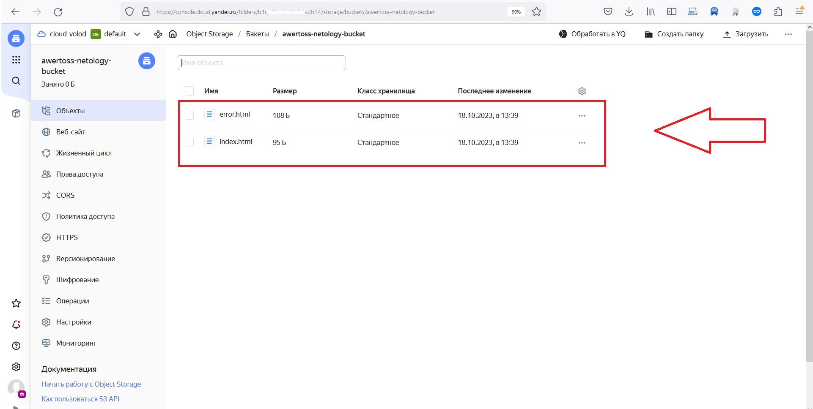

# Домашнее задание к занятию «Безопасность в облачных провайдерах»  

Используя конфигурации, выполненные в рамках предыдущих домашних заданий, нужно добавить возможность шифрования бакета.

---
## Задание 1. Yandex Cloud   

1. С помощью ключа в KMS необходимо зашифровать содержимое бакета:

 - создать ключ в KMS;
 - с помощью ключа зашифровать содержимое бакета, созданного ранее.
2. (Выполняется не в Terraform)* Создать статический сайт в Object Storage c собственным публичным адресом и сделать доступным по HTTPS:

 - создать сертификат;
 - создать статическую страницу в Object Storage и применить сертификат HTTPS;
 - в качестве результата предоставить скриншот на страницу с сертификатом в заголовке (замочек).

Конфиг: [bucket](terraform/bucket.tf)

<p align="center">
  
</p>

```
terraform init

terraform apply

Terraform used the selected providers to generate the following execution plan. Resource actions are indicated with the
following symbols:
  + create

Terraform will perform the following actions:

  # yandex_iam_service_account.bucket-sa-a will be created
  + resource "yandex_iam_service_account" "bucket-sa-a" {
      + created_at = (known after apply)
      + folder_id  = (known after apply)
      + id         = (known after apply)
      + name       = "bucket-sa-a"
    }

  # yandex_iam_service_account_static_access_key.sa-static-key will be created
  + resource "yandex_iam_service_account_static_access_key" "sa-static-key" {
      + access_key           = (known after apply)
      + created_at           = (known after apply)
      + description          = "static access key for bucket-sa object storage"
      + encrypted_secret_key = (known after apply)
      + id                   = (known after apply)
      + key_fingerprint      = (known after apply)
      + secret_key           = (sensitive value)
      + service_account_id   = (known after apply)
    }

  # yandex_kms_symmetric_key.key-a will be created
  + resource "yandex_kms_symmetric_key" "key-a" {
      + created_at          = (known after apply)
      + default_algorithm   = "AES_128"
      + deletion_protection = false
      + description         = "Ключ для шифрования бакета"
      + folder_id           = (known after apply)
      + id                  = (known after apply)
      + name                = "netology-key"
      + rotated_at          = (known after apply)
      + rotation_period     = "8760h"
      + status              = (known after apply)
    }

  # yandex_resourcemanager_folder_iam_member.sa-editor will be created
  + resource "yandex_resourcemanager_folder_iam_member" "sa-editor" {
      + folder_id = "b1gd02p4ii36h57v2h14"
      + id        = (known after apply)
      + member    = (known after apply)
      + role      = "editor"
    }

  # yandex_storage_bucket.bucket-for-web-1 will be created
  + resource "yandex_storage_bucket" "bucket-for-web-1" {
      + access_key            = (known after apply)
      + acl                   = "public-read"
      + bucket                = "awertoss-netology-bucket"
      + bucket_domain_name    = (known after apply)
      + default_storage_class = (known after apply)
      + folder_id             = (known after apply)
      + force_destroy         = false
      + id                    = (known after apply)
      + secret_key            = (sensitive value)
      + website_domain        = (known after apply)
      + website_endpoint      = (known after apply)

      + anonymous_access_flags {
          + list = false
          + read = true
        }

      + server_side_encryption_configuration {
          + rule {
              + apply_server_side_encryption_by_default {
                  + kms_master_key_id = (known after apply)
                  + sse_algorithm     = "aws:kms"
                }
            }
        }

      + website {
          + error_document = "error.html"
          + index_document = "index.html"
        }
    }

  # yandex_storage_object.error will be created
  + resource "yandex_storage_object" "error" {
      + access_key                    = (known after apply)
      + acl                           = "private"
      + bucket                        = (known after apply)
      + content_type                  = (known after apply)
      + id                            = (known after apply)
      + key                           = "error.html"
      + object_lock_legal_hold_status = "OFF"
      + secret_key                    = (sensitive value)
      + source                        = "./site/error.html"
    }

  # yandex_storage_object.index will be created
  + resource "yandex_storage_object" "index" {
      + access_key                    = (known after apply)
      + acl                           = "private"
      + bucket                        = (known after apply)
      + content_type                  = (known after apply)
      + id                            = (known after apply)
      + key                           = "index.html"
      + object_lock_legal_hold_status = "OFF"
      + secret_key                    = (sensitive value)
      + source                        = "./site/index.html"
    }

Plan: 7 to add, 0 to change, 0 to destroy.

Do you want to perform these actions?
  Terraform will perform the actions described above.
  Only 'yes' will be accepted to approve.

  Enter a value: yes

yandex_iam_service_account.bucket-sa-a: Creating...
yandex_kms_symmetric_key.key-a: Creating...
yandex_kms_symmetric_key.key-a: Creation complete after 1s [id=abjfo91dkvm2o5lmhprp]
yandex_iam_service_account.bucket-sa-a: Creation complete after 3s [id=ajenltfrq43pnfqi733q]
yandex_iam_service_account_static_access_key.sa-static-key: Creating...
yandex_resourcemanager_folder_iam_member.sa-editor: Creating...
yandex_iam_service_account_static_access_key.sa-static-key: Creation complete after 1s [id=ajer4btnoam7b9f9i8k2]
yandex_storage_bucket.bucket-for-web-1: Creating...
yandex_resourcemanager_folder_iam_member.sa-editor: Creation complete after 4s [id=b1gd02p4ii36h57v2h14/editor/serviceAccount:ajenltfrq43pnfqi733q]
yandex_storage_bucket.bucket-for-web-1: Still creating... [10s elapsed]
yandex_storage_bucket.bucket-for-web-1: Still creating... [20s elapsed]
yandex_storage_bucket.bucket-for-web-1: Still creating... [30s elapsed]
yandex_storage_bucket.bucket-for-web-1: Still creating... [40s elapsed]
yandex_storage_bucket.bucket-for-web-1: Still creating... [50s elapsed]
yandex_storage_bucket.bucket-for-web-1: Still creating... [1m0s elapsed]
yandex_storage_bucket.bucket-for-web-1: Still creating... [1m10s elapsed]
yandex_storage_bucket.bucket-for-web-1: Still creating... [1m20s elapsed]
yandex_storage_bucket.bucket-for-web-1: Still creating... [1m30s elapsed]
yandex_storage_bucket.bucket-for-web-1: Still creating... [1m40s elapsed]
yandex_storage_bucket.bucket-for-web-1: Still creating... [1m50s elapsed]
yandex_storage_bucket.bucket-for-web-1: Still creating... [2m0s elapsed]
yandex_storage_bucket.bucket-for-web-1: Still creating... [2m10s elapsed]
yandex_storage_bucket.bucket-for-web-1: Creation complete after 2m19s [id=awertoss-netology-bucket]
yandex_storage_object.index: Creating...
yandex_storage_object.error: Creating...
yandex_storage_object.error: Creation complete after 0s [id=error.html]
yandex_storage_object.index: Creation complete after 0s [id=index.html]

Apply complete! Resources: 7 added, 0 changed, 0 destroyed.
root@ubuntuserver:/home/srg/terraform/153#

```

Полезные документы:

- [Настройка HTTPS статичного сайта](https://cloud.yandex.ru/docs/storage/operations/hosting/certificate).
- [Object Storage bucket](https://registry.terraform.io/providers/yandex-cloud/yandex/latest/docs/resources/storage_bucket).
- [KMS key](https://registry.terraform.io/providers/yandex-cloud/yandex/latest/docs/resources/kms_symmetric_key).

--- 
## Задание 2*. AWS (задание со звёздочкой)

Это необязательное задание. Его выполнение не влияет на получение зачёта по домашней работе.

**Что нужно сделать**

1. С помощью роли IAM записать файлы ЕС2 в S3-бакет:
 - создать роль в IAM для возможности записи в S3 бакет;
 - применить роль к ЕС2-инстансу;
 - с помощью bootstrap-скрипта записать в бакет файл веб-страницы.
2. Организация шифрования содержимого S3-бакета:

 - используя конфигурации, выполненные в домашнем задании из предыдущего занятия, добавить к созданному ранее бакету S3 возможность шифрования Server-Side, используя общий ключ;
 - включить шифрование SSE-S3 бакету S3 для шифрования всех вновь добавляемых объектов в этот бакет.

3. *Создание сертификата SSL и применение его к ALB:

 - создать сертификат с подтверждением по email;
 - сделать запись в Route53 на собственный поддомен, указав адрес LB;
 - применить к HTTPS-запросам на LB созданный ранее сертификат.

Resource Terraform:

- [IAM Role](https://registry.terraform.io/providers/hashicorp/aws/latest/docs/resources/iam_role).
- [AWS KMS](https://registry.terraform.io/providers/hashicorp/aws/latest/docs/resources/kms_key).
- [S3 encrypt with KMS key](https://registry.terraform.io/providers/hashicorp/aws/latest/docs/resources/s3_bucket_object#encrypting-with-kms-key).

Пример bootstrap-скрипта:

```
#!/bin/bash
yum install httpd -y
service httpd start
chkconfig httpd on
cd /var/www/html
echo "<html><h1>My cool web-server</h1></html>" > index.html
aws s3 mb s3://mysuperbacketname2021
aws s3 cp index.html s3://mysuperbacketname2021
```

### Правила приёма работы

Домашняя работа оформляется в своём Git репозитории в файле README.md. Выполненное домашнее задание пришлите ссылкой на .md-файл в вашем репозитории.
Файл README.md должен содержать скриншоты вывода необходимых команд, а также скриншоты результатов.
Репозиторий должен содержать тексты манифестов или ссылки на них в файле README.md.
