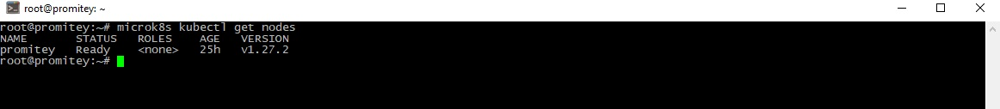
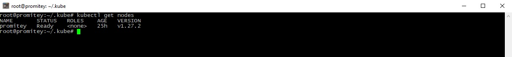

# Домашнее задание к занятию «Kubernetes. Причины появления. Команда kubectl»

### Цель задания

Для экспериментов и валидации ваших решений вам нужно подготовить тестовую среду для работы с Kubernetes. Оптимальное решение — развернуть на рабочей машине или на отдельной виртуальной машине MicroK8S.

------

### Чеклист готовности к домашнему заданию

1. Личный компьютер с ОС Linux или MacOS 

или

2. ВМ c ОС Linux в облаке либо ВМ на локальной машине для установки MicroK8S  

------

### Инструкция к заданию

1. Установка MicroK8S:
    - sudo apt update,
    - sudo apt install snapd,
    - sudo snap install microk8s --classic,
    - добавить локального пользователя в группу `sudo usermod -a -G microk8s $USER`,
    - изменить права на папку с конфигурацией `sudo chown -f -R $USER ~/.kube`.

2. Полезные команды:
    - проверить статус `microk8s status --wait-ready`;
    - подключиться к microK8s и получить информацию можно через команду `microk8s command`, например, `microk8s kubectl get nodes`;
    - включить addon можно через команду `microk8s enable`; 
    - список addon `microk8s status`;
    - вывод конфигурации `microk8s config`;
    - проброс порта для подключения локально `microk8s kubectl port-forward -n kube-system service/kubernetes-dashboard 10443:443`.

3. Настройка внешнего подключения:
    - отредактировать файл /var/snap/microk8s/current/certs/csr.conf.template
    ```shell
    # [ alt_names ]
    # Add
    # IP.4 = 123.45.67.89
    ```
    - обновить сертификаты `sudo microk8s refresh-certs --cert front-proxy-client.crt.

4. Установка kubectl:
    - curl -LO https://storage.googleapis.com/kubernetes-release/release/`curl -s https://storage.googleapis.com/kubernetes-release/release/stable.txt`/bin/linux/amd64/kubectl;
    - chmod +x ./kubectl;
    - sudo mv ./kubectl /usr/local/bin/kubectl;
    - настройка автодополнения в текущую сессию `bash source <(kubectl completion bash)`;
    - добавление автодополнения в командную оболочку bash `echo "source <(kubectl completion bash)" >> ~/.bashrc`.

------

### Инструменты и дополнительные материалы, которые пригодятся для выполнения задания

1. [Инструкция](https://microk8s.io/docs/getting-started) по установке MicroK8S.
2. [Инструкция](https://kubernetes.io/ru/docs/reference/kubectl/cheatsheet/#bash) по установке автодополнения **kubectl**.
3. [Шпаргалка](https://kubernetes.io/ru/docs/reference/kubectl/cheatsheet/) по **kubectl**.

------

### Задание 1. Установка MicroK8S

1. Установить MicroK8S на локальную машину или на удалённую виртуальную машину.
2. Установить dashboard.
3. Сгенерировать сертификат для подключения к внешнему ip-адресу.

```
apt install snapd
snap install microk8s --classic

usermod -a -G microk8s $USER`
chown -f -R $USER ~/.kube`

root@promitey:~# microk8s status
microk8s is running
high-availability: no
  datastore master nodes: 127.0.0.1:19001
  datastore standby nodes: none

microk8s kubectl apply -f https://raw.githubusercontent.com/kubernetes/dashboard/v2.7.0/aio/deploy/recommended.yaml


mcedit /var/snap/microk8s/current/certs/csr.conf.template


microk8s enable dns
microk8s enable hostpath-storage

microk8s kubectl create deployment nginx --image=nginx

microk8s kubectl proxy --address 0.0.0.0 --accept-hosts '.*'

microk8s stop
microk8s start

Проверка.
root@promitey:~# curl --insecure localhost:8001
{
  "paths": [
    "/.well-known/openid-configuration",
    "/api",
    "/api/v1",
    "/apis",
    "/apis/",
    "/apis/admissionregistration.k8s.io",
    "/apis/admissionregistration.k8s.io/v1",
    "/apis/apiextensions.k8s.io",
    "/apis/apiextensions.k8s.io/v1",
    "/apis/apiregistration.k8s.io",
    "/apis/apiregistration.k8s.io/v1",
    "/apis/apps",
    "/apis/apps/v1",
    "/apis/authentication.k8s.io",
    "/apis/authentication.k8s.io/v1",
    "/apis/authorization.k8s.io",
    "/apis/authorization.k8s.io/v1",
    "/apis/autoscaling",
    "/apis/autoscaling/v1",
    "/apis/autoscaling/v2",
    "/apis/batch",
    "/apis/batch/v1",
    "/apis/certificates.k8s.io",
    "/apis/certificates.k8s.io/v1",
    "/apis/coordination.k8s.io",
    "/apis/coordination.k8s.io/v1",
    "/apis/crd.projectcalico.org",
    "/apis/crd.projectcalico.org/v1",
    "/apis/discovery.k8s.io",
    "/apis/discovery.k8s.io/v1",
    "/apis/events.k8s.io",
    "/apis/events.k8s.io/v1",
    "/apis/flowcontrol.apiserver.k8s.io",
    "/apis/flowcontrol.apiserver.k8s.io/v1beta2",
    "/apis/flowcontrol.apiserver.k8s.io/v1beta3",
    "/apis/metrics.k8s.io",
    "/apis/metrics.k8s.io/v1beta1",
    "/apis/networking.k8s.io",
    "/apis/networking.k8s.io/v1",
    "/apis/node.k8s.io",
    "/apis/node.k8s.io/v1",
    "/apis/policy",
    "/apis/policy/v1",
    "/apis/rbac.authorization.k8s.io",
    "/apis/rbac.authorization.k8s.io/v1",
    "/apis/scheduling.k8s.io",
    "/apis/scheduling.k8s.io/v1",
    "/apis/storage.k8s.io",
    "/apis/storage.k8s.io/v1",
    "/healthz",
    "/healthz/autoregister-completion",
    "/healthz/etcd",
    "/healthz/log",
    "/healthz/ping",
    "/healthz/poststarthook/aggregator-reload-proxy-client-cert",
    "/healthz/poststarthook/apiservice-discovery-controller",
    "/healthz/poststarthook/apiservice-openapi-controller",
    "/healthz/poststarthook/apiservice-openapiv3-controller",
    "/healthz/poststarthook/apiservice-registration-controller",
    "/healthz/poststarthook/apiservice-status-available-controller",
    "/healthz/poststarthook/bootstrap-controller",
    "/healthz/poststarthook/crd-informer-synced",
    "/healthz/poststarthook/generic-apiserver-start-informers",
    "/healthz/poststarthook/kube-apiserver-autoregistration",
    "/healthz/poststarthook/priority-and-fairness-config-consumer",
    "/healthz/poststarthook/priority-and-fairness-config-producer",
    "/healthz/poststarthook/priority-and-fairness-filter",
    "/healthz/poststarthook/scheduling/bootstrap-system-priority-classes",
    "/healthz/poststarthook/start-apiextensions-controllers",
    "/healthz/poststarthook/start-apiextensions-informers",
    "/healthz/poststarthook/start-cluster-authentication-info-controller",
    "/healthz/poststarthook/start-deprecated-kube-apiserver-identity-lease-garbage-collector",
    "/healthz/poststarthook/start-kube-aggregator-informers",
    "/healthz/poststarthook/start-kube-apiserver-admission-initializer",
    "/healthz/poststarthook/start-kube-apiserver-identity-lease-controller",
    "/healthz/poststarthook/start-kube-apiserver-identity-lease-garbage-collector",
    "/healthz/poststarthook/start-legacy-token-tracking-controller",
    "/healthz/poststarthook/start-system-namespaces-controller",
    "/healthz/poststarthook/storage-object-count-tracker-hook",
    "/livez",
    "/livez/autoregister-completion",
    "/livez/etcd",
    "/livez/log",
    "/livez/ping",
    "/livez/poststarthook/aggregator-reload-proxy-client-cert",
    "/livez/poststarthook/apiservice-discovery-controller",
    "/livez/poststarthook/apiservice-openapi-controller",
    "/livez/poststarthook/apiservice-openapiv3-controller",
    "/livez/poststarthook/apiservice-registration-controller",
    "/livez/poststarthook/apiservice-status-available-controller",
    "/livez/poststarthook/bootstrap-controller",
    "/livez/poststarthook/crd-informer-synced",
    "/livez/poststarthook/generic-apiserver-start-informers",
    "/livez/poststarthook/kube-apiserver-autoregistration",
    "/livez/poststarthook/priority-and-fairness-config-consumer",
    "/livez/poststarthook/priority-and-fairness-config-producer",
    "/livez/poststarthook/priority-and-fairness-filter",
    "/livez/poststarthook/scheduling/bootstrap-system-priority-classes",
    "/livez/poststarthook/start-apiextensions-controllers",
    "/livez/poststarthook/start-apiextensions-informers",
    "/livez/poststarthook/start-cluster-authentication-info-controller",
    "/livez/poststarthook/start-deprecated-kube-apiserver-identity-lease-garbage-collector",
    "/livez/poststarthook/start-kube-aggregator-informers",
    "/livez/poststarthook/start-kube-apiserver-admission-initializer",
    "/livez/poststarthook/start-kube-apiserver-identity-lease-controller",
    "/livez/poststarthook/start-kube-apiserver-identity-lease-garbage-collector",
    "/livez/poststarthook/start-legacy-token-tracking-controller",
    "/livez/poststarthook/start-system-namespaces-controller",
    "/livez/poststarthook/storage-object-count-tracker-hook",
    "/logs",
    "/metrics",
    "/metrics/slis",
    "/openapi/v2",
    "/openapi/v3",
    "/openapi/v3/",
    "/openid/v1/jwks",
    "/readyz",
    "/readyz/autoregister-completion",
    "/readyz/etcd",
    "/readyz/etcd-readiness",
    "/readyz/informer-sync",
    "/readyz/log",
    "/readyz/ping",
    "/readyz/poststarthook/aggregator-reload-proxy-client-cert",
    "/readyz/poststarthook/apiservice-discovery-controller",
    "/readyz/poststarthook/apiservice-openapi-controller",
    "/readyz/poststarthook/apiservice-openapiv3-controller",
    "/readyz/poststarthook/apiservice-registration-controller",
    "/readyz/poststarthook/apiservice-status-available-controller",
    "/readyz/poststarthook/bootstrap-controller",
    "/readyz/poststarthook/crd-informer-synced",
    "/readyz/poststarthook/generic-apiserver-start-informers",
    "/readyz/poststarthook/kube-apiserver-autoregistration",
    "/readyz/poststarthook/priority-and-fairness-config-consumer",
    "/readyz/poststarthook/priority-and-fairness-config-producer",
    "/readyz/poststarthook/priority-and-fairness-filter",
    "/readyz/poststarthook/scheduling/bootstrap-system-priority-classes",
    "/readyz/poststarthook/start-apiextensions-controllers",
    "/readyz/poststarthook/start-apiextensions-informers",
    "/readyz/poststarthook/start-cluster-authentication-info-controller",
    "/readyz/poststarthook/start-deprecated-kube-apiserver-identity-lease-garbage-collector",
    "/readyz/poststarthook/start-kube-aggregator-informers",
    "/readyz/poststarthook/start-kube-apiserver-admission-initializer",
    "/readyz/poststarthook/start-kube-apiserver-identity-lease-controller",
    "/readyz/poststarthook/start-kube-apiserver-identity-lease-garbage-collector",
    "/readyz/poststarthook/start-legacy-token-tracking-controller",
    "/readyz/poststarthook/start-system-namespaces-controller",
    "/readyz/poststarthook/storage-object-count-tracker-hook",
    "/readyz/shutdown",
    "/version"
  ]


```

------

### Задание 2. Установка и настройка локального kubectl
1. Установить на локальную машину kubectl.
2. Настроить локально подключение к кластеру.
3. Подключиться к дашборду с помощью port-forward.

```
cd $HOME
mkdir .kube
cd .kube
microk8s config > config

```

<p align="center">
  
</p>

<p align="center">
  
</p>
------

### Правила приёма работы

1. Домашняя работа оформляется в своём Git-репозитории в файле README.md. Выполненное домашнее задание пришлите ссылкой на .md-файл в вашем репозитории.
2. Файл README.md должен содержать скриншоты вывода команд `kubectl get nodes` и скриншот дашборда.

------

### Критерии оценки
Зачёт — выполнены все задания, ответы даны в развернутой форме, приложены соответствующие скриншоты и файлы проекта, в выполненных заданиях нет противоречий и нарушения логики.

На доработку — задание выполнено частично или не выполнено, в логике выполнения заданий есть противоречия, существенные недостатки.
