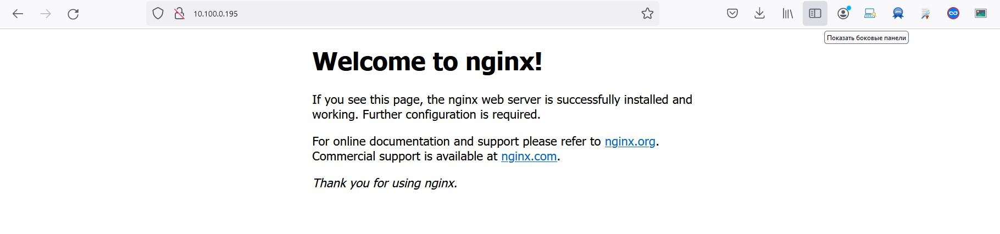

# Домашнее задание к занятию «Сетевое взаимодействие в K8S. Часть 2»

### Цель задания

В тестовой среде Kubernetes необходимо обеспечить доступ к двум приложениям снаружи кластера по разным путям.

------

### Чеклист готовности к домашнему заданию

1. Установленное k8s-решение (например, MicroK8S).
2. Установленный локальный kubectl.
3. Редактор YAML-файлов с подключённым Git-репозиторием.

------

### Инструменты и дополнительные материалы, которые пригодятся для выполнения задания

1. [Инструкция](https://microk8s.io/docs/getting-started) по установке MicroK8S.
2. [Описание](https://kubernetes.io/docs/concepts/services-networking/service/) Service.
3. [Описание](https://kubernetes.io/docs/concepts/services-networking/ingress/) Ingress.
4. [Описание](https://github.com/wbitt/Network-MultiTool) Multitool.

------

### Задание 1. Создать Deployment приложений backend и frontend

1. Создать Deployment приложения _frontend_ из образа nginx с количеством реплик 3 шт.

Конфиг: [frontend.yaml](frontend.yaml)
```
microk8s kubectl apply -f frontend.yaml
deployment.apps/frontend created

microk8s kubectl get deployment
NAME       READY   UP-TO-DATE   AVAILABLE   AGE
frontend   3/3     3            3           7s


```
2. Создать Deployment приложения _backend_ из образа multitool.

Конфиг: [backend.yaml](backend.yaml)
```
microk8s kubectl apply -f backend.yaml
deployment.apps/backend created

microk8s kubectl get deployments
NAME       READY   UP-TO-DATE   AVAILABLE   AGE
frontend   3/3     3            3           62s
backend    1/1     1            1           25s


```
3. Добавить Service, которые обеспечат доступ к обоим приложениям внутри кластера.

Конфиг: [service-backend.yaml](service-backend.yaml)

Конфиг: [service-frontend.yaml](service-frontend.yaml)

```
microk8s kubectl apply -f service-frontend.yaml
service/svc-front created
microk8s kubectl apply -f service-backend.yaml
service/svc-back created

microk8s kubectl get svc
NAME         TYPE        CLUSTER-IP       EXTERNAL-IP   PORT(S)   AGE
kubernetes   ClusterIP   10.152.183.1     <none>        443/TCP   7d17h
svc-front    ClusterIP   10.152.183.75    <none>        80/TCP    16s
svc-back     ClusterIP   10.152.183.208   <none>        80/TCP    7s


```
4. Продемонстрировать, что приложения видят друг друга с помощью Service.

```
 microk8s kubectl get svc
NAME         TYPE        CLUSTER-IP       EXTERNAL-IP   PORT(S)   AGE
kubernetes   ClusterIP   10.152.183.1     <none>        443/TCP   7d17h
svc-front    ClusterIP   10.152.183.75    <none>        80/TCP    40s
svc-back     ClusterIP   10.152.183.208   <none>        80/TCP    31s
root@ubuntutest:~/kuber5# microk8s kubectl get pods
NAME                        READY   STATUS    RESTARTS   AGE
frontend-5d865b9b74-qz4w4   1/1     Running   0          2m15s
frontend-5d865b9b74-fcq4b   1/1     Running   0          2m14s
frontend-5d865b9b74-mqf5p   1/1     Running   0          2m14s
backend-866d8d9754-jx5pt    1/1     Running   0          98s

microk8s kubectl exec frontend-5d865b9b74-qz4w4 -- curl svc-front
  % Total    % Received % Xferd  Average Speed   Time    Time     Time  Current
                                 Dload  Upload   Total   Spent    Left  Speed
100   612  100   612    0     0    99k      0 --:--<!DOCTYPE html>:--:--     0
<html>
<head>
<title>Welcome to nginx!</title>
<style>
    body {
        width: 35em;
        margin: 0 auto;
        font-family: Tahoma, Verdana, Arial, sans-serif;
    }
</style>
</head>
<body>
<h1>Welcome to nginx!</h1>
<p>If you see this page, the nginx web server is successfully installed and
working. Further configuration is required.</p>

<p>For online documentation and support please refer to
<a href="http://nginx.org/">nginx.org</a>.<br/>
Commercial support is available at
<a href="http://nginx.com/">nginx.com</a>.</p>

<p><em>Thank you for using nginx.</em></p>
</body>
</html>


  microk8s kubectl exec backend-866d8d9754-jx5pt -- curl svc-back
  % Total    % Received % Xferd  Average Speed   Time    Time     Time  Current
                                 Dload  Upload   Total   Spent    Left  Speed
100   139  100   139    0     0  43478      0 --:--:-- --:--:-- --:--:-- 69500
WBITT Network MultiTool (with NGINX) - backend-866d8d9754-jx5pt - 10.1.45.65 - HTTP: 80 , HTTPS: 443 . (Formerly praqma/network-multitool)


```
5. Предоставить манифесты Deployment и Service в решении, а также скриншоты или вывод команды п.4.

```
Смотреть выше.
```
------

### Задание 2. Создать Ingress и обеспечить доступ к приложениям снаружи кластера

1. Включить Ingress-controller в MicroK8S.

```
# microk8s enable ingress
Infer repository core for addon ingress
Enabling Ingress
ingressclass.networking.k8s.io/public created
ingressclass.networking.k8s.io/nginx created
namespace/ingress created
serviceaccount/nginx-ingress-microk8s-serviceaccount created
clusterrole.rbac.authorization.k8s.io/nginx-ingress-microk8s-clusterrole created
role.rbac.authorization.k8s.io/nginx-ingress-microk8s-role created
clusterrolebinding.rbac.authorization.k8s.io/nginx-ingress-microk8s created
rolebinding.rbac.authorization.k8s.io/nginx-ingress-microk8s created
configmap/nginx-load-balancer-microk8s-conf created
configmap/nginx-ingress-tcp-microk8s-conf created
configmap/nginx-ingress-udp-microk8s-conf created
daemonset.apps/nginx-ingress-microk8s-controller created
Ingress is enabled

```
2. Создать Ingress, обеспечивающий доступ снаружи по IP-адресу кластера MicroK8S так, чтобы при запросе только по адресу открывался _frontend_ а при добавлении /api - _backend_.

Конфиг: [ingress.yaml](ingress.yaml)

```
microk8s kubectl apply -f ingress.yaml
ingress.networking.k8s.io/ingress created

microk8s kubectl describe ingress
Name:             ingress
Labels:           <none>
Namespace:        default
Address:
Ingress Class:    public
Default backend:  <default>
Rules:
  Host        Path  Backends
  ----        ----  --------
  *
              /      svc-front:80 (10.1.45.66:80,10.1.45.76:80,10.1.45.78:80)
              /api   svc-back:80 (10.1.45.65:80)
Annotations:  nginx.ingress.kubernetes.io/rewrite-target: /
Events:
  Type    Reason  Age   From                      Message
  ----    ------  ----  ----                      -------
  Normal  Sync    25s   nginx-ingress-controller  Scheduled for sync

```
3. Продемонстрировать доступ с помощью браузера или `curl` с локального компьютера.
 
<p align="center">
  
</p>


4. Предоставить манифесты и скриншоты или вывод команды п.2.

```
Смотреть выше.
```

------

### Правила приема работы

1. Домашняя работа оформляется в своем Git-репозитории в файле README.md. Выполненное домашнее задание пришлите ссылкой на .md-файл в вашем репозитории.
2. Файл README.md должен содержать скриншоты вывода необходимых команд `kubectl` и скриншоты результатов.
3. Репозиторий должен содержать тексты манифестов или ссылки на них в файле README.md.

------
