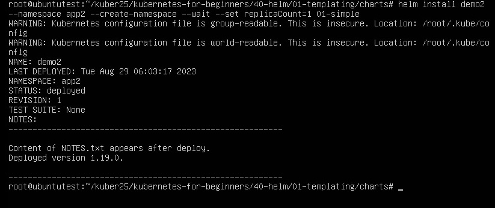

# Домашнее задание к занятию «Helm»

### Цель задания

В тестовой среде Kubernetes необходимо установить и обновить приложения с помощью Helm.

------

### Чеклист готовности к домашнему заданию

1. Установленное k8s-решение, например, MicroK8S.
2. Установленный локальный kubectl.
3. Установленный локальный Helm.
4. Редактор YAML-файлов с подключенным репозиторием GitHub.

------

### Инструменты и дополнительные материалы, которые пригодятся для выполнения задания

1. [Инструкция](https://helm.sh/docs/intro/install/) по установке Helm. [Helm completion](https://helm.sh/docs/helm/helm_completion/).

------

### Задание 1. Подготовить Helm-чарт для приложения

1. Необходимо упаковать приложение в чарт для деплоя в разные окружения. 
2. Каждый компонент приложения деплоится отдельным deployment’ом или statefulset’ом.
3. В переменных чарта измените образ приложения для изменения версии.

```
helm version
version.BuildInfo{Version:"v3.12.3", GitCommit:"3a31588ad33fe3b89af5a2a54ee1d25b                    fe6eaa5e", GitTreeState:"clean", GoVersion:"go1.20.7"}

Возьму файлы из гита для деплоя.
git clone https://github.com/aak74/kubernetes-for-beginners.git

cd kubernetes-for-beginners/40-helm/01-templating/charts/

Создаю шаблон

helm template 01-simple
---
# Source: hard/templates/service.yaml
apiVersion: v1
kind: Service
metadata:
  name: demo
  labels:
    app: demo
spec:
  ports:
    - port: 80
      name: http
  selector:
    app: demo
---
# Source: hard/templates/deployment.yaml
apiVersion: apps/v1
kind: Deployment
metadata:
  name: demo
  labels:
    app: demo
spec:
  replicas: 1
  selector:
    matchLabels:
      app: demo
  template:
    metadata:
      labels:
        app: demo
    spec:
      containers:
        - name: hard
          image: "nginx:1.16.0"
          imagePullPolicy: IfNotPresent
          ports:
            - name: http
              containerPort: 80
              protocol: TCP
          resources:
            limits:
              cpu: 200m
              memory: 256Mi
            requests:
              cpu: 100m
              memory: 128Mi


В файле Chart.yaml меняем номер версии приложения.

cat 01-simple/Chart.yaml
apiVersion: v2
name: hard
description: A minimal chart for demo

type: application

version: 0.1.2
appVersion: "1.19.0"


```
------
### Задание 2. Запустить две версии в разных неймспейсах

1. Подготовив чарт, необходимо его проверить. Запуститe несколько копий приложения.
2. Одну версию в namespace=app1, вторую версию в том же неймспейсе, третью версию в namespace=app2.
3. Продемонстрируйте результат.

```
Проверка.
helm template 01-simple
---
# Source: hard/templates/service.yaml
apiVersion: v1
kind: Service
metadata:
  name: demo
  labels:
    app: demo
spec:
  ports:
    - port: 80
      name: http
  selector:
    app: demo
---
# Source: hard/templates/deployment.yaml
apiVersion: apps/v1
kind: Deployment
metadata:
  name: demo
  labels:
    app: demo
spec:
  replicas: 1
  selector:
    matchLabels:
      app: demo
  template:
    metadata:
      labels:
        app: demo
    spec:
      containers:
        - name: hard
          image: "nginx:1.19.0"
          imagePullPolicy: IfNotPresent
          ports:
            - name: http
              containerPort: 80
              protocol: TCP
          resources:
            limits:
              cpu: 200m
              memory: 256Mi
            requests:
              cpu: 100m
              memory: 128Mi


Пробуем установить.

 microk8s kubectl config view --raw > ~/.kube/config  - копируем конфиг.


helm install demo1 01-simple - установка.
WARNING: Kubernetes configuration file is group-readable. This is insecure. Location: /root/.kube/config
WARNING: Kubernetes configuration file is world-readable. This is insecure. Location: /root/.kube/config
NAME: demo1
LAST DEPLOYED: Tue Aug 29 05:06:09 2023
NAMESPACE: app
STATUS: deployed
REVISION: 1
TEST SUITE: None
NOTES:
---------------------------------------------------------

Content of NOTES.txt appears after deploy.
Deployed version 1.19.0.

---------------------------------------------------------

helm list
WARNING: Kubernetes configuration file is group-readable. This is insecure. Location: /root/.kube/config
WARNING: Kubernetes configuration file is world-readable. This is insecure. Location: /root/.kube/config
NAME    NAMESPACE       REVISION        UPDATED                                 STATUS          CHART           APP VERSION
demo1   app             1               2023-08-29 05:06:09.514005123 +0000 UTC deployed        hard-0.1.2      1.19.0


Запустим несколько версий приложения.

helm upgrade demo1 --set replicaCount=3 01-simple
WARNING: Kubernetes configuration file is group-readable. This is insecure. Location: /root/.kube/config
WARNING: Kubernetes configuration file is world-readable. This is insecure. Location: /root/.kube/config
Release "demo1" has been upgraded. Happy Helming!
NAME: demo1
LAST DEPLOYED: Tue Aug 29 05:14:56 2023
NAMESPACE: app
STATUS: deployed
REVISION: 2
TEST SUITE: None
NOTES:
---------------------------------------------------------

Content of NOTES.txt appears after deploy.
Deployed version 1.19.0.

---------------------------------------------------------

kubectl get pod
NAME                    READY   STATUS    RESTARTS   AGE
demo-6b8889fc7f-ljj6m   1/1     Running   0          9m34s
demo-6b8889fc7f-75gkm   1/1     Running   0          47s
demo-6b8889fc7f-nzjmj   1/1     Running   0          48s

Удалим helm demo1, затем создадим новый в namespace.

helm uninstall demo1
release "demo1" uninstalled

helm install demo2 --namespace app1 --create-namespace --wait --set replicaCount=2 01-simple
```
<p align="center">
  
</p>

```
helm install demo2 --namespace app2 --create-namespace --wait --set replicaCount=1 01-simple
```


<p align="center">
  
</p>

```
kubectl get pod -n app1

kubectl get pod -n app2
```

<p align="center">
  
</p>

### Правила приёма работы

1. Домашняя работа оформляется в своём Git репозитории в файле README.md. Выполненное домашнее задание пришлите ссылкой на .md-файл в вашем репозитории.
2. Файл README.md должен содержать скриншоты вывода необходимых команд `kubectl`, `helm`, а также скриншоты результатов.
3. Репозиторий должен содержать тексты манифестов или ссылки на них в файле README.md.
