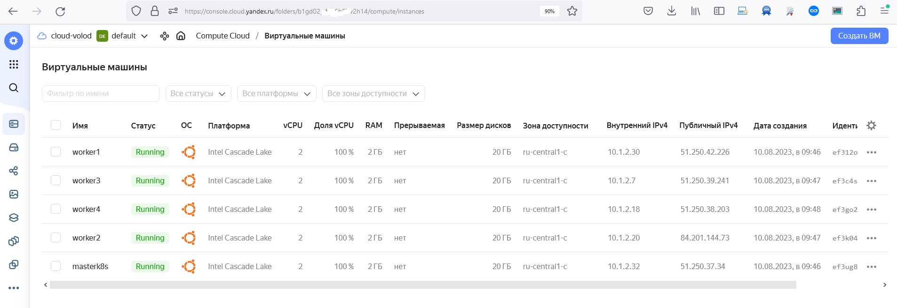

# Домашнее задание к занятию «Установка Kubernetes»

### Цель задания

Установить кластер K8s.

### Чеклист готовности к домашнему заданию

1. Развёрнутые ВМ с ОС Ubuntu 20.04-lts.


### Инструменты и дополнительные материалы, которые пригодятся для выполнения задания

1. [Инструкция по установке kubeadm](https://kubernetes.io/docs/setup/production-environment/tools/kubeadm/create-cluster-kubeadm/).
2. [Документация kubespray](https://kubespray.io/).

-----

### Задание 1. Установить кластер k8s с 1 master node

1. Подготовка работы кластера из 5 нод: 1 мастер и 4 рабочие ноды.
2. В качестве CRI — containerd.
3. Запуск etcd производить на мастере.
4. Способ установки выбрать самостоятельно.

```
Буду устанавливать k8s c помощью Kubespray — набор ansible-ролей для установки и конфигурации Kubernetes.

Далее установим yc.

curl -sSL https://storage.yandexcloud.net/yandexcloud-yc/install.sh | bash
Downloading yc 0.108.1
  % Total    % Received % Xferd  Average Speed   Time    Time     Time  Current
                                 Dload  Upload   Total   Spent    Left  Speed
100  100M  100  100M    0     0  10.2M      0  0:00:09  0:00:09 --:--:-- 10.4M
Yandex Cloud CLI 0.108.1 linux/amd64

 yc -v
Yandex Cloud CLI 0.108.1 linux/amd64

yc init
Welcome! This command will take you through the configuration process.
Please go to https://oauth.yandex.ru/authorize?response_type=token&client_id=1a6990aa636648e9b2ef855fa7bec2fb in order to obtain OAuth token.

Создадим в yc необходимое количество виртуальных машин

yc vpc network create  --name net --labels my-label=netology --description "net yc"
id: enpvfd7s3qaeh1tre4t0
folder_id: b1gd02p4ii36h57v2h14
created_at: "2023-08-10T06:16:31Z"
name: net
description: net yc
labels:
  my-label: netology

yc vpc subnet create  --name my-subnet --zone ru-central1-c --range 10.1.2.0/24 --network-name net --description "subnet yc"
id: b0cj69jp8s8jmpripti0
folder_id: b1gd02p4ii36h57v2h14
created_at: "2023-08-10T06:17:26Z"
name: my-subnet
description: subnet yc
network_id: enpvfd7s3qaeh1tre4t0
zone_id: ru-central1-c
v4_cidr_blocks:
  - 10.1.2.0/24

Запусти bash скрипт создания виртуальных машин.
bash createvm.bash
done (30s)
id: ef3ug8t6n989j1bnpp2b
folder_id: b1gd02p4ii36h57v2h14
created_at: "2023-08-10T06:46:24Z"
name: masterk8s
zone_id: ru-central1-c
platform_id: standard-v2
resources:
  memory: "2147483648"
  cores: "2"
  core_fraction: "100"
status: RUNNING
metadata_options:
  gce_http_endpoint: ENABLED
  aws_v1_http_endpoint: ENABLED
  gce_http_token: ENABLED
  aws_v1_http_token: DISABLED
boot_disk:
  mode: READ_WRITE
  device_name: ef3q4gujbjbosud1cac7
  auto_delete: true
  disk_id: ef3q4gujbjbosud1cac7
network_interfaces:
  - index: "0"
    mac_address: d0:0d:1e:82:3a:6b
    subnet_id: b0cj69jp8s8jmpripti0
    primary_v4_address:
      address: 10.1.2.32
      one_to_one_nat:
        address: 51.250.37.34
        ip_version: IPV4
gpu_settings: {}
fqdn: masterk8s.ru-central1.internal
scheduling_policy: {}
network_settings:
  type: STANDARD
placement_policy: {}

done (27s)
id: ef312ojbpotkuptqorin
folder_id: b1gd02p4ii36h57v2h14
created_at: "2023-08-10T06:46:56Z"
name: worker1
zone_id: ru-central1-c
platform_id: standard-v2
resources:
  memory: "2147483648"
  cores: "2"
  core_fraction: "100"
status: RUNNING
metadata_options:
  gce_http_endpoint: ENABLED
  aws_v1_http_endpoint: ENABLED
  gce_http_token: ENABLED
  aws_v1_http_token: DISABLED
boot_disk:
  mode: READ_WRITE
  device_name: ef3drqdloc6k3vm6k41r
  auto_delete: true
  disk_id: ef3drqdloc6k3vm6k41r
network_interfaces:
  - index: "0"
    mac_address: d0:0d:11:62:6b:ce
    subnet_id: b0cj69jp8s8jmpripti0
    primary_v4_address:
      address: 10.1.2.30
      one_to_one_nat:
        address: 51.250.42.226
        ip_version: IPV4
gpu_settings: {}
fqdn: worker1.ru-central1.internal
scheduling_policy: {}
network_settings:
  type: STANDARD
placement_policy: {}

done (23s)
id: ef3k041lq1jt1jf2dr8k
folder_id: b1gd02p4ii36h57v2h14
created_at: "2023-08-10T06:47:25Z"
name: worker2
zone_id: ru-central1-c
platform_id: standard-v2
resources:
  memory: "2147483648"
  cores: "2"
  core_fraction: "100"
status: RUNNING
metadata_options:
  gce_http_endpoint: ENABLED
  aws_v1_http_endpoint: ENABLED
  gce_http_token: ENABLED
  aws_v1_http_token: DISABLED
boot_disk:
  mode: READ_WRITE
  device_name: ef389blerf28j3m3o32s
  auto_delete: true
  disk_id: ef389blerf28j3m3o32s
network_interfaces:
  - index: "0"
    mac_address: d0:0d:14:01:03:5d
    subnet_id: b0cj69jp8s8jmpripti0
    primary_v4_address:
      address: 10.1.2.20
      one_to_one_nat:
        address: 84.201.144.73
        ip_version: IPV4
gpu_settings: {}
fqdn: worker2.ru-central1.internal
scheduling_policy: {}
network_settings:
  type: STANDARD
placement_policy: {}

done (37s)
id: ef3c4sqelhraunitnu0r
folder_id: b1gd02p4ii36h57v2h14
created_at: "2023-08-10T06:47:50Z"
name: worker3
zone_id: ru-central1-c
platform_id: standard-v2
resources:
  memory: "2147483648"
  cores: "2"
  core_fraction: "100"
status: RUNNING
metadata_options:
  gce_http_endpoint: ENABLED
  aws_v1_http_endpoint: ENABLED
  gce_http_token: ENABLED
  aws_v1_http_token: DISABLED
boot_disk:
  mode: READ_WRITE
  device_name: ef3godtic3uin5052fgq
  auto_delete: true
  disk_id: ef3godtic3uin5052fgq
network_interfaces:
  - index: "0"
    mac_address: d0:0d:c2:73:4e:ac
    subnet_id: b0cj69jp8s8jmpripti0
    primary_v4_address:
      address: 10.1.2.7
      one_to_one_nat:
        address: 51.250.39.241
        ip_version: IPV4
gpu_settings: {}
fqdn: worker3.ru-central1.internal
scheduling_policy: {}
network_settings:
  type: STANDARD
placement_policy: {}

done (31s)
id: ef3go25b5k47bnc2cv5b
folder_id: b1gd02p4ii36h57v2h14
created_at: "2023-08-10T06:48:29Z"
name: worker4
zone_id: ru-central1-c
platform_id: standard-v2
resources:
  memory: "2147483648"
  cores: "2"
  core_fraction: "100"
status: RUNNING
metadata_options:
  gce_http_endpoint: ENABLED
  aws_v1_http_endpoint: ENABLED
  gce_http_token: ENABLED
  aws_v1_http_token: DISABLED
boot_disk:
  mode: READ_WRITE
  device_name: ef3hmhs7sojr79n6nlbr
  auto_delete: true
  disk_id: ef3hmhs7sojr79n6nlbr
network_interfaces:
  - index: "0"
    mac_address: d0:0d:10:c0:8a:b2
    subnet_id: b0cj69jp8s8jmpripti0
    primary_v4_address:
      address: 10.1.2.18
      one_to_one_nat:
        address: 51.250.38.203
        ip_version: IPV4
gpu_settings: {}
fqdn: worker4.ru-central1.internal
scheduling_policy: {}
network_settings:
  type: STANDARD
placement_policy: {}


```
<p align="center">
  
</p>

```
Репозиторий
Подключаемся к виртуальной машине
ssh yc-user@84.201.148.2
The authenticity of host '84.201.148.2 (84.201.148.2)' can't be established.
ED25519 key fingerprint is SHA256:dOcDQa5fVAJKq8QMar3xu9cjGZYdlOex07PO8h2/wts.
This key is not known by any other names
Are you sure you want to continue connecting (yes/no/[fingerprint])? yes
Warning: Permanently added '84.201.148.2' (ED25519) to the list of known hosts.
Welcome to Ubuntu 20.04.6 LTS (GNU/Linux 5.4.0-155-generic x86_64)

 * Documentation:  https://help.ubuntu.com
 * Management:     https://landscape.canonical.com
 * Support:        https://ubuntu.com/advantage

The programs included with the Ubuntu system are free software;
the exact distribution terms for each program are described in the
individual files in /usr/share/doc/*/copyright.

Ubuntu comes with ABSOLUTELY NO WARRANTY, to the extent permitted by
applicable law.


Копируем репозиторий.
apt install git
git clone https://github.com/kubernetes-sigs/kubespray


Установка зависимостей


```
## Дополнительные задания (со звёздочкой)

**Настоятельно рекомендуем выполнять все задания под звёздочкой.** Их выполнение поможет глубже разобраться в материале.   
Задания под звёздочкой необязательные к выполнению и не повлияют на получение зачёта по этому домашнему заданию. 

------
### Задание 2*. Установить HA кластер

1. Установить кластер в режиме HA.
2. Использовать нечётное количество Master-node.
3. Для cluster ip использовать keepalived или другой способ.

### Правила приёма работы

1. Домашняя работа оформляется в своем Git-репозитории в файле README.md. Выполненное домашнее задание пришлите ссылкой на .md-файл в вашем репозитории.
2. Файл README.md должен содержать скриншоты вывода необходимых команд `kubectl get nodes`, а также скриншоты результатов.
3. Репозиторий должен содержать тексты манифестов или ссылки на них в файле README.md.
